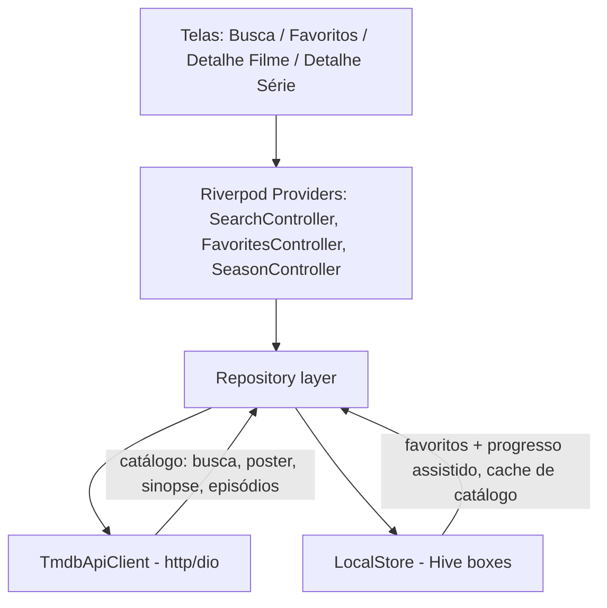

# Design: CineTrack

**Contexto:** App mobile pessoal (Flutter), single-user, sem backend próprio. Fonte de dados de catálogo é a TMDB API pública; estado do usuário (favoritos + progresso de episódios) é local ao aparelho.

**Requisitos não funcionais:**
- Funciona offline para qualquer item já favoritado (dado cacheado).
- Sem custo de infra (sem servidor próprio).
- App single-user: sem requisito de concorrência/consistência distribuída.
- Latência dominada pela TMDB API (fora do nosso controle); UI nunca deve travar esperando rede — sempre otimista/local-first para toggles de "assistido".

## Opções consideradas

### Gerenciamento de estado
| Opção | Prós | Contras | Custo/Esforço |
|-------|------|---------|---------------|
| `setState` puro | Zero dependência | Não escala além de 1-2 telas, difícil testar | Baixo |
| Provider | Simples, oficial há anos | Boilerplate de `ChangeNotifier`, menos seguro em tempo de compilação | Baixo |
| **Riverpod** | Testável sem `BuildContext`, composição de providers, ótimo para cache+async (`FutureProvider`/`AsyncNotifier`) | Curva de aprendizado inicial | Médio |
| Bloc | Muito estruturado, ótimo em times grandes | Boilerplate alto para um app pequeno de 1 dev | Médio-Alto |

### Persistência local
| Opção | Prós | Contras | Custo/Esforço |
|-------|------|---------|---------------|
| **Hive** | Puro Dart, sem dependência nativa extra, rápido, schema flexível (bom para o formato aninhado show→season→episode) | Sem SQL/joins; queries complexas ficam em memória (ok para o volume de dados de 1 usuário) | Baixo |
| Drift (sqlite) | Relacional, queries tipadas, migrações formais | Code-gen (`build_runner`), mais setup para um domínio que não precisa de joins complexos | Médio |
| SharedPreferences | Trivial | Só serve para chave/valor simples, não para listas aninhadas de episódios | N/A (não serve) |

### Fonte de dados de catálogo
Definido pelo Manager: **TMDB API** (`https://api.themoviedb.org/3`), autenticação via API Key (v3) em query param `api_key` ou Bearer token v4. Endpoints usados:
- `GET /search/multi` — busca filme/série.
- `GET /tv/{id}` — detalhes + lista de temporadas.
- `GET /tv/{id}/season/{season_number}` — episódios da temporada.
- `GET /movie/{id}` — detalhes do filme.
- Imagens: `https://image.tmdb.org/t/p/{size}/{path}`.

### Navegação
`go_router` — padrão atual do Flutter, URLs nomeadas, deep-link-ready, simples para as ~4 telas do MVP.

## Solução escolhida



- **Camada de repositório** é a única que sabe se um dado vem da rede ou do cache — a UI/providers não sabem de TMDB nem de Hive diretamente (facilita teste com fakes).
- **Local-first para progresso:** toggle de "assistido" grava direto no Hive antes/independente de qualquer chamada de rede — nunca depende da TMDB estar no ar.
- **Cache de catálogo:** ao favoritar um item, salvamos localmente título, pôster, sinopse e (para séries) a lista de temporadas/episódios já buscada. Isso resolve o critério de aceite "abrir série favoritada offline".

## Modelo de dados (Hive, local)

```
FavoriteItem
  id: int (tmdb id)
  mediaType: "movie" | "tv"
  title: string
  posterPath: string?
  overview: string
  addedAt: DateTime
  watchedMovie: bool          // só relevante se mediaType == movie
  seasons: List<SeasonCache>? // só relevante se mediaType == tv

SeasonCache
  seasonNumber: int
  episodes: List<EpisodeCache>

EpisodeCache
  episodeNumber: int
  name: string
  airDate: DateTime?
  watched: bool
```

Chave do box Hive: `id-mediaType` (ex. `"1396-tv"`), evitando colisão entre filme e série com mesmo id numérico.

## Contratos internos
- `TmdbApiClient`: `searchMulti(query)`, `getTvDetails(id)`, `getSeasonEpisodes(id, seasonNumber)`, `getMovieDetails(id)`.
- `FavoritesRepository`: `add(item)`, `remove(id, mediaType)`, `watchAll()` (stream para a UI reagir), `toggleEpisodeWatched(id, season, episode)`, `toggleMovieWatched(id)`.
- Erros de rede tipados (`TmdbException` com `.notFound`, `.rateLimited`, `.network`, `.unauthorized`) para a UI escolher a mensagem certa (critério de aceite de erro 429 / chave inválida).

## Estratégia de rollout
Sem produção/deploy remoto — é um app local instalado via `flutter run` / build manual no aparelho do próprio usuário. Não se aplica feature flag nem rollout progressivo.

## Observabilidade
App pessoal, sem telemetria remota (não expõe dados a terceiros além da própria TMDB). `debugPrint`/logs locais bastam para desenvolvimento.

## Riscos
- **API key da TMDB é responsabilidade do usuário** (não pode ser gerada por nós); sem ela o app não busca catálogo novo, mas itens já cacheados continuam funcionando offline.
- Hive sem migração formal de schema: se o modelo mudar depois, precisaremos escrever migração manual (documentar em ADR futura se acontecer).

## Tarefas técnicas sugeridas (para o Orquestrador)
1. Scaffold do projeto Flutter + dependências (Dev Frontend).
2. `TmdbApiClient` + modelos de rede (Dev Frontend).
3. `LocalStore`/Hive + `FavoritesRepository` (Dev Frontend).
4. Telas: Busca, Favoritos, Detalhe Filme, Detalhe Série (Dev Frontend).
5. Testes unitários (cálculo de progresso, repositório) + widget tests dos estados (Dev Frontend/QA).
6. Code review (Code Reviewer) + parecer QA.
