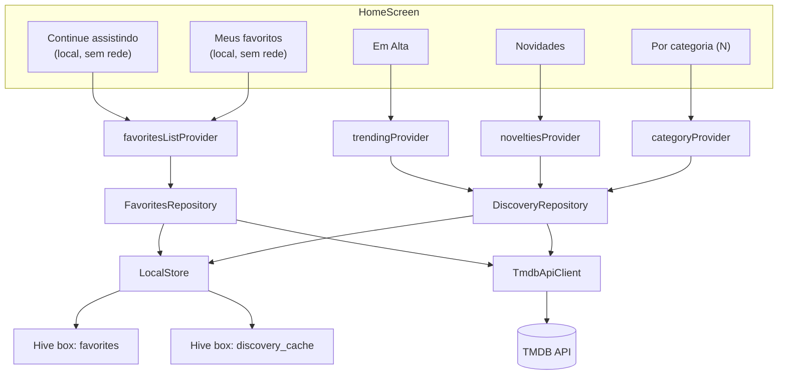
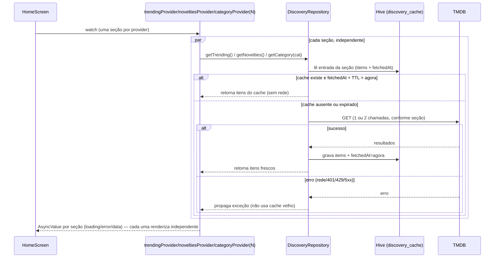

# Design: Home com descoberta visual (Em Alta, Novidades, Por categoria, Continue assistindo)

> Autor: Arquiteto (squad) · Base: `docs/05-especificacao-home-descoberta.md` (Product Analyst).
> Evolui: `docs/01-especificacao.md`, `docs/02-design.md`, `docs/adr/adr-001-stack.md`.
> ADR relacionada: `docs/adr/adr-002-cache-descoberta-ttl.md` (nova, ver seção final).

## Contexto

Hoje `HomeScreen` renderiza só a lista de favoritos (`favoritesListProvider`, um `StreamProvider` que reage ao `Box.watch()` do Hive). Não existe nenhuma chamada TMDB na abertura da home — todo o tráfego de rede hoje acontece em `SearchScreen` (`searchResultsProvider`, um `FutureProvider.family` sem cache/TTL, recriado a cada busca) e nas telas de detalhe/temporada.

Esta feature introduz o primeiro cenário em que a home passa a depender de **múltiplas chamadas TMDB em paralelo, toda vez que o app abre** — isso é novo e é o que motiva a maior parte das decisões deste doc.

**Nota de causa raiz (contexto do bug recente):** `seasonProvider` (`FutureProvider.family<SeasonCache, SeasonKey>`) cacheava dado no Riverpod sem mecanismo de expiração — o provider "achava" que seu valor ainda era válido mesmo depois do repositório/Hive mudarem por baixo, exigindo `ref.invalidate` manual espalhado pelo código para não mostrar dado obsoleto. A causa raiz não foi "Riverpod cacheia" (isso é o comportamento esperado de `FutureProvider` com `keepAlive` implícito por family), foi **não haver uma fonte de verdade explícita sobre "esse dado ainda é válido?"** — a validade vivia implicitamente no fato de o provider nunca ter sido invalidado. Este design evita repetir isso: nenhum provider de descoberta decide sozinho se seu dado é válido — quem decide é o repositório, consultando um timestamp persistido no Hive a cada chamada. Detalhe na seção "Estratégia de cache".

## Requisitos não funcionais

Este é um app local, single-user, sem backend (ADR-001) — não há requisito de disponibilidade/throughput de servidor. Os NFRs relevantes aqui são outros:

- **Latência percebida ao abrir a home:** a lista de favoritos e "Continue assistindo" (dado 100% local) devem renderizar imediatamente, sem esperar nenhuma chamada de rede — isso já é verdade hoje e não pode regredir. Seções de descoberta podem levar mais tempo (chamada de rede), mas cada uma aparece assim que estiver pronta, sem bloquear as demais nem a tela.
- **Resiliência a rate limit do TMDB (free tier):** abrir a home não pode disparar uma rajada de chamadas toda vez. O free tier do TMDB não publica hoje um limite fixo agressivo, mas 429 é um erro real e já modelado (`TmdbException.rateLimited()`) — o app deve se comportar bem tanto reduzindo a frequência de chamadas (cache com TTL) quanto absorvendo um 429 quando ele acontecer (falha isolada por seção, nunca a home inteira).
- **Degradação por seção, não por tela:** uma seção de descoberta com erro (rede, 429, sem chave TMDB) não pode impedir as outras seções nem os favoritos locais de funcionar. Isso é tratado como requisito de arquitetura (um `AsyncValue` por seção), não só de UI.
- **Compatibilidade de dados:** qualquer novo campo em `FavoriteItem` precisa ser lido de forma segura em registros Hive já salvos por versões anteriores do app (não há `TypeAdapter`/schema versionado — é `Map` cru).

## Opções consideradas

### 1. Estratégia de busca das seções de descoberta

| Opção | Prós | Contras | Custo/Esforço |
|---|---|---|---|
| **A. Tudo em paralelo, sem cache, toda abertura da home** | Simples de implementar | Rajada de N chamadas TMDB toda vez que o app abre (favoritos locais + trending + novidades + N categorias); maior risco de 429; sem ganho perceptível de "frescor" para o usuário (catálogo trending/novidades não muda minuto a minuto) | Baixo |
| **B. Lazy por visibilidade (só busca quando o carrossel entra na viewport)** | Reduz chamadas na abertura | Exige biblioteca de visibility-detection (dependência nova, fora do padrão atual do projeto que evita deps supérfluas — ver ADR-001); complexidade de scroll não compensa para uma tela com poucas seções | Médio-alto |
| **C. Cache local (Hive) com TTL por seção, busca paralela só do que estiver expirado/ausente** ✅ | Home abre "instantânea" na maioria das aberturas (dentro do TTL, zero chamadas de rede); rajada de N chamadas só acontece quando o cache expira, não a cada abertura; mantém o padrão já usado no projeto (repositório decide rede×cache) | Mais um Hive box + lógica de expiração para manter | Médio |

**Escolhida: C.** É a única que ataca a causa do risco (frequência de chamadas), não só o sintoma (UI não travar). Reaproveita o padrão arquitetural já existente (`FavoritesRepository` como única camada que decide rede×cache) — só que para catálogo, não para favoritos.

### 2. Onde mora a lógica de "esse dado ainda é válido?"

| Opção | Prós | Contras |
|---|---|---|
| **A. No provider Riverpod (ex. `FutureProvider` com `keepAlive` + timer para auto-invalidar)** | Não precisa de Hive extra | É exatamente o padrão que causou o bug do `seasonProvider`: validade vive na memória do provider, desalinhada da fonte real de dado; timer de invalidação é mais um mecanismo para esquecer/errar |
| **B. Timestamp persistido no Hive, checado pelo repositório a cada leitura** ✅ | Fonte única de verdade (Hive), provider vira função pura de "pergunte ao repositório" — sem estado próprio para desalinhar; sobrevive a restart do app (não perde cache ao fechar) | Mais um box Hive para gerenciar |

**Escolhida: B**, pelo motivo explicado na nota de causa raiz acima.

### 3. Unificar gênero filme×série em "Por categoria"?

TMDB tem **taxonomias de gênero diferentes** para filme e série (`/genre/movie/list` vs `/genre/tv/list`). Nomes iguais nem sempre têm o mesmo id, e alguns gêneros só existem para um dos dois tipos — ex.: **TV não tem "Horror" nem "Romance" nem "Thriller" como gênero próprio** (a lista de gênero de TV do TMDB é: Action & Adventure, Animation, Comedy, Crime, Documentary, Drama, Family, Kids, Mystery, News, Reality, Sci-Fi & Fantasy, Soap, Talk, War & Politics, Western).

| Opção | Prós | Contras |
|---|---|---|
| **A. Separar carrosséis "Terror (filmes)" / "Terror (séries)"** | Fiel à taxonomia TMDB | Contraria pedido explícito de produto ("apresentada de forma unificada"); dobra o número de seções |
| **B. Um carrossel por categoria, misturando filme+série quando ambos têm gênero equivalente; só filme quando a série não tiver o gênero** ✅ | Atende o pedido de produto (uma seção "Terror", um label); simples de explicar; degrada bem (categoria vira "só filme" em vez de quebrar) | Usuário não percebe que "Terror" é só filme — aceitável, não é enganoso, é só a taxonomia real do catálogo |

**Escolhida: B.** Cada categoria é definida como `{label, movieGenreId, tvGenreId?}` — busca em `/discover/movie` sempre, em `/discover/tv` só quando `tvGenreId != null`.

### 4. Fonte da lista de categorias: fixa no app vs. dinâmica (`/genre/*/list`)

| Opção | Prós | Contras |
|---|---|---|
| **A. Dinâmica via `/genre/movie/list` + `/genre/tv/list`** | Sempre atualizada se TMDB mudar a lista | +2 chamadas de rede na abertura (mais risco de rate limit, para um dado que praticamente nunca muda); precisa de mapeamento manual do mesmo jeito (ids diferentes entre filme/série) |
| **B. Lista fixa e curta no código do app** ✅ | Zero chamadas extras; previsível; produto já pediu "fixo/definido pelo app nesta versão" (fora de escopo personalização) | Se TMDB adicionar/renomear gênero, não reflete automaticamente — aceitável, é dado que muda em anos, não em dias |

**Escolhida: B.**

## Solução escolhida





Pontos-chave do diagrama de sequência:
- Cada seção é um provider e uma chamada independente — nunca uma query monolítica. Erro em uma não afeta `AsyncValue` das outras (requisito de negócio direto).
- Em cache-hit (a maioria das aberturas, dado o TTL), **zero chamadas de rede** — resolve o "não pode parecer lenta a cada abertura" e reduz drasticamente a frequência de rajadas.
- Em erro de rede/API, a decisão é **não** cair silenciosamente para um cache expirado — o erro é propagado e a seção mostra estado de erro com retry. Ver justificativa abaixo.

**Por que não usar cache expirado como fallback silencioso em caso de erro?** Foi cogitado (stale-while-error) mas descartado: os critérios de aceite da spec pedem explicitamente que uma seção com erro/429 **mostre o estado de erro com retry**, não que esconda o problema atrás de dado antigo sem o usuário saber. Servir stale-on-error também reintroduziria o mesmo padrão do bug do `seasonProvider` — dado potencialmente desatualizado sendo mostrado como se fosse válido, sem sinalização. Fica registrado como possível otimização futura (stale-while-revalidate), não necessária agora.

### Contratos — novos métodos em `TmdbApiClient`

```dart
Future<List<SearchResult>> getTrending();                      // GET /trending/all/week
Future<List<SearchResult>> getNowPlayingMovies();               // GET /movie/now_playing?region=BR
Future<List<SearchResult>> getOnTheAirTv();                     // GET /tv/on_the_air
Future<List<SearchResult>> discoverMoviesByGenre(int genreId);  // GET /discover/movie?with_genres={id}&sort_by=popularity.desc
Future<List<SearchResult>> discoverTvByGenre(int genreId);      // GET /discover/tv?with_genres={id}&sort_by=popularity.desc
```

Todos reaproveitam `_get()`/`TmdbException.fromStatusCode` já existentes — nenhuma mudança no tratamento de erro da camada HTTP.

Decisões de parâmetro:
- `region: 'BR'` só em `getNowPlayingMovies` — é o único endpoint em que "região" tem efeito real (data de lançamento em cartaz varia por país). Os demais endpoints já ficam localizados via `language=pt-BR` (parâmetro global existente em `_uri`), que é suficiente.
- `sort_by=popularity.desc` nos `/discover/*` — evita que `with_genres` sozinho traga itens de popularidade/qualidade muito baixa primeiro.
- `/trending/all/week` (não `/day`) — janela mais estável; combinado com o TTL de cache (abaixo), a seção já não parece "travada" — não precisa de janela curta para isso.

**Parsing:** `/trending/all/week` já retorna `media_type` por item — `SearchResult.fromTmdb` (existente) funciona sem alteração. Os outros quatro endpoints **não** retornam `media_type` (o tipo já é conhecido pelo endpoint chamado) — adicionar em `SearchResult`:

```dart
factory SearchResult.fromTmdbTyped(Map<String, dynamic> json, MediaType mediaType) {
  final title = mediaType == MediaType.movie ? json['title'] as String? : json['name'] as String?;
  return SearchResult(
    id: json['id'] as int,
    mediaType: mediaType,
    title: title ?? '',
    posterPath: json['poster_path'] as String?,
    overview: json['overview'] as String? ?? '',
  );
}
```

### Novo modelo: `DiscoveryCategory`

Segue o mesmo padrão de `typedef SeasonKey = ({int tvId, int seasonNumber})` já usado em `providers.dart` (record do Dart 3 — igualdade estrutural automática, funciona direto como chave de `FutureProvider.family`):

```dart
// lib/models/discovery_category.dart
typedef DiscoveryCategory = ({String label, int movieGenreId, int? tvGenreId});

const kDiscoveryCategories = <DiscoveryCategory>[
  (label: 'Ação',     movieGenreId: 28,    tvGenreId: 10759), // TV: Action & Adventure
  (label: 'Comédia',  movieGenreId: 35,    tvGenreId: 35),
  (label: 'Terror',   movieGenreId: 27,    tvGenreId: null),  // TV não tem gênero de horror
  (label: 'Romance',  movieGenreId: 10749, tvGenreId: null),  // TV não tem gênero de romance
  (label: 'Animação', movieGenreId: 16,    tvGenreId: 16),
];
```

Responde a pergunta ❓1 (quais categorias/fonte) e ❓3 (unificar taxonomia) ao mesmo tempo.

### Novo repositório: `DiscoveryRepository`

Mesma responsabilidade de `FavoritesRepository` — única camada que decide rede×cache — mas para catálogo de descoberta (não mistura com favoritos: são bounded contexts diferentes, um lê/escreve o box `favorites`, o outro o box `discovery_cache`).

```dart
class DiscoveryRepository {
  final TmdbApiClient _api;
  final LocalStore _store;

  static const trendingTtl = Duration(hours: 3);
  static const noveltiesTtl = Duration(hours: 6);
  static const categoryTtl = Duration(hours: 12);

  Future<List<SearchResult>> getTrending() =>
      _cached('trending', trendingTtl, () => _api.getTrending());

  Future<List<SearchResult>> getNovelties() =>
      _cached('novelties', noveltiesTtl, () async {
        final results = await Future.wait([
          _api.getNowPlayingMovies(),
          _api.getOnTheAirTv(),
        ]);
        return _interleave(results[0].take(10).toList(), results[1].take(10).toList());
      });

  Future<List<SearchResult>> getCategory(DiscoveryCategory category) =>
      _cached('category:${category.label}', categoryTtl, () async {
        final calls = [
          _api.discoverMoviesByGenre(category.movieGenreId),
          if (category.tvGenreId != null) _api.discoverTvByGenre(category.tvGenreId!),
        ];
        final results = await Future.wait(calls);
        return _interleave(
          results[0].take(10).toList(),
          results.length > 1 ? results[1].take(10).toList() : const [],
        );
      });

  Future<List<SearchResult>> _cached(
    String key,
    Duration ttl,
    Future<List<SearchResult>> Function() fetch,
  ) async {
    final cached = _store.readDiscoveryCache(key);
    if (cached != null && DateTime.now().difference(cached.fetchedAt) < ttl) {
      return cached.items;
    }
    final fresh = await fetch(); // erro propaga — sem fallback silencioso pra cache velho
    await _store.saveDiscoveryCache(key, fresh);
    return fresh;
  }

  static List<SearchResult> _interleave(List<SearchResult> a, List<SearchResult> b) {
    final out = <SearchResult>[];
    for (var i = 0; i < a.length || i < b.length; i++) {
      if (i < a.length) out.add(a[i]);
      if (i < b.length) out.add(b[i]);
    }
    return out;
  }
}
```

Nota: `getNovelties`/`getCategory` usam `Future.wait` — se uma das duas chamadas internas falhar, a seção inteira (Novidades, ou aquela categoria) mostra erro. É uma simplificação deliberada: a spec pede isolamento **por seção** (Em Alta × Novidades × Categoria × Favoritos), não granularidade de "só a metade filme de Novidades falhou". Falha parcial dentro de uma seção composta é aceitável para este escopo.

### Novos providers Riverpod (`lib/providers/providers.dart`)

```dart
final discoveryRepositoryProvider = Provider<DiscoveryRepository>((ref) {
  return DiscoveryRepository(
    api: ref.watch(tmdbApiClientProvider),
    store: ref.watch(localStoreProvider),
  );
});

final trendingProvider = FutureProvider<List<SearchResult>>((ref) {
  return ref.watch(discoveryRepositoryProvider).getTrending();
});

final noveltiesProvider = FutureProvider<List<SearchResult>>((ref) {
  return ref.watch(discoveryRepositoryProvider).getNovelties();
});

final categoryProvider =
    FutureProvider.family<List<SearchResult>, DiscoveryCategory>((ref, category) {
  return ref.watch(discoveryRepositoryProvider).getCategory(category);
});

/// Derivação pura do que já está em `favoritesListProvider` — sem chamada de
/// rede, sem cache próprio, sem risco de desalinhar: recalcula sempre que o
/// Hive de favoritos mudar (o Stream já existente cuida disso).
final continueWatchingProvider = Provider<List<FavoriteItem>>((ref) {
  final favorites = ref.watch(favoritesListProvider).valueOrNull ?? const [];
  final inProgress = favorites.where((item) {
    if (item.mediaType != MediaType.tv) return false;
    final progress = ProgressCalculator.compute(item.seasons ?? const []);
    return progress.isStarted && !progress.isCompleted;
  }).toList()
    ..sort((a, b) =>
        (b.lastWatchedAt ?? b.addedAt).compareTo(a.lastWatchedAt ?? a.addedAt));
  return inProgress;
});
```

Por que `continueWatchingProvider` é um `Provider` simples (não `FutureProvider`/`StreamProvider` próprio): ele não tem estado ou cache que possa desalinhar — é uma função pura sobre o valor mais atual de `favoritesListProvider`, que já é a fonte de verdade reativa do Hive. Zero superfície para o tipo de bug do `seasonProvider`.

Responde ❓2 (critério de ordenação de "Continue assistindo"): **última atividade** (`lastWatchedAt`), com fallback para `addedAt` quando `lastWatchedAt` ainda for `null` (itens já favoritados antes desta versão) — ver modelo de dados abaixo.

### Favoritar direto do carrossel

Reaproveita exatamente o padrão já usado em `SearchScreen._addFavorite`: `favoritesRepositoryProvider.addMovie/addTvShow` (já idempotente — `if (_store.read(key) != null) return;` cobre o duplo-toque do critério de aceite), estado de "favoritando" com `Set<String> _pendingKeys` local ao widget do carrossel, e o ícone de favorito lido de `favoritesListProvider` (não de estado otimista) — resolve diretamente o caso de borda "estado do ícone precisa refletir a fonte da verdade local, não um estado otimista desalinhado". Nenhum código novo de favoritar é necessário — é composição do que já existe.

### Componentização da `HomeScreen`

```
HomeScreen (Scaffold, body = ListView vertical de seções)
 ├─ _ContinueWatchingSection   (Provider: continueWatchingProvider) — some se lista vazia
 ├─ _DiscoverySection('Em Alta', trendingProvider)
 ├─ _DiscoverySection('Novidades', noveltiesProvider)
 ├─ _DiscoverySection(cat.label, categoryProvider(cat))   — um por item de kDiscoveryCategories
 └─ _FavoritesSection          (StreamProvider: favoritesListProvider, com o filtro Todos/Filmes/Séries atual)
```

`_DiscoverySection` é um único widget reutilizável para Em Alta / Novidades / cada Categoria — recebe `title` + `AsyncValue<List<SearchResult>>` (via `ref.watch` do provider correspondente) + os favoritos atuais (para o selo de já-favoritado) e resolve sozinho `loading` (skeleton/spinner horizontal), `error` (mensagem compacta + botão "tentar de novo" chamando `ref.invalidate(provider)`), `data` vazio (a seção some — "categoria sem lançamento" do caso de borda) e `data` com itens (carrossel horizontal, pôster maior, coração overlay). Isso é o que garante "uma seção com erro não derruba a home nem as demais seções" — é estrutural (um widget, um `AsyncValue`, um retry), não uma convenção que dá pra esquecer.

`_FavoritesSection` é a `HomeScreen` atual, extraída como está (mesmo filtro, mesmo `ListView`, pôster um pouco maior por pedido de produto) — nenhuma regra de negócio muda, só a posição na tela (agora abaixo do destaque de descoberta/continue assistindo).

## Modelo de dados / migração no Hive

`FavoriteItem` ganha um campo novo, opcional:

```dart
final DateTime? lastWatchedAt; // null = nunca teve episódio marcado desde que este campo existe

// toJson
'lastWatchedAt': lastWatchedAt?.toIso8601String(),

// fromJson — null-safe, não quebra registros salvos antes desta versão
lastWatchedAt: DateTime.tryParse(json['lastWatchedAt'] as String? ?? ''),
```

`copyWith` ganha o parâmetro `DateTime? lastWatchedAt` correspondente.

`FavoritesRepository.toggleEpisodeWatched` passa a gravar a atividade:

```dart
await _store.save(item.copyWith(seasons: updatedSeasons, lastWatchedAt: DateTime.now()));
```

Atualiza em qualquer toggle (marcar **ou** desmarcar um episódio) — representa "última vez que mexi no progresso dessa série", não só "última vez que avancei". Suficiente para o critério de ordenação pedido; não há requisito de distinguir os dois casos.

**Compatibilidade:** como o Hive salva `Map` cru (sem `TypeAdapter`), isto é seguro nos dois sentidos:
- App novo lendo dado salvo por versão antiga → chave ausente → `json['lastWatchedAt']` é `null` → `DateTime.tryParse(null ?? '')` → `null`. Sem exceção.
- Rollback para versão antiga lendo dado salvo pela versão nova → `fromJson` antigo simplesmente ignora a chave `lastWatchedAt` que não conhece (Hive/`Map` não reclama de chave extra). Sem exceção.

Nenhuma migração ativa (nenhum script de backfill) é necessária — o campo começa `null` para todo item existente e passa a ser preenchido organicamente no próximo `toggleEpisodeWatched`.

**Novo box Hive:** `discovery_cache`, separado do box `favorites` (bounded context diferente — um bug ou uma limpeza de cache de descoberta nunca deve poder tocar dado de favorito do usuário). Aberto em `LocalStore.init()` junto do box existente:

```dart
static const _discoveryBoxName = 'discovery_cache';
late final Box<dynamic> _discoveryBox;
// init(): _discoveryBox = await Hive.openBox<dynamic>(_discoveryBoxName);
```

Novo modelo `DiscoveryCacheEntry { List<SearchResult> items; DateTime fetchedAt; }` com `toJson`/`fromJson` no mesmo estilo dos modelos existentes (chave por seção: `'trending'`, `'novelties'`, `'category:Terror'`, etc. — mesma ideia de `storageKey` já usada em `FavoriteItem`). `LocalStore` ganha `readDiscoveryCache(String key)` / `saveDiscoveryCache(String key, List<SearchResult> items)`.

Não requer nenhuma mudança em `FavoriteItem`/box `favorites` além do campo `lastWatchedAt` já descrito.

## Riscos

| Risco | Mitigação |
|---|---|
| Rajada de chamadas simultâneas na abertura da home (favoritos locais + trending + novidades + 5 categorias = até 11 chamadas TMDB em paralelo com cache frio) | TTL por seção (3h/6h/12h) garante que a rajada só acontece na primeira abertura após expirar, não a cada abertura; cada seção isolada em erro (429 numa não derruba as outras); nenhuma retry automática em loop (só retry manual via botão) |
| TMDB free tier sem limite documentado hoje, mas sujeito a 429 sob rajada real | `TmdbException.rateLimited()` já existe e já vira estado de erro por seção com retry — comportamento correto já modelado, só precisa ser exercitado pelas novas seções |
| `Future.wait` em `getNovelties`/`getCategory` falha inteiro se uma das duas chamadas internas falhar (ex. só `/discover/tv` deu 429) | Aceito conscientemente — granularidade de seção (não de chamada) é o que a spec pede; usuário vê retry na seção inteira |
| Campo novo em `Map` cru sem schema — erro de digitação na chave JSON falha silenciosamente (vira `null`) em vez de erro em tempo de compilação | Teste unit de round-trip (`toJson` → `fromJson`) para `FavoriteItem` cobrindo `lastWatchedAt`, incluindo o caso de `Map` sem a chave (simula dado pré-migração) |
| "Continue assistindo" calcula progresso só a partir de `item.seasons` (temporadas já abertas pelo usuário) — se o usuário nunca abriu uma temporada, ela não conta no total | Limitação pré-existente de `ProgressCalculator`, não introduzida por esta feature — não é necessário corrigir aqui, só registrar |
| Lista fixa de categorias não reflete gêneros novos do TMDB automaticamente | Aceito — gênero é dado que muda em anos; revisar lista manualmente se necessário no futuro |

## Estratégia de rollout e rollback

Sem infra própria/feature flag remoto (ADR-001) — rollout é a própria distribuição de uma nova versão do app; rollback é reverter para a versão anterior. Como detalhado em "Modelo de dados / migração", o novo campo (`lastWatchedAt`) e o novo box (`discovery_cache`) são aditivos e não quebram nem para frente nem para trás — uma versão antiga do app abre normalmente um Hive já usado pela versão nova (ela só ignora a chave/box que não conhece). Nenhum passo manual de migração é necessário no rollout.

Sugestão de rollout gradual **dentro do próprio app** (não infra): entregar por fatia (1→4, ver abaixo), cada fatia é uma versão utilizável e revertível isoladamente — reduz o raio de um bug a uma seção por vez.

## Observabilidade

Sem telemetria remota (ADR-001 — decisão consciente de produto pessoal sem infra). Não há o que medir remotamente. Sugestão leve, só para debug local do próprio usuário/dev (sem infra nova):
- `debugPrint` (ou equivalente) em `DiscoveryRepository._cached` nos casos de cache-hit vs cache-miss/expirado, e quando uma chamada resulta em `TmdbException.rateLimited()` — ajuda a diagnosticar "por que essa seção está lenta/com erro" durante desenvolvimento, sem exigir nenhuma infra de observabilidade.

## Respostas às perguntas ❓ da spec

1. **Quais categorias e de onde vêm?** Lista fixa no app (`kDiscoveryCategories`, 5 categorias: Ação, Comédia, Terror, Romance, Animação), não dinâmica via `/genre/*/list`. Motivo: produto já sugeriu fixo; dinâmico custaria 2 chamadas extras para um dado que não muda; ver Opção 4 acima.
2. **Critério de ordenação de "Continue assistindo"?** Última atividade (`lastWatchedAt`, novo campo em `FavoriteItem`, atualizado em todo `toggleEpisodeWatched`), com fallback para `addedAt` quando `null` (itens antigos, pré-campo). Ver seção "Modelo de dados".
3. **Unificar taxonomia filme×série?** Sim, um carrossel por categoria com label único, buscando em `/discover/movie` sempre e `/discover/tv` só quando a série tiver gênero equivalente (Terror e Romance ficam só-filme, porque TV não tem esses gêneros no TMDB — constatação técnica, não escolha). Ver Opção 3 acima.
4. **Cache/TTL?** Hive (`discovery_cache`, box separado de `favorites`) com TTL por tipo de seção: Em Alta 3h, Novidades 6h, Categoria 12h. Repositório é a única camada que decide "cache válido ou não" — provider nunca guarda essa decisão. Ver Opção 2 e seção "Estratégia de cache" acima.

Nenhuma das quatro é decisão de negócio disfarçada — são normais de design técnico, resolvidas aqui, sem necessidade de escalar ao Manager.

## Tarefas técnicas sugeridas (para o Orquestrador distribuir ao Dev)

### Fatia 1 — "Em Alta"
1. `TmdbApiClient.getTrending()` (`GET /trending/all/week`) — reaproveita `SearchResult.fromTmdb` existente.
2. `LocalStore`: novo box `discovery_cache` + `DiscoveryCacheEntry` (model) + `readDiscoveryCache`/`saveDiscoveryCache`.
3. `DiscoveryRepository` com só `getTrending()` por enquanto (TTL 3h) — esqueleto pronto para as próximas fatias.
4. `trendingProvider` em `providers.dart`.
5. Widget `_DiscoverySection` reutilizável (loading/error/vazio/dados, pôster maior, ícone de favorito overlay, favoritar direto do card reaproveitando `favoritesRepositoryProvider`).
6. Encaixar a seção "Em Alta" acima da lista de favoritos atual em `HomeScreen`.
7. Testes unit: `DiscoveryRepository._cached` (cache-hit dentro do TTL não chama API; cache expirado/ausente chama API e persiste; erro de API propaga sem usar cache velho).
8. Testes widget: os 4 estados de `_DiscoverySection`; favoritar do card atualiza ícone e não duplica em duplo toque.

### Fatia 2 — Reestruturação visual + Continue assistindo
1. `FavoriteItem`: campo `lastWatchedAt` (nullable) + `toJson`/`fromJson` null-safe + `copyWith`.
2. `FavoritesRepository.toggleEpisodeWatched` grava `lastWatchedAt: DateTime.now()`.
3. `continueWatchingProvider` (`Provider<List<FavoriteItem>>`, derivação pura sobre `favoritesListProvider`).
4. Widget `_ContinueWatchingSection` (cards maiores + `ProgressBadge` já existente).
5. Extrair `_FavoritesSection` da `HomeScreen` atual (mesmo comportamento/filtro, pôster maior), recompor `HomeScreen` como lista de seções.
6. Testes unit: regras de `continueWatchingProvider` (série parcial entra; filme não entra nunca; série com 0 episódios assistidos não entra; série 100% sai; ordenação por `lastWatchedAt ?? addedAt`).
7. Teste unit: round-trip `FavoriteItem.toJson`/`fromJson`, incluindo `Map` sem a chave `lastWatchedAt` (simula dado pré-migração).
8. Teste widget: filtro Todos/Filmes/Séries afeta só `_FavoritesSection`, não `_ContinueWatchingSection` nem as seções de descoberta.

### Fatia 3 — "Novidades"
1. `SearchResult.fromTmdbTyped(json, mediaType)` (para endpoints sem `media_type` no payload).
2. `TmdbApiClient.getNowPlayingMovies()` (`region: BR`) e `getOnTheAirTv()`.
3. `DiscoveryRepository.getNovelties()` (TTL 6h, interleave movie/tv).
4. `noveltiesProvider` + seção "Novidades" na `HomeScreen`.
5. Testes unit: interleave, TTL, isolamento de erro (Novidades falha, Em Alta/Continue assistindo/Favoritos continuam OK).

### Fatia 4 — "Por categoria"
1. `DiscoveryCategory` (record) + `kDiscoveryCategories` (lista fixa, ver tabela acima).
2. `TmdbApiClient.discoverMoviesByGenre`/`discoverTvByGenre`.
3. `DiscoveryRepository.getCategory()` (TTL 12h, pula chamada TV quando `tvGenreId == null`).
4. `categoryProvider` (family) + N seções na `HomeScreen`, uma por `kDiscoveryCategories`.
5. Testes unit: categoria só-filme (Terror/Romance) não chama `/discover/tv`; merge/interleave; TTL.

### Transversal (qualquer fatia)
- Acessibilidade: `Semantics`/`label` com o título do item em cada card de carrossel (leitor de tela); carrossel navegável via teclado/leitor, não só gesto — validar manualmente com TalkBack/VoiceOver antes do DoD.

## ADR

Registrada separadamente em `docs/adr/adr-002-cache-descoberta-ttl.md` — decisão de usar Hive com TTL explícito (não estado só-em-memória do Riverpod) como fonte de verdade de "esse dado de catálogo ainda é válido", diretamente motivada pela causa raiz do bug do `seasonProvider`.
