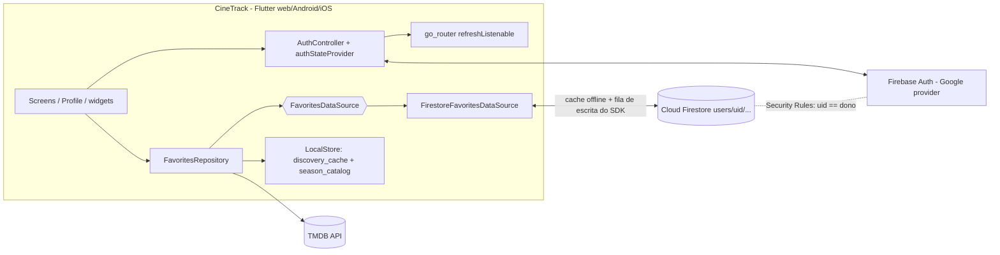
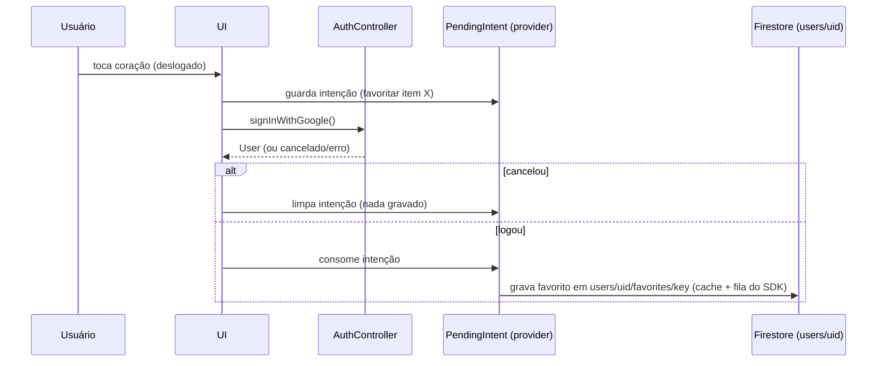

# Design: Login com Google, Perfil e dados por usuário na nuvem

> Autor: Arquiteto · Entrada: [`07-especificacao-login-perfil.md`](./07-especificacao-login-perfil.md) · Decisão: [`adr/adr-003-firebase-auth-e-persistencia-na-nuvem.md`](./adr/adr-003-firebase-auth-e-persistencia-na-nuvem.md) (Proposta) · Revisa a premissa "somente local" do [ADR-001](./adr/adr-001-stack.md).
> Status: **proposta, aguardando aprovação do Manager** (decisões em "Decisões pendentes"). Nenhum código foi escrito.
>
> **Decisões do Manager já incorporadas (rev. 2):** (1) deslogado navega o catálogo; gravar exige login; **sem modo convidado**. (2) **Sem migração Hive→nuvem**: os dados locais atuais podem ser abandonados (a antiga Fatia 3 e o "Remover cópia local" foram eliminados). (3) **Logout não limpa nada local**; a garantia exigida é que tudo feito após o login seja persistido por usuário, sem perda e sem vazamento entre contas (tratada como NFR, ver "Isolamento do cache local por uid"). (4) iOS na App Store e Sign in with Apple: futuro, registrado como débito. (5) Texto de privacidade/LGPD validado.

## Contexto
Favoritos, `watchedMovie` e episódios assistidos vivem só no Hive local (`LocalStore`, box `favorites`). O Manager quer login Google, tela de Perfil e dados por usuário acessíveis de qualquer dispositivo (web no GitHub Pages, Android, iOS), com custo zero. O app hoje não tem backend, não tem identidade e a única credencial no cliente é a chave TMDB (que, aliás, já é compilada no bundle web via `--dart-define`, ou seja, já é pública na prática; fora de escopo, mas vale rotacionar/ciente).

**Restrições:** custo zero e sem cartão; sem servidor próprio para manter; web em site estático (GitHub Pages); 1 dev; dados reais do Manager (anos de histórico) não podem ser perdidos.

**Requisitos não funcionais**
| NFR | Meta |
|---|---|
| Latência percebida de uma marcação (favoritar/episódio) | UI atualiza imediatamente (otimista, < 100 ms), sync em segundo plano |
| Abertura do app logado | lista de favoritos vinda do cache local em < 1 s, mesmo offline |
| Disponibilidade | app utilizável (leitura + marcação) sem rede e com cota/serviço fora do ar |
| Consistência | eventual; marcações concorrentes em dispositivos distintos nunca se perdem (merge por campo) |
| Isolamento | usuário A nunca lê/escreve dado de B (imposto no servidor, não no cliente) |
| **Persistência por usuário sem perda e sem vazamento (NFR do Manager)** | Toda escrita feita logado é durável (cache local + fila) e chega à conta *do uid que a fez*, mesmo se o app fechar offline ou se outra conta logar antes do envio. Nenhuma tela lê dado de outro uid, no servidor ou no cache. Logout não apaga nada local |
| Custo | US$ 0, sem cartão (plano Spark); uso esperado < 5% das cotas diárias |
| Privacidade/LGPD | guardar o mínimo (uid + apelido + listas); e-mail/foto não copiados para o banco; exclusão real |
| Dados locais legados | abandonados por decisão do Manager (sem migração); box Hive `favorites` não é lido nem apagado pelo app novo |

## Fatos verificados (e o que NÃO foi verificado)
Verificados em 2026-10-02 contra a documentação oficial:
- **Spark (sem cartão), Firestore:** 1 GiB armazenado, 50 mil leituras/dia, 20 mil escritas/dia, 20 mil deletes/dia, 10 GiB/mês de saída; um banco gratuito por projeto. Documento máx. 1 MiB. Backups/PITR/TTL exigem billing. Fonte: firebase.google.com/pricing e /docs/firestore/quotas.
- **Spark, Auth:** sem custo até 50 mil MAU (login Google); SMS/telefone não se aplica.
- **Chave de API do Firebase não é segredo:** a doc diz que as chaves de serviços Firebase "são OK em código ou arquivos de configuração versionados"; a proteção real são as Security Rules (+ restrições de chave e App Check opcional). Fonte: firebase.google.com/docs/projects/api-keys.
- **Google Sign-In com firebase_auth:** web usa `signInWithPopup`/`signInWithRedirect` com `GoogleAuthProvider` (sem `google_sign_in`); Android/iOS exigem o pacote `google_sign_in` + `signInWithCredential`. Android precisa de SHA-1 cadastrada; iOS precisa só do provider ativo + config do app. Fonte: firebase.google.com/docs/auth/flutter/federated-auth.
- **Persistência offline do Firestore:** ligada por padrão em Android/Apple, **desligada por padrão na web**; cache padrão 100 MB; web tem modo multi-aba opcional; conflito = last-write-wins por documento/campo. Fonte: /docs/firestore/manage-data/enable-offline.
- **Exclusão de usuário:** `delete()` exige login recente (senão `requires-recent-login`; reautenticar). A extensão "Delete User Data" existe, mas ver abaixo (exige Blaze).
- **Versões atuais no pub.dev (consultadas hoje):** `firebase_core 4.15.0`, `firebase_auth 6.7.0`, `cloud_firestore 6.10.0`, `google_sign_in 7.2.0`. Os quatro suportam web, Android e iOS.
- **Supabase Free:** 500 MB de banco, 50 mil MAU, 2 projetos ativos, **projeto pausa após 1 semana de inatividade**. **Drive appData:** escopo `drive.appdata` é *não sensível*, pasta oculta ao usuário; no web o `google_sign_in` 7.x não renova o access token (expira em 1 h) e exige o botão renderizado pelo SDK.

**Não verificado (confiança baixa; a validar no spike da Fatia 1/2):**
1. Se as versões acima resolvem com o SDK/Flutter do projeto (`sdk: >=3.3.0 <4.0.0`; CI com Flutter 3.47.5) junto de `riverpod 2.5`/`go_router 14`. Rodar `flutter pub add` e checar o resolver antes de prometer prazo. Não invento versão: usar a que o resolver aceitar.
2. Que Cloud Functions, Cloud Storage, backups/PITR e a extensão "Delete User Data" exigem plano Blaze (sei de fontes anteriores; só os backups/PITR/TTL foram confirmados hoje). Premissa do design: **não há código no servidor**.
3. Comportamento exato de estouro de cota na Spark (a página de preços fala em "preço padrão do Google Cloud ao exceder", mas sem cartão não há como cobrar). Assumo: **operações passam a falhar até o reset diário**; confirmar no Console e **não ativar Blaze**.
4. Se a cota gratuita do Firestore vale para qualquer região do banco (inclusive `southamerica-east1`). Ver decisão pendente de região.
5. Nome/API exata do gerenciador multi-aba na web em `cloud_firestore` 6.x e a necessidade de `serverClientId` no `google_sign_in` 7.x Android (Credential Manager). Itens do spike S1.
5b. **Que a fila de escritas pendentes do SDK é separada por uid** (pelo que conheço da arquitetura do SDK, as mutações pendentes são guardadas por usuário e só as do usuário autenticado são enviadas). Não encontrei isso na documentação oficial: é a base do NFR de isolamento e precisa de teste automatizado/manual no spike S1 (ver "Isolamento do cache local por uid"). Se falhar, o fallback é o `FavoritesDataSource` manter uma outbox própria por uid.
6. Se o SDK JS do Firebase é carregado em runtime do CDN `gstatic` por `firebase_core_web` (esperado; não exigiria mexer no `web/index.html`). Conferir no build.
7. Se o fluxo `signInWithRedirect` quebra no GitHub Pages por particionamento de storage de terceiros (authDomain `*.firebaseapp.com` ≠ `celsofabri.github.io`). Tenho memória disso, não verifiquei: por isso a escolha é **popup**.

## Opções consideradas
| Opção | Prós | Contras | Custo / risco de o free tier mudar |
|---|---|---|---|
| **A. Firebase Auth + Cloud Firestore (Spark)** | Um SDK oficial para Auth + banco + **offline/fila de escrita/merge por campo prontos**; Google login nas 3 plataformas; sem servidor; Security Rules impõem isolamento; 50k MAU / 50k leituras/dia sobram ~20x para uso pessoal | Lock-in no Google (mitigado por camada `DataSource` + exportação); sem backup gerenciado no Spark; sem código de servidor (exclusão e validações só no cliente + rules); config por plataforma (SHA-1, plist) | US$ 0 sem cartão. Risco médio-baixo: Google já mexeu em cotas/planos de produtos Firebase (Storage); Firestore é produto central, mas **sem garantia contratual**. Mitigação: abstração + export |
| **B. Supabase Free (Auth Google + Postgres + RLS)** | Postgres/SQL, RLS expressiva, exportável (pg_dump), menos lock-in | **Projeto pausa após 1 semana de inatividade** (app pessoal de uso irregular = login quebrado ao voltar); limite de 2 projetos; **sem offline pronto**: precisaria de Hive como cache + outbox + resolução de conflito feitos à mão (o item mais arriscado do projeto); deep-link/OAuth no mobile mais manual; web precisa de redirect/popup próprio | US$ 0. Risco médio: pausa já é limite documentado; regras do free podem apertar |
| **C. Google Sign-In + Drive `appDataFolder` (JSON por usuário)** | 100% sob a conta do usuário (privacidade máxima, exclusão = apagar o app data), sem projeto de banco, escopo não sensível | Sem consulta/merge: arquivo inteiro com ETag, conflito multi-dispositivo e fila offline todos feitos à mão; **no web o token expira em 1 h sem refresh** e exige o botão do SDK (UX/arquitetura piores); sem isolamento "imposto" (é só o token); latência de Drive API; consent screen do OAuth ainda precisa de projeto no Google Cloud (modo teste tem limites que não verifiquei) | US$ 0. Risco baixo de cobrança, mas **alto de complexidade/UX**. Sheets descartado (escopo sensível, verificação OAuth) |
| **D. Firebase Auth + Realtime Database** | Mesmo ecossistema; modelo JSON simples | Persistência offline nativa fraca na web; rules menos expressivas; consulta pobre; Firestore é o caminho recomendado hoje | US$ 0; sem vantagem sobre A |
| **E. Backend próprio (Cloudflare Workers+D1, PocketBase/Appwrite hospedado)** | Controle total, exportável | Contraria "sem infra própria" (ADR-001): código de servidor, deploy, segredos, manutenção; PocketBase self-host precisa de máquina 24/7 (não é grátis de verdade); não aprofundei limites | Free tiers existem, **não verificados**; custo real = tempo |

### Escolha: **A — Firebase Auth + Cloud Firestore no plano Spark**
Justificativa: o requisito mais difícil e mais perigoso do spec é *offline + fila + conflito multi-dispositivo sem perder marcação* (Fatia 4). Em A isso vem do SDK e o modelo de dados (mapa de episódios com atualização por caminho de campo) resolve o merge nativamente. Em B e C teríamos de construir e testar um motor de sync. Os limites gratuitos têm folga de ~20x. O risco principal (lock-in/mudança de plano) é tratado com a camada `FavoritesDataSource` (troca de backend sem tocar UI) e com a exportação JSON (fatia futura). Não escolhemos B porque a pausa por inatividade e a ausência de offline pronto atacam diretamente o objetivo do Manager.

## Solução escolhida



Descrição:
- **Identidade:** `firebase_auth`. Web: `signInWithPopup(GoogleAuthProvider())` chamado sincronamente no toque (evita bloqueio de popup, principalmente no Safari). Android/iOS: `google_sign_in` (`GoogleSignIn.instance.authenticate()`) → `GoogleAuthProvider.credential(idToken)` → `signInWithCredential`. Sessão persistida pelo SDK.
- **Dados:** Firestore, tudo sob `users/{uid}`. O cliente nunca usa `uid` de terceiros; as rules garantem.
- **Offline/cache:** a persistência do próprio Firestore *é* o cache e a fila de escrita (ver seção própria). O Hive deixa de guardar dados do usuário.
- **Catálogo (TMDB) continua local:** `discovery_cache` (ADR-002) e um novo box `season_catalog` (episódios/datas de exibição por série, rebaixáveis do TMDB). Não vão para a nuvem.

### Fluxo de login e intenção pós-login



## Contratos

### Modelo de dados Firestore
Decisão: **um documento por favorito** (não um documento único por usuário).

| Caminho | Conteúdo |
|---|---|
| `users/{uid}` | `displayName` (apelido, 1-40, opcional), `schemaVersion` (int), `updatedAt`, `deleting` (bool, marcador de exclusão em andamento). **Sem e-mail, sem foto, sem nome Google** (vêm do `User` do Auth em runtime; "membro desde" = `user.metadata.creationTime`) |
| `users/{uid}/favorites/{key}` | `key` = `FavoriteItem.storageKey` (`'{id}-{movie|tv}'`, preserva a chave composta do spec). Campos: `id`, `mediaType`, `title`, `posterPath`, `overview`, `addedAt` (timestamp), `lastWatchedAt` (timestamp, null), `watchedMovie` (bool), `seasonSummaries` (lista de `{seasonNumber,name,episodeCount}`), `eps` (mapa), `updatedAt` |

**Onde fica o progresso de episódios:** no próprio documento da série, no mapa `eps`, com chave `"{season}_{episode}"` e valor `true` somente para episódios assistidos. Marcar = `update({'eps.1_2': true})`; desmarcar = `update({'eps.1_2': FieldValue.delete()})`; "marcar temporada" = **uma** escrita com N caminhos. Cada caminho de campo é mesclado pelo servidor.

**Por que documento por favorito e não um doc por usuário:** (1) conflito de dois dispositivos em séries diferentes nem se toca; (2) doc único de usuário cresceria até o limite de 1 MiB e é reescrito inteiro a cada toque; (3) a leitura da lista é 1 query (`users/{uid}/favorites`) com cache incremental. **Por que `eps` dentro do doc da série e não doc por episódio:** uma série longa com 600 episódios geraria 600 documentos (600 leituras a cada abertura, 600 escritas na migração), queimando as cotas; um mapa de ~600 entradas pesa ~15-25 KB (<< 1 MiB). Mapa com chaves compostas evita arrays (arrays não mesclam por elemento).

**O que NÃO vai para a nuvem:** `FavoriteItem.seasons` com lista completa de episódios (nomes, `airDate`). É catálogo TMDB, rebaixável, e pesaria. Fica no box local `season_catalog`. O repositório *hidrata* o `FavoriteItem` (mantendo a forma pública atual, para não mexer em telas nem em `ProgressCalculator`): doc da nuvem + episódios do catálogo local + overlay `watched` vindo de `eps`. Se o catálogo da série não estiver no cache (aparelho novo), `loadSeason` busca no TMDB como já faz hoje. Estatística "séries concluídas" usa o catálogo local quando existe, senão `seasonSummaries.episodeCount` (nuance a confirmar com PA: episódio não exibido ainda).

**Resolução de conflito (spec ❓):** merge por caminho de campo; mesmo episódio nos dois lados → último a *chegar ao servidor* vence (determinístico, sem relógio do cliente, resolvendo o risco de relógio errado do spec). Divergência assumida do spec: uma desmarcação feita offline e enviada tarde pode sobrescrever uma marcação mais nova do outro aparelho (spec dizia "último a alterar"). Impacto: raro, 1 episódio, reversível. `addedAt`: mais antigo (na migração; nas rules só pode diminuir). `lastWatchedAt`: `FieldValue.serverTimestamp()` em toda marcação (evita dispositivo "do futuro" vencer sempre). `watchedMovie`: boolean simples, last-write-wins.

### Estimativa de custo no free tier (uso esperado, 1 usuário, ~100 favoritos, ~15 aberturas/dia, ~50 marcações/dia)
| Operação | Conta | Total/dia | % da cota |
|---|---|---|---|
| Abrir app (listener da coleção; cache local resume só o que mudou se <30 min, senão relê tudo) | até ~100 leituras × 15 | ~1.500 leituras (pior caso) | 3% de 50k |
| Marcar episódio / filme / favoritar | 1 escrita cada | ~50 escritas | 0,25% de 20k |
| Atualizar `lastWatchedAt` junto da marcação | mesmo update | 0 extra | - |
| Exclusão de conta com 500 itens | 500 deletes | 500 | 2,5% de 20k |
| Armazenamento | ~100 docs × ~3-25 KB | < 3 MB por usuário | 0,3% de 1 GiB |
Folga: ~30 usuários iguais ao Manager caberiam nas leituras diárias. A cota zera diariamente (fuso do Pacífico, a confirmar). Sem índices compostos (ordenação feita no cliente, como hoje).

### Security Rules (`firestore.rules`)
```
rules_version = '2';
service cloud.firestore {
  match /databases/{database}/documents {

    function isOwner(uid) {
      return request.auth != null && request.auth.uid == uid;
    }

    function validProfile() {
      let d = request.resource.data;
      return d.keys().hasOnly(['displayName', 'schemaVersion', 'updatedAt', 'deleting'])
        && (!('displayName' in d) || (d.displayName is string
              && d.displayName.trim().size() >= 1 && d.displayName.size() <= 40))
        && (!('schemaVersion' in d) || d.schemaVersion is int)
        && (!('deleting' in d) || d.deleting is bool);
    }

    function validFavorite(key) {
      let d = request.resource.data;
      return key.matches('^[0-9]{1,9}-(movie|tv)$')
        && d.keys().hasOnly(['id', 'mediaType', 'title', 'posterPath', 'overview', 'addedAt',
                             'lastWatchedAt', 'watchedMovie', 'seasonSummaries', 'eps', 'updatedAt'])
        && d.keys().hasAll(['id', 'mediaType', 'title', 'addedAt'])
        && d.id is int && d.id == int(key.split('-')[0])
        && d.mediaType in ['movie', 'tv'] && d.mediaType == key.split('-')[1]
        && d.title is string && d.title.size() <= 300
        && (!('overview' in d) || (d.overview is string && d.overview.size() <= 4000))
        && (!('posterPath' in d) || d.posterPath == null
              || (d.posterPath is string && d.posterPath.size() <= 200))
        && d.addedAt is timestamp
        && (!('lastWatchedAt' in d) || d.lastWatchedAt == null || d.lastWatchedAt is timestamp)
        && (!('watchedMovie' in d) || d.watchedMovie is bool)
        && (!('seasonSummaries' in d) || (d.seasonSummaries is list && d.seasonSummaries.size() <= 100))
        && (!('eps' in d) || (d.eps is map && d.eps.size() <= 5000));
    }

    match /users/{uid} {
      allow read, delete: if isOwner(uid);
      allow create, update: if isOwner(uid) && validProfile();

      match /favorites/{key} {
        allow read, delete: if isOwner(uid);
        allow create: if isOwner(uid) && validFavorite(key);
        // addedAt so pode diminuir (nunca avanca)
        allow update: if isOwner(uid) && validFavorite(key)
          && request.resource.data.addedAt <= resource.data.addedAt;
      }
    }

    // Tudo o que nao foi liberado acima e negado (inclusive subcolecoes futuras).
    match /{document=**} {
      allow read, write: if false;
    }
  }
}
```
Notas: (1) `list` está coberto por `read`. (2) Funções `int()`, `split()`, `trim()`, `matches()` existem na linguagem de rules, mas **não testei esta regra**: a Fatia 2 tem como critério de pronto uma suíte de testes de rules no Emulator (usuário A lê/escreve B → negado; sem auth → negado; chave inválida; campo extra; `title` gigante; `addedAt` crescente). (3) Rules não impedem um usuário autenticado malicioso de gastar a *própria* cota de escritas (risco de DoS de cota, ver Riscos).

### Offline / sincronização: escolha — **persistência nativa do Firestore** (Hive fica só com cache de catálogo)
| | A1. Persistência offline do Firestore | A2. Hive como cache + outbox própria |
|---|---|---|
| Fila de escrita, retry, ordem | pronto no SDK | a construir e testar |
| Merge multi-dispositivo | por campo no servidor | a construir |
| Estado "pendente" por documento | `metadata.hasPendingWrites` | a construir |
| Isolamento por uid da fila de escrita | do SDK (a validar no spike S1) | por nossa conta |
| Compatível com "logout não limpa" | sim | sim |
Escolho **A1**: o item mais caro e arriscado do projeto vem pronto. Cuidados obrigatórios:
- **Web:** persistência é desligada por padrão; ligar explicitamente (`Settings(persistenceEnabled: true)`), com modo multi-aba (spec cita aba duplicada); fallback silencioso para memória se o navegador negar (modo anônimo) com aviso "dados não ficarão offline".
- **Indicador de sync:** `snapshots(includeMetadataChanges: true)`: `hasPendingWrites`/`fromCache` → "Sincronizado / Pendente / Offline".
- **Logout não limpa nada local** (decisão do Manager). Ver seção seguinte para como isso é seguro entre contas. Logout só encerra a sessão Auth e desliga os listeners; providers de dados são recriados por uid.
- **Primeiro login sem rede / leitura falhou:** distinguir "erro" de "vazio" usando `fromCache` + `snapshot.error` (cenário do spec); nunca mostrar "você não tem favoritos" por falha.
- **Sessão expirada:** erros `permission-denied`/`unauthenticated` ao sincronizar → banner "Sessão expirada"; pendências ficam no cache até novo login do *mesmo* uid.
- **Cota esgotada:** `resource-exhausted` → comportamento offline + mensagem honesta.
- Itens do spike S1 (não verificados): API multi-aba web, **fila de pendências por uid (5b)**, `serverClientId` no Android.

### Isolamento do cache local por uid (NFR do Manager: sem perda, sem vazamento)
Com "logout não limpa nada local", a garantia vem de quatro camadas, nenhuma depende de apagar cache:
1. **Servidor (barreira real):** rules `request.auth.uid == uid`. Um uid nunca lê/escreve dados de outro, por mais que o cliente erre.
2. **Leitura sempre escopada ao uid logado:** o único caminho de leitura de dados do usuário é `FirestoreFavoritesDataSource(uid)`, que consulta `users/{uid}/favorites`. Ele é criado por `favoritesDataSourceProvider`, que depende do `authStateProvider`; **deslogado devolve um data source vazio** (leitura vazia, escrita lança `AuthRequiredException`); ao trocar de conta, o provider é descartado e recriado, derrubando listeners e estado em memória da conta anterior. Não existe API "leia tudo do cache".
3. **Escritas pendentes ficam amarradas a quem as fez (premissa a validar, item 5b):** o SDK mantém as mutações pendentes por usuário autenticado; as de Ana continuam guardadas no aparelho quando Bruno loga e só são enviadas quando Ana voltar. Resultado: nada se perde no logout e nada de Ana é gravado na conta de Bruno (e, mesmo que fosse tentado, as rules negariam). Isso substitui o diálogo "Sincronizar e sair / Sair e descartar" do default do spec, que o Manager dispensou.
4. **Caches não pessoais:** `discovery_cache` e `season_catalog` (TMDB) não têm dado do usuário e são globais; não precisam de isolamento. `season_catalog` guarda só episódios/datas, **nunca** flags `watched` (vêm da nuvem), então não vaza progresso entre contas.

Risco residual aceito: o cache de documentos do Firestore (IndexedDB na web / SQLite no mobile) continua no disco com os dados da última conta. A aplicação não os expõe a outro uid (item 2), mas quem inspecionar o armazenamento do navegador/aparelho consegue ver. Em aparelho/navegador compartilhado isso é uma exposição de privacidade que o Manager aceitou ao decidir que logout não limpa. Mitigação futura barata: botão opcional "Sair e limpar este aparelho" (`terminate`+`clearPersistence`, a spikar).

Testes obrigatórios (Fatia 2/3): (a) Ana marca offline, faz logout, Bruno loga online: a conta de Bruno não recebe nada; Ana volta e a marcação chega à conta dela; (b) Bruno nunca vê favorito de Ana em nenhuma tela/estatística; (c) rules: A→B negado.

### Dados locais legados: sem migração (decisão do Manager)
- O box Hive `favorites` **não é migrado, lido nem apagado** pelo app novo. O Manager aceitou abandonar esses dados. Os cenários de migração do spec (importação, merge, verificação, "Agora não", "Importar dados deste aparelho", "Remover cópia local") **ficam fora de escopo** e a antiga Fatia 3 foi removida.
- **`LocalStore` permanece**, enxuto: continua dono de `Hive.initFlutter()`, do box `discovery_cache` (ADR-002 inalterado) e ganha `season_catalog`. Os métodos `readAll/read/save/delete/watch` do box `favorites` e a abertura desse box podem ser **removidos do código**; os bytes antigos ficam no disco sem uso (sem custo; limpeza não é necessária). Se o Manager mudar de ideia sobre os dados antigos, a importação continua sendo viável depois porque o box não é apagado (nova demanda).
- Consequência para o usuário: ao atualizar o app, os favoritos antigos deixam de aparecer; recomeça-se do zero na conta. Avisar na nota de release. Rollback do app para a versão anterior reexibe os dados locais antigos (intactos).

## Impacto nas camadas atuais
| Camada | Mudança |
|---|---|
| `lib/models/*` | `FavoriteItem` **mantém** sua forma (telas e `ProgressCalculator` intactos). Adicionar `toFirestore/fromFirestore` (ou mapper separado) para `eps`/`seasonSummaries`; `toJson/fromJson` permanecem (úteis à futura exportação) |
| `LocalStore` | Permanece (init do Hive + `discovery_cache`, ADR-002 inalterado). Remove-se o acesso ao box `favorites` (`readAll/read/save/delete/watch`). Novo: box `season_catalog` (episódios/datas por série; sem flags `watched`) |
| `FavoritesRepository` | Hoje faz *read-modify-write* de um `FavoriteItem` inteiro no Hive. Passa a depender de `FavoritesDataSource` (interface: `watchAll()`, `add`, `remove`, `setWatchedMovie`, `setEpisode(s)`, `setSeasonEpisodes`) e fazer **escritas por intenção** (um caminho de campo), não reescrita do objeto. Fica com a hidratação (cloud + catálogo). `addTvShow` hoje faz `await` do TMDB *antes* de gravar: inverter (grava o favorito já, `seasonSummaries` entra num `update` depois, best-effort). `lastWatchedAt` = `serverTimestamp`. Deslogado: `AuthRequiredException` em escritas |
| `providers.dart` | Novos: `firebaseAppProvider`/init, `authStateProvider` (`StreamProvider<AppUser?>` sobre `authStateChanges`), `authControllerProvider` (login/logout/delete, estado de loading anti-duplo-toque, erros tipados), `favoritesDataSourceProvider` (depende do uid; **recriado ao trocar de usuário**; deslogado = data source vazio; nunca compartilha estado entre contas), `pendingIntentProvider`, `syncStatusProvider`, `profileStatsProvider` (derivação pura de `favoritesListProvider`, como `continueWatchingProvider`). `favoritesListProvider`/`continueWatchingProvider` não mudam de contrato |
| `main.dart` | `Firebase.initializeApp(options: DefaultFirebaseOptions.currentPlatform)` antes do `runApp`; configurar `Settings` do Firestore; `AppSplash` aguarda o **primeiro** evento de `authStateChanges` (evita piscar "deslogado", requisito do spec) |
| go_router | Catálogo continua público. `refreshListenable` ligado ao `authStateProvider`. Nova rota `/profile` com `redirect`: deslogado → `/` com convite de login. Ações de escrita (coração/marcar) chamam `requireLogin(intent)` na UI: grava `FavoriteIntent`/`WatchIntent` em `pendingIntentProvider`, dispara login; após sucesso (e após decidir a migração) executa e limpa; se cancelar, limpa. Intenção só em memória (popup mantém a página); se um dia usar redirect, persistir no Hive |
| UI | Botão "Entrar com Google" (web: chamada síncrona no `onPressed`), avatar no topo da home → `/profile`; tela de Perfil; banner de sync; diálogos (importar, sair com pendência, excluir). Tratamento de erros mapeado em `AuthFailure` (cancelado, sem rede, popup bloqueado, domínio não autorizado, genérico) |
| Testes | Fakes em memória de `FavoritesDataSource` e `AuthRepository` para unit/widget (sem conta Google real). Rules testadas no Firebase Emulator (Node + Java locais). Avaliar `fake_cloud_firestore`/`firebase_auth_mocks` (verificar existência e versão no pub.dev antes de adotar) |

## Configuração do web no GitHub Pages
- **Domínio autorizado:** Console → Authentication → Settings → Authorized domains: adicionar `celsofabri.github.io` (só o host, sem `/cinetrack`). `localhost` já vem autorizado. Sem isso o popup falha com `auth/unauthorized-domain` (tratar com mensagem clara).
- **Chaves no CI: não precisam ser secrets.** `firebase_options.dart` (gerado pelo FlutterFire CLI), `google-services.json` e `GoogleService-Info.plist` contêm identificadores públicos por design. Decisão recomendada: **versionar** esses arquivos; o workflow `deploy-pages.yml` **não muda** para o Firebase. (Alternativa descartada: injetar via `--dart-define`/secrets: complica sem ganho de segurança; só se o Manager preferir não ver as chaves no repo, ver Decisões pendentes.) O secret `TMDB_API_KEY` continua como está.
- **Proteção real:** (1) Security Rules acima; (2) restringir as API keys no Google Cloud Console: chave web por *HTTP referrer* (`https://celsofabri.github.io/*` e `http://localhost:*/*`), chave Android por package `com.celsofabrijr.cinetrack` + SHA-1, chave iOS por bundle id; manter nas allowlists só APIs necessárias (Identity Toolkit, Secure Token, Firestore, Firebase Installations, Firebase Management se pedido); testar login após restringir; (3) App Check: fora da v1 (ver Riscos).
- O hosting continua sendo GitHub Pages (não usar Firebase Hosting). O `web/index.html` provavelmente não muda (item 6 não verificado).
- A etapa de CI `flutter analyze/test` roda com os arquivos versionados; testes que tocam Firebase usam fakes (nada de rede no CI).

## Exclusão de conta (LGPD)
Sem Cloud Functions (Blaze) e sem a extensão Delete User Data, a exclusão é **orquestrada no cliente e retomável**:
1. Online obrigatório (offline → mensagem, nada apagado). Reautenticar com a mesma conta: web `reauthenticateWithPopup`, nativo `google_sign_in` + `reauthenticateWithCredential` (confirmar mesmo `uid`).
2. Gravar `users/{uid}.deleting = true` (marcador).
3. Apagar `favorites` em lotes (≤ 400 por batch, paginado) e depois `users/{uid}`.
4. `currentUser.delete()` (já reautenticado); as exclusões já refletem no cache do SDK (nenhum `clearPersistence` necessário); deslogar.
5. Falha em qualquer passo: estado consistente ou retomável: ao próximo login, se `deleting == true`, o app oferece concluir a exclusão. (Se o passo 4 falhar após o 3, o usuário Auth fica sem dados; retry resolve.)
Retenção: o spec pede "sem retenção"; **não verificado** se o Google mantém backups técnicos de Firestore/Auth por prazo após exclusão. Informar ao Manager na política de privacidade como "pode haver cópias técnicas temporárias no provedor". Backups gerenciados do Firestore estão **indisponíveis** no Spark (logo, nenhuma retenção por iniciativa nossa).

## Observabilidade (possível no free tier)
- **Sem telemetria remota própria** (ADR-001 e spec). O que dá para ver, de graça: Console → Firestore → Usage (leituras/escritas/deletes diários vs. cota), Authentication → Users (contagem). Alertas de orçamento exigem billing: **não disponíveis**. Rotina sugerida: o Manager olha o Usage no 1º mês.
- **No app (sem PII):** `syncStatusProvider` (sincronizado/pendente/offline/erro + código do erro Firebase), tela "Diagnóstico" opcional no Perfil: nº de pendências, último sync, último código de erro. Logs só com códigos (`permission-denied`, `resource-exhausted`...), jamais e-mail, nome ou token.
- Crashlytics é gratuito mas não cobre web e adiciona dependência/telemetria: **decisão pendente** (default: não).
- Sinais de alarme: `resource-exhausted` (cota), `permission-denied` em operações próprias (rules/uid errado), divergência entre pendências esperadas e sincronizadas.

## Estratégia de rollout e rollback
- **Feature flag de build:** `--dart-define=CLOUD_SYNC=true|false` liga/desliga login e camada de nuvem (desligado = build equivalente à atual, só leitura de catálogo). Fatia 1 (só identidade) pode ir sem flag (não toca dados). Fatias 2-4 ficam atrás do flag até o Manager validar.
- **Ordem:** (1) criar projeto + rules em modo fechado antes de qualquer deploy; (2) Fatia 1; (3) Fatia 2 (nuvem + isolamento); (4) Fatia 3 (offline robusto); (5) Fatia 4 (perfil/exclusão) **antes de qualquer outra pessoa usar o app**.
- **Rollback app:** reverter o commit/redeploy do workflow anterior (Pages) ou `CLOUD_SYNC=false`: o Hive antigo nunca é alterado, então a versão antiga volta a funcionar com os dados locais antigos; o que foi gravado na nuvem fica preservado lá, mas não aparece na versão antiga.
- **Rollback de rules:** manter `firestore.rules` versionado; republicar a versão anterior no Console (ou `firebase deploy --only firestore:rules`). Mudanças de schema na nuvem são só *aditivas* (expandir → migrar → contrair no futuro); campos novos opcionais.
- **Mobile:** Android/iOS são builds pessoais (APK/sideload); rollback = reinstalar o build anterior.

## Riscos
| Risco | Prob. | Impacto | Mitigação |
|---|---|---|---|
| Dados locais antigos "somem" da UI ao atualizar (abandono aceito) | Certa | Baixo (decidido) | Nota de release; box Hive não é apagado; rollback reexibe |
| Fila de pendências do SDK não ser separada por uid (item 5b) → escrita de Ana perdida/negada ao Bruno logar | Baixa-Média | Médio | Spike S1 + teste (a); fallback: outbox própria por uid no data source |
| Cache do Firestore permanece no disco após logout (decisão do Manager) → exposição em aparelho compartilhado | Média (só se compartilhado) | Baixo-Médio | App só lê o uid logado; aviso na política de privacidade; futuro botão "Sair e limpar" |
| Google muda free tier / lock-in | Baixa-Média | Médio | `FavoritesDataSource`, exportação JSON, mapa de dados simples e portável |
| Cota diária esgotada por abuso (chave pública + conta Google qualquer grava no próprio espaço) | Baixa | Médio (app vira offline-only até o reset) | Rules limitam tamanhos; restrição de chaves; App Check pós-v1; opção de allowlist de uid; app já degrada para offline |
| Popup bloqueado / navegador sem storage (anônimo, Safari ITP) | Média | Baixo | Chamada síncrona no gesto, mensagem de erro específica, persistência em memória como fallback |
| Config por plataforma errada (SHA-1, plist, domínio) | Alta no começo | Baixo | Fatia 1 existe para isso; checklist no passo a passo |
| Versões de pacote incompatíveis com o SDK/CI atual | Média | Médio | Verificar no resolver antes de planejar (item 1 de "não verificado") |
| Mudar o `addTvShow` (await TMDB antes de gravar) causa regressão | Média | Baixo | Teste de contrato antes de refatorar (TEAM: cobrir antes de mudar) |
| iOS sem Apple Developer pago: assinatura de 7 dias; **débito: Sign in with Apple** exigido para publicar na App Store | Alta (iOS) | Baixo agora | iOS como build pessoal; App Store é futuro (nova demanda) |
| Domínio do Pages ou nome do repositório mudar | Baixa | Médio | Domínio autorizado e referrer da chave são config; ajustar no Console |

## Tarefas técnicas sugeridas (para o Orquestrador)
Legenda: **BE** = Dev Backend/config (Firebase, rules, CI, config nativa, camada de dados); **FE** = Dev Frontend (telas, providers de UI, rotas).

**Pré-requisito (Manager):** executar o "Passo a passo manual" e entregar `firebase_options.dart`/`google-services.json`/`GoogleService-Info.plist` (ou rodar o `flutterfire configure` junto do dev).

**Fatia 1 — Identidade**
- BE: spike S1 (resolver de dependências com as versões do pub.dev; login web popup em localhost e no Pages; Android com SHA-1; iOS; `serverClientId`; **teste da fila de pendências por uid, item 5b**); adicionar `firebase_core`, `firebase_auth`, `google_sign_in` (e já `cloud_firestore`); `AuthRepository` (interface + impl Firebase + fake) com `AuthFailure` tipado; init no `main.dart`; flutterfire config; restrição das API keys.
- FE: `authStateProvider`, `AuthController` (anti-duplo-toque), botão "Entrar com Google", avatar na home, `/profile` mínima (nome/foto/e-mail/Sair com confirmação), splash aguardando 1º estado de auth, guard de `/profile`, mensagens de erro.
- Testes: widget (estados de login, cancelado, popup bloqueado) com `FakeAuthRepository`.

**Fatia 2 — Dados por usuário + isolamento** (inclui o NFR "sem perda, sem vazamento")
- BE: `firestore.rules` + testes no Emulator; `FavoritesDataSource` + `FirestoreFavoritesDataSource` + data source vazio (deslogado) + fake em memória; flag `CLOUD_SYNC`; `season_catalog` no `LocalStore` e remoção do acesso ao box `favorites`; refatorar `FavoritesRepository` para escritas por intenção + hidratação; **testes de contrato do comportamento atual antes de refatorar**; `Settings` de persistência (web multi-aba).
- FE: `requireLogin(intent)` e `pendingIntentProvider` nos corações/marcações; estado deslogado (convite na home); troca de conta (providers recriados por uid); nota de release sobre o abandono dos dados locais antigos.
- Testes: unit do mapper e do merge por campo; widget deslogado→login→intenção executada/cancelada; rules (isolamento); testes (a)(b)(c) de isolamento do cache.

**Fatia 3 — Offline e sync robusto** (antiga Fatia 4; a antiga Fatia 3 de migração foi removida)
- BE: mapeamento de erros (`resource-exhausted`, `unauthenticated`, `permission-denied`), erro vs. vazio no primeiro login, testes de conflito (dois clientes, `eps`), sessão expirada preservando pendências.
- FE: `syncStatusProvider` + indicador/banners, estados de erro com "Tentar novamente".

**Fatia 4 — Perfil completo e conta** (antiga Fatia 5)
- BE: `deleteAccount()` retomável (reauth, `deleting`, batches, `User.delete`), apelido (`displayName`) com rules, teste de exclusão no Emulator.
- FE: estatísticas (`profileStatsProvider`), apelido editável (validação 1-40, trim), diálogo de exclusão (acessível, teclado na web), reauth, mensagens; política de privacidade (texto já validado) como página estática no Pages + resumo no app.

**Fatia 5 (futura):** exportação JSON, tempo real entre dispositivos (já vem do listener), botão "Sair e limpar este aparelho", outros provedores, **Sign in with Apple (débito, necessário para App Store)**.

## Passo a passo manual do Manager
Tudo no navegador, sem cartão (manter o projeto no plano **Spark**; não ativar Blaze).
1. **Criar projeto:** console.firebase.google.com → Adicionar projeto (ex.: `cinetrack-celso`). Desligar Google Analytics (ADR-001: sem telemetria).
2. **Ativar login Google:** Build → Authentication → Começar → Sign-in method → Google → Ativar, informar e-mail de suporte. Em Settings → Authorized domains, **adicionar `celsofabri.github.io`** (`localhost` já existe).
3. **Criar Firestore:** Build → Firestore Database → Criar banco (modo produção), região conforme decisão pendente (permanente). Aba Rules → colar `firestore.rules` (será entregue pelo dev, conteúdo na seção "Security Rules") → Publicar.
4. **Registrar apps** (Project settings → Your apps): **Web** (apelido `cinetrack-web`, sem Hosting); **Android** com package `com.celsofabrijr.cinetrack`; **iOS** com bundle id `com.celsofabrijr.cinetrack`. (Alternativa: `dart pub global activate flutterfire_cli` e `flutterfire configure` na pasta do projeto, que faz tudo e gera `lib/firebase_options.dart`.)
5. **SHA-1 do Android:** na pasta `android`, `./gradlew signingReport` (ou `keytool -list -v -keystore ~/.android/debug.keystore -alias androiddebugkey -storepass android -keypass android`). Cadastrar a SHA-1 do **debug** e, se instalar build release, a do **release**, em Project settings → app Android → Add fingerprint. Baixar de novo o `google-services.json`.
6. **iOS:** baixar `GoogleService-Info.plist`; o dev adiciona ao Runner e o URL scheme (REVERSED_CLIENT_ID) no `Info.plist`.
7. **Entregar ao dev** `firebase_options.dart`, `google-services.json`, `GoogleService-Info.plist` (podem ir ao repositório; são públicos por design).
8. **Restringir chaves:** console.cloud.google.com → projeto → APIs & Services → Credentials → cada API key: web = HTTP referrers (`https://celsofabri.github.io/*`, `http://localhost:*/*`); Android = package + SHA-1; iOS = bundle id. Testar login depois.
9. **GitHub:** nenhum secret novo é necessário se os arquivos forem versionados. Manter `TMDB_API_KEY`. (Só se optar por não versionar: criar secrets e avisar o dev para ajustar o workflow.) Confirmar que Pages está servindo de `celsofabri.github.io/cinetrack/`.
10. **Primeiro mês:** olhar Firestore → Usage 1x por semana.

## Decisões pendentes 🧑‍💼
**Já decididas pelo Manager (rev. 2):** deslogado navega e gravar exige login, sem convidado; sem migração (dados locais abandonados); logout não limpa nada local; iOS/App Store e Sign in with Apple = futuro (débito); texto de privacidade validado.

Do spec, ainda em aberto, com recomendação:
1. **Apelido editável:** recomendo sim (só `displayName`, 1-40). 2. **Estatísticas:** as do spec, calculadas sem contadores armazenados. 3. **Resolução de conflito:** aceitar "último a chegar ao servidor vence por episódio" (em vez de "último a alterar").
4. **Aceitar o risco residual de cache no disco após logout** (consequência direta da decisão 3 do Manager em aparelho/navegador compartilhado) e a dependência da premissa 5b (fila de pendências por uid), a validar no spike; fallback = outbox própria.

Minhas (novas):
5. **Aceitar o Firebase (Google) como dependência e o risco de lock-in/free tier mudar**, mitigado por abstração e exportação (ADR-003). Alternativa mais conservadora = opção B/C, com mais esforço e pior UX/robustez.
6. **Versionar `firebase_options.dart`/`google-services.json`/plist no repositório (recomendado) ou injetar por secrets/dart-define?**
7. **Região do Firestore:** `southamerica-east1` (menor latência) vs. `nam5`; escolher a que o Console mostrar com cota gratuita (item 4 não verificado). Escolha permanente.
8. **Quem pode usar o app?** Só o Manager ou aberto? Se só o Manager: opcional allowlist de uid nas rules (reduz risco de abuso de cota). Se aberto: Fatia 5 obrigatória antes e avaliar App Check.
9. **Crashlytics/telemetria de erros:** default não (ADR-001).
10. **Aviso de release:** confirmar que o Manager quer a nota "favoritos antigos locais não serão exibidos" no README/release.
11. **Rotacionar a chave TMDB:** ela já vai no bundle web público (observação, fora do escopo).

## Decisões do Manager (gate de arquitetura aprovado em 2026-10-02)
1. Firebase (Auth + Firestore, plano Spark) aceito como dependência, incluindo o risco de mudança do plano gratuito.
2. Região do Firestore: a recomendada, `southamerica-east1`.
3. `firebase_options.dart`, `google-services.json` e `GoogleService-Info.plist` versionados no repositório.
4. App **aberto a outras pessoas**: sem allowlist de uid. Exclusão de conta (Fatia 4) e mitigação de abuso de cota (avaliar App Check) são pré-requisito antes de divulgar o app.
5. Conflito no mesmo episódio: delegado ao Arquiteto, vale "último a chegar ao servidor vence por episódio".
6. Nota de release sobre os favoritos locais antigos: aceita, baixa prioridade (ninguém mais usa a versão atual).
7. Crashlytics/telemetria: fora.
8. Apelido editável (1-40) e estatísticas sem contadores armazenados: aceitos conforme recomendação.

## Registro de implementação (Fatias 1 e 2, rodada sem credenciais)
Implementado atrás das abstrações do design; **não** verificado de ponta a ponta (não há projeto Firebase). Desvios e decisões do dev, para o Code Reviewer:
1. **Gate de login por `AuthRequiredException`:** em vez de `requireLogin(intent)` antes da escrita, a UI chama `runWrite(context, ...)`; o repositório deslogado lança `AuthRequiredException`, que vira `PendingIntent` + login. Mesmo efeito, mantém os testes de tela existentes intactos. A intenção é reexecutada por `PendingIntentRunner` quando o uid aparece (com `Future.microtask`: dentro do listener o repositório do novo uid ainda não foi reconstruído; bug encontrado em teste).
2. **Escritas não aguardam o ack do servidor** (`FirestoreFavoritesDataSource._fire`): o `Future` de escrita do Firestore só completa online; aguardar travaria a UI offline. Erros do servidor (rules/cota) hoje só são logados (código); a exibição é trabalho da Fatia 3.
3. **`CLOUD_SYNC` desligado ou Firebase não configurado = sem gravação**, porque o box Hive `favorites` não é mais lido (decisão do Manager). O design diz "equivalente à atual"; isso só vale com nuvem ligada. Consequência: não publicar na `main` antes de configurar o Firebase.
4. `lib/firebase_options.dart` é *placeholder* (lança `UnsupportedError`); `initFirebase()` captura e o app abre sem login. `flutterfire configure` o substitui.
5. `FavoritesRepository` ganhou `dataSource` **opcional** (padrão: deslogado), para os fakes dos testes existentes continuarem compilando; a produção sempre injeta via `favoritesDataSourceProvider`. `isFavorite()` (sem uso) foi removido.
6. Documento da nuvem também grava `updatedAt` (serverTimestamp); o Firestore `get()` lê do cache primeiro (`Source.cache`) e cai para o padrão se falhar. `lastWatchedAt` = serverTimestamp (no cliente aparece como null até o ack; ordenação cai em `addedAt`).
7. Sem o catálogo local (aparelho novo), a série mostra progresso 0 até as temporadas serem abertas (`seasons` hidratado só com o que está no `season_catalog`); a estatística "concluídas" (Fatia 4) deve usar `seasonSummaries`.
8. Testes de regras executados localmente no Emulator (Firestore Emulator, JDK 24): 15/15 passaram, incluindo `int()/split()/trim()` do design (que estavam "não testadas"). O teste (a) de isolamento da fila offline usa um **modelo** da premissa 5b; o SDK real continua não verificado (spike S1).


### Rodada de correções do review (doc 09): B1, I2, I3, I4, I5, Q1, Q5
- **B1:** `.github/workflows/deploy-pages.yml` ganhou o passo "Ensure Firebase is configured" (antes de `pub get`/analyze/build): falha o job com `::error::` se `lib/firebase_options.dart` ainda contém `PLACEHOLDER`. Só faz `grep -q`; não lê nem imprime segredos. Obs.: o `flutterfire configure` sobrescreve o arquivo e o marcador some, liberando o deploy.
- **I2:** novo `FavoritesUnavailableException` (`favorites_data_source.dart`). `FirestoreFavoritesDataSource.get` o lança quando cache e servidor falham (antes o `FirebaseException` do fallback subia cru). Repositório: `addMovie`/`addTvShow` tratam "indisponível" como "não existe" (o `set` não pode avançar `addedAt` pelas rules, então não sobrescreve doc existente; a ação do usuário não se perde); toggles (`toggleMovieWatched`, `toggleEpisodeWatched`, `setSeasonWatched`) deixam propagar. UI: `runWrite` mostra snackbar `kFavoriteUnavailableMessage`; as telas de detalhe (filme, episódio, temporada) agora usam `runWrite`. Testes: `test/favorites_unavailable_test.dart` (fake com `FakeCloud.readsUnavailable`). Spike S1 com SDK real segue pendente.
- **I3:** rules validam `updatedAt is timestamp` (favorito e perfil). `eps`/`seasonSummaries`: rules não iteram, então só tipo e tamanho (limitação anotada em `firestore.rules`; o limite de 1 MiB e o isolamento por dono contêm o risco). +8 testes de rules (eps 5000/5001, tipos, seasonSummaries 100/101, updatedAt, lastWatchedAt, overview/posterPath, perfil update/delete): 23/23 com JDK 24.
- **I4:** `google-services.json` e `GoogleService-Info.plist` removidos do `.gitignore` (decisão do Manager/ADR-003: identificadores públicos, versionados). Nada sensível entra: `.env`, keystores, `key.properties` e afins continuam ignorados; a proteção é rules + restrição da API key.
- **I5:** `AppSplash.maxWait` (3 s): se `ready` nunca ficar true, a splash some e a UI segue como deslogada. Timer só armado enquanto `!ready`. Teste em `app_splash_test.dart`.
- **Q1:** `test/router_profile_redirect_test.dart` (deslogado vai a `/`, logado acessa, `isLoading` não redireciona, demais rotas públicas).
- **Q5:** `discovery_section.dart` usa `repo.addResult(result)`.
- **Não feito (fora do escopo desta rodada):** I1 (Fatia 3), I6, S1-S7, Q2-Q4.
- **Atenção (formatação):** um `dart format` acidental reformatou arquivos da branch; reverti os que só mudaram de formatação e reformatei o restante com `-l 100`. Pode haver ruído de formatação residual em alguns arquivos do diff.

## Registro de implementação (Fatias 3 e 4: offline/sync robusto, perfil e conta)
Implementado com o Firebase web já configurado pelo Manager (projeto `cinetrack-d9398`, só web). Tudo abaixo foi testado com fakes e com o Emulator (regras); o que depende do Firebase real está marcado como **não verificado**.

**Fatia 3 (offline/sync)**
- **Finding I1 (erros de escrita engolidos):** `SyncFailureSink` (`lib/data/sync_status.dart`) recebe toda rejeição de escrita (`fire()` no lugar do antigo `_fire`, que só fazia `debugPrint`). Continua sem aguardar o ack (não trava offline), mas o erro vira estado: `syncStatusProvider` -> faixa "recusou uma alteração" / "limite diário" / "sessão expirada" + ícone no topo. Código de erro apenas, sem PII.
- **Mapeamento:** `permission-denied`, `resource-exhausted`, `unauthenticated` e outros em `SyncFailure.fromCode`. Como `permission-denied` pode ser regra recusando OU sessão morta, o notifier chama `AuthRepository.verifySession()` (renova o token) e só então decide entre "recusado" e "sessão expirada".
- **`syncStatusProvider`:** combina `snapshots(includeMetadataChanges: true)` (`hasPendingWrites`, `isFromCache`) com o sink. Fases: conectando / sincronizado / pendente / offline / problema. Carência de 5 s (`syncGraceProvider`) antes de afirmar "offline" ou "não confirmado", para não alarmar na abertura. Reinicia ao trocar de conta ou em `retrySync`.
- **Erro x vazio no primeiro login:** `favoritesGateProvider` (ready/loading/unconfirmed). Lista vazia sem nenhuma resposta do servidor depois da carência vira `FavoritesLoadError` ("Não foi possível carregar seus favoritos agora" + "Tentar novamente"), nunca "Nenhum favorito ainda". Com cache não vazio mostra a lista. Erro do stream também usa esse estado (antes imprimia o `$error` cru).
- **Sessão expirada:** `SessionExpiryNotifier` detecta "saiu sem eu pedir" (uid foi a null sem `expectSignOut`) e a faixa oferece "Entrar". As escritas pendentes ficam no cache do SDK (premissa 5b, **não verificada**) e seguem ao entrar com a mesma conta.
- **Indicador/banners:** `SyncIndicator` (ao lado do avatar) e `SyncBanner` (rodapé, um aviso por vez, `liveRegion`), ligado no `builder` do `MaterialApp`.

**Fatia 4 (perfil e conta)**
- **`deleteAccount()` retomável:** `AccountDeleter` (`lib/account/`): reauth (mesma conta) -> sonda de rede (`get` com `Source.server`) -> marcador `deleting` -> favoritos em lotes de 400 -> `users/{uid}` -> `User.delete`. Cada passo é idempotente, com timeout de 30 s por ida e volta (offline o SDK enfileira e nunca completa). Offline detectado antes de abrir o popup. Se `User.delete` falhar depois de apagar o perfil, o marcador é regravado para a retomada continuar possível (o design não cobria esse caso: o marcador morava no documento já apagado). Retomada: cartão no Perfil e faixa "Concluir" quando `deleting == true`.
- **Apelido:** `ProfileDataSource` (`users/{uid}.displayName`), validação `Nickname` (trim, 1-40) espelhando as regras, escrita sem aguardar ack, "Usar nome do Google" remove o campo. O rótulo do avatar/Perfil usa o apelido.
- **Estatísticas:** `ProfileStats` + `profileStatsProvider`, sempre derivadas dos documentos. "Concluídas": usa o catálogo local se ele cobre todas as temporadas conhecidas; senão `seasonSummaries` (resolve a nota do review sobre aparelho novo).
- **Diálogo de exclusão:** foco inicial no "Cancelar", Esc fecha (bloqueado durante a execução), Tab/Enter, progresso e erro em `liveRegion`; a reautenticação é disparada direto do `onPressed` (popup web). Mensagens em pt-BR por tipo de falha.
- **Privacidade:** `web/privacidade.html` (copiada para o build; URL `/cinetrack/privacidade.html`) + resumo e link no Perfil e no convite de login. Texto baseado no spec/design (dados guardados, finalidade, provedores, cache local após logout, exclusão, direitos LGPD).

**Desvios e decisões do dev**
1. Estatísticas derivam de `favoriteDocsProvider` (documentos), não de `favoritesListProvider` como o design dizia: o item hidratado perde as marcações das temporadas sem catálogo local, o que zeraria "episódios assistidos" em aparelho novo. A lista é observada só como gatilho de mudança de catálogo.
2. O review sugeriu um `Stream` de erros no data source; usei um sink injetado (um por uid) porque o perfil também precisa reportar rejeições.
3. A mensagem do spec "Tentaremos de novo" não se aplica a rejeições: falhas transitórias o SDK reenvia sozinho e nunca chegam ao callback; o que chega é rejeição definitiva (a UI já reverteu). O texto diz isso ("não foi salva").
4. Regras do Firestore **não mudaram** (já permitiam apelido, marcador e deletes); só ganharam testes. Não é preciso republicar, mas vale confirmar que as regras publicadas são as da versão atual do repositório (a rodada anterior mudou `updatedAt`).
5. Testes antigos ajustados: `login_widgets_test` agora usa `cloudOverrides` (o ícone de sincronização lê o data source); a rolagem do Perfil exigiu `scrollUntilVisible`.
6. Dependências novas: `url_launcher` (link da política) e `fake_async` (dev, teste de carência).
7. O contato da política é o e-mail informado pelo Manager (celso.fabri@gmail.com), não mais as issues públicas.

**Não verificado (só dá para validar com Firebase real)**
- Reauth do Google (popup web `reauthenticateWithPopup`; nativo via `google_sign_in`) e erros reais (`user-mismatch`, `requires-recent-login`).
- `User.delete` e o fluxo completo de exclusão ponta a ponta, incluindo a sonda `Source.server` e o timeout offline.
- Que o SDK só entrega ao callback rejeições definitivas; códigos exatos de estouro de cota na Spark; `getIdToken(true)` com sessão revogada.
- Ícone "offline" e carência de 5 s no comportamento real do listener; fila de pendências por uid (premissa 5b, spike S1).
- Android/iOS (fora de escopo): o caminho nativo de `reauthenticate`/`deleteCurrentUser` compila mas nunca rodou.

## Registro: correções do review das fatias 3 e 4 (doc 10)

**Corrigido no código**
- **I1-B:** `SyncStatusNotifier` usa uma geração por `build()` capturada pelos closures (no lugar do `_disposed` reposto a cada build). Resultado em voo de `verifySession` de uma conta, de um retry ou de um dispose é descartado. `verifySession({expectedUid})` fica preso à conta dona da falha (uid diferente = `unknown`). Testes: verificação em voo da Ana não chega ao Bruno; retry com verificação em voo.
- **I1-C:** `SyncFailureSink` guarda a última falha (`unacknowledged`) até alguém dispensar (`acknowledge`, chamado por `dismissFailure`). O notifier lê `sink.unacknowledged` ao construir, então o banner não precisa estar observando quando a rejeição chega. Testes: falha antes de qualquer observador; dispensada não volta após retry.
- **I2:** `guardDeletionStep(write:)` (`lib/data/deletion_guard.dart`). Timeout de **leitura** = `offline` ("conecte-se e tente novamente"; nada mudou). Timeout de **escrita** = nova falha `uncertain`: o SDK mantém a mutação na fila persistente e a envia ao reconectar, então o texto agora diz "pode ter sido iniciada e ser concluída quando a conexão voltar; reconecte e repita". Removida a frase "Nada foi apagado ou ...". O marcador `deleting` (aplicado localmente na hora) segue acionando o cartão/faixa de retomada. Limite honesto: o timeout **não cancela** a escrita, só a deixa de aguardar.
- **I3 (ii):** após `User.delete` falhar por rede, o `AccountDeleter` pergunta `userStillExists(uid)` (`reload()`): conta já excluída = sucesso + signOut, sem regravar o marcador; conta existe = regrava o marcador; incerto = não grava (falha `uncertain`). Nunca se grava em `users/{uid}` sem ter certeza de que a conta existe. **I3 (i) permanece risco residual:** outra aba/aparelho com a mesma conta mantém ID token válido por até ~1 h depois do `User.delete`, e as rules só olham `request.auth.uid`; escritas nessa janela podem recriar `users/{uid}/favorites/*` sem dono. Não há mitigação no cliente nem nas rules do plano Spark. Dívida: limpeza de órfãos por Cloud Function/TTL (exige Blaze). Falta citar isso na política (decisão do Manager, não alterada).
- **I4:** `reauthenticate(expectedUid)` e `deleteCurrentUser(expectedUid)`; se `currentUser.uid` mudou (sessão sincronizada entre abas) lançam `wrongAccount` sem tocar em ninguém, antes do popup no caso do reauth; o marcador não é regravado nesse caso. `AccountDeleter` recebe o `uid`. Testes com `FakeAuthRepository.switchSessionTo`.
- **I6:** logout continua **sem limpar nada**. Só após uma exclusão **concluída** grava-se um pedido (`LocalStore.markFirestoreCachePurge`, Hive) e, na próxima abertura, `initFirebase(purgeCache: true)` chama `clearPersistence()` antes de qualquer outra chamada ao Firestore (sem `terminate`, sem recarregar). Se falhar (ex.: outra aba aberta com o banco), o pedido é mantido para a próxima. **Custo a decidir pelo Manager:** `clearPersistence` apaga o banco inteiro do navegador, inclusive escritas offline ainda não enviadas de OUTRAS contas usadas ali; aceitei por só ocorrer depois de exclusão explícita e na abertura seguinte. O cache Hive (catálogo TMDB, não pessoal) não é tocado. Só a web foi pensada (a política menciona o navegador); nativo executa o mesmo caminho, não verificado.
- **I7:** `wipeInPages` extraído (testável sem Firebase). Testes: 0/1/400/401/800/950 documentos, falha no 2º lote e retomada, teto de páginas, timeouts de leitura x escrita, mapeamento de erros. Emulator (`firestore.rules.test.mjs`): laço de 950 favoritos (limit 400, lote, repete) = páginas [400, 400, 150] e coleção vazia. **Sem teste direto:** `FirestoreProfileDataSource`, `FirestoreFavoritesDataSource` e `FirebaseAuthRepository` (as classes `FirebaseFirestore`/`FirebaseAuth` não têm fake utilizável aqui e `fake_cloud_firestore` não está no projeto); permanecem cobertas só pelo roteiro manual R1.
- **Reflow:** revertidos os hunks só de formatação em `catalog_screen`, `search_screen`, `movie_details_screen`, `tv_details_screen`, `discovery_section`, `favorites_section` e `providers.dart` (restaram só mudanças reais).

**I1-A: o que o SDK realmente faz (verificado no código-fonte)**
Fonte lida: `@firebase/firestore` 4.17.2 (do `firebase` 12.19.0, a mesma versão que o `firebase_core_web` 3.12.0 carrega: `supportedFirebaseJsSdkVersion = 12.19.0`), em `firestore_rules_test/node_modules`, `__PRIVATE_isPermanentError` e `__PRIVATE_handleWriteError`. Só erros "permanentes" rejeitam a escrita (`isPermanentWriteError` = permanente e diferente de `aborted`): `invalid-argument`, `not-found`, `already-exists`, `permission-denied`, `failed-precondition`, `out-of-range`, `unimplemented`, `data-loss`. **`resource-exhausted`, `unauthenticated`, `unavailable`, `deadline-exceeded`, `internal`, `unknown`, `cancelled` são transitórios: o SDK repete, o Future não falha e o callback não é chamado** (o comentário do próprio código diz que `unauthenticated` "will retry with new credentials"). Consequência: cota estourada ou sessão morta **não** chegam ao sink em escrita; os textos "limite diário atingido" e "Sessão expirada" via sink são praticamente inalcançáveis por esse caminho (restam por `SessionExpiryNotifier`, que detecta signOut não pedido, e por `permission-denied` + `verifySession`).
Ajuste: sinal por tempo. Conectado (`fromCache == false`) com escritas pendentes por mais de 30 s (`syncStallProvider`) vira `SyncPhase.stalled`: ícone de problema e faixa "Não conseguimos confirmar suas últimas alterações. Elas continuam guardadas neste aparelho e serão reenviadas. Se isso persistir, tente mais tarde." (sem afirmar causa; some sozinha quando o servidor confirma). Offline não conta (já tem indicador). Teste com `FakeCloud.stuck`.
**Confiança:** alta no código do SDK web (lido); **não verificado** com cota realmente estourada nem no caminho nativo (Android/iOS usam os SDKs nativos, que seguem a mesma regra pelo que sei, não li). O spike S1 deve confirmar com a rede derrubada/cota real.

**Não alterado (por decisão do Manager / validação manual):** política de privacidade (R3/I5), R1, R2, S1. A política segue dizendo que o cache sobrevive ao logout; falta dizer que a exclusão agenda a limpeza na próxima abertura e o risco residual do I3(i).
