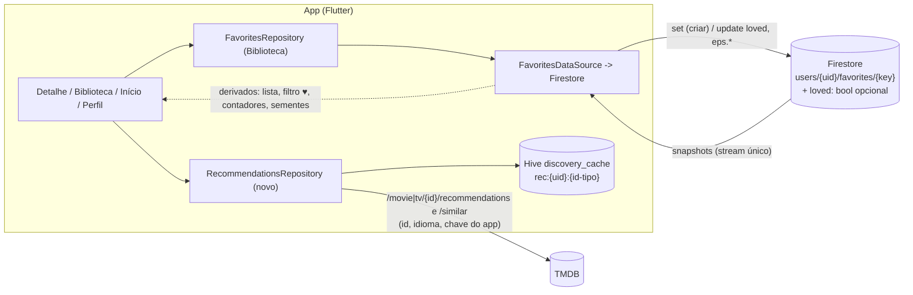
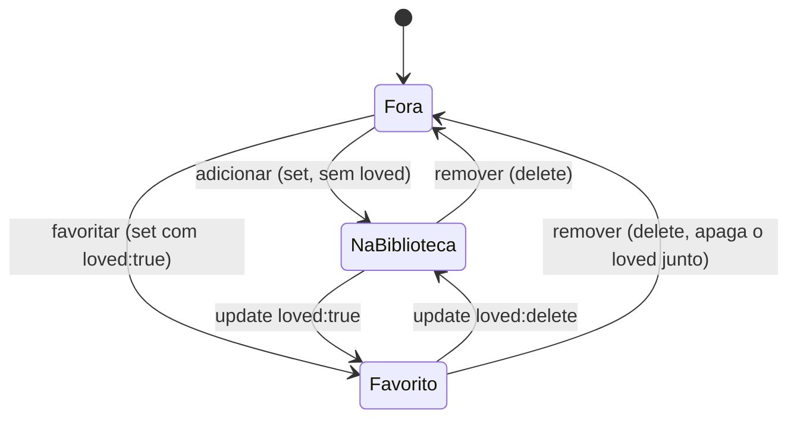

# 36 - Design: Biblioteca e Favoritos (com recomendações)

> **ATENÇÃO (2026-10-03): REVISADO.** A direção mudou (Favoritos permanece; nasce "Minhas recomendações"). A seção **REVISÃO** logo abaixo é o design vigente. O corpo original (seções 1 a 14) é histórico: vale como referência de análise e para a futura iteração "Sugestões para você" (seção 9). Onde o texto antigo diz `loved`, leia **`recommended`** (ver tabela R.1); as partes sobre renomear para Biblioteca, chip "Favoritos", banner e rota `/library` estão **CANCELADAS**.

---

## REVISÃO 2026-10-03: Minhas recomendações

Autor: Arquiteto. Entrada: [docs/35, REVISÃO](./35-especificacao-biblioteca-e-favoritos.md). ADR: [ADR-004](./adr/adr-004-biblioteca-e-favoritos.md) (revisado). Nenhum código alterado. **[V]** = verificado (nesta ou na rodada anterior, ver ressalva); **[NV]** = não verificado.

### R.1 O que se reaproveita do design anterior

| Antes | Agora | Observação |
|---|---|---|
| campo `loved` | campo **`recommended`** (bool opcional) | Mesma semântica de dados: `true` = marcado; ausente = não; desmarcar = `FieldValue.delete()`; `false` tolerado e lido como não |
| `FavoriteDoc/Item.loved`, `setLoved`, `addAndLove`, `lovedCount` | `.recommended`, `setRecommended`, `addAndRecommend`, `recommendedCount` | Nomes de código. `ProfileStats.favorites` **não** é renomeado (Favoritos mantém o sentido) |
| Opção A (campo no documento) x B (coleção) x C (prefs) | **A mantida** | Razões iguais (sem órfão, atômico, 0 leituras). Reforço novo: o dado de futuro compartilhamento NÃO deve ser este campo (R.9) |
| Verificação de regras no emulador (12 casos, v1 e v2) | vale **por analogia** | **[V parcial]** a verificação foi feita com o nome `loved`; a lógica não depende do nome, mas a suíte renomeada **precisa ser reexecutada** na Fatia 1 (R.3) antes do gate. Não reexecutei nesta rodada |
| Irreversibilidade das regras, regra de `addedAt`, escrita idempotente, trava anti-clobber, resíduo R11 | **mantidos** | seções 4.3, 5, 8.3, 12 do corpo antigo |
| Rotas `/library`, `libraryCount`, strings da tabela 1.4, ícones bookmark, banner, chip Favoritos, coração só no detalhe | **CANCELADOS** | |
| Recomendados (TMDB), seção 9 | **ADIADOS** → "Sugestões para você", iteração futura | |

### R.2 Modelo de dados

Documento `users/{uid}/favorites/{id}-{movie|tv}` (nenhum campo atual muda) + **um** campo:

| Campo | Tipo | Obrigatório | Default | Escrita |
|---|---|---|---|---|
| `recommended` | `bool` | não | ausente = **não recomendado** (só `true` conta) | `true` ao marcar; `FieldValue.delete()` ao desmarcar |

- Sem migração, sem backfill: os ~54 documentos ficam intactos; nada vira recomendado sozinho. O Perfil começa com "Recomendo = 0".
- **Privado por construção:** nenhuma regra de leitura nova; o caminho continua `isOwner(uid)`. O campo **não** é, nem será, o mecanismo de compartilhamento (R.9).
- Mapeamento: `FavoriteMapper.toMap` emite `'recommended': true` **somente** quando verdadeiro (um `add` comum fica bit-a-bit igual ao de hoje e é aceito até pelas regras antigas); `fromMap`: `map['recommended'] == true`; `FavoriteItem.recommended` com default `false` e JSON/Hive tolerante a ausência; `byRecentActivity` inalterado; `ProfileStats.recommendedCount = docs.where(recommended).length` (calculado, sem contadores gravados).
- Data source: `setRecommended(key, bool)` = `update({'recommended': v ? true : FieldValue.delete(), 'updatedAt': serverTimestamp()})`; **nunca** `set` nem `set(merge)`; não chama `_activity.stamp`, não escreve `lastWatchedAt` nem `addedAt`.
- Repositório: `setRecommended(id, type, v)` (item ausente → `FavoriteGoneException`, mensagem `kGoneMessage` atual "Este título não está mais nos favoritos."); `addAndRecommend(SearchResult r)` = `if (await _exists(key)) → setRecommended(key,true) else → add(doc.copyWith(recommended:true))` (reaproveita o `_exists` tolerante de hoje; série: `seasonSummaries` best-effort como hoje). Bulk/Desfazer (docs/30) só usam `eps.*` por field path: **não tocam** `recommended`.

### R.3 Regras do Firestore

#### Diff exato (2 linhas lógicas, mais a vírgula)

```diff
--- firestore.rules (atual)
+++ firestore.rules (proposta)
@@ function validFavorite(key) {
       return key.matches('^[0-9]{1,9}-(movie|tv)$')
         && d.keys().hasOnly(['id', 'mediaType', 'title', 'posterPath', 'overview', 'addedAt',
-                             'lastWatchedAt', 'watchedMovie', 'seasonSummaries', 'eps', 'updatedAt'])
+                             'lastWatchedAt', 'watchedMovie', 'seasonSummaries', 'eps', 'updatedAt',
+                             'recommended'])
         && d.keys().hasAll(['id', 'mediaType', 'title', 'addedAt'])
@@
         && (!('eps' in d) || (d.eps is map && d.eps.size() <= 5000))
+        && (!('recommended' in d) || d.recommended is bool)
         && (!('updatedAt' in d) || d.updatedAt is timestamp);
```

`match`, regra `addedAt só diminui`, perfil e o `deny` final: intactos. Efeito: `recommended` opcional, só `bool`; qualquer outra chave desconhecida continua negada.

#### Garantias de compatibilidade (herdadas do design anterior, ver 4.3 do corpo antigo)

- App atual + regras novas: progresso e `add` aceitos, inclusive em documentos com `recommended` (update por field path preserva as demais chaves).
- App atual tentando `add` (set completo) sobre item existente: negado pela trava `addedAt` (o `DateTime.now()` é maior). Resíduo (relógio atrasado + cache frio) documentado, já existe hoje.
- App novo + regras antigas: `add`/progresso/remover funcionam; **só marcar "Recomendo" falha** (`permission-denied`, visível via `SyncStatus`, botão reverte).
- Regras antigas + documento já com `recommended:true`: **qualquer update que mantenha o campo é negado** → regra nova **nunca** volta atrás depois da primeira marcação (R.7).
- `FieldValue.delete()` do campo é aceito inclusive pelas regras antigas (plano de contingência R.7).

#### Testes de regras (arquivo `firestore_rules_test/recommended.test.mjs` + `fixtures/firestore.rules.v1`)

| # | Caso | Regra nova | v1 |
|---|---|---|---|
| T1 | Criar sem `recommended` (formato exato do `add`) | ok | ok |
| T2 | Criar com `recommended:true` (adicionar+recomendar) | ok | negado |
| T3 | Doc legado: `update` de progresso (`eps.x`, `watchedMovie`, `lastWatchedAt`, `seasonSummaries`) | ok | ok |
| T4 | `update({recommended:true, updatedAt})` | ok | negado |
| T5 | `update({recommended: deleteField()})` | ok | ok |
| T6 | `recommended:false` | ok | negado |
| T7 | `recommended` = `'sim'`, `1`, `null`, `{}`, `[]` | negado | negado |
| T8 | Chave desconhecida (`recomended`, `loved`, `shared`, `public`) | negado | negado |
| T9 | Doc com `recommended:true`: `update` de progresso | ok | **negado** (documenta a irreversibilidade) |
| T10 | Clobber: `set` completo sem `recommended` sobre doc com `recommended` e `eps`, `addedAt` novo maior | negado | negado |
| T11 | Residual: mesmo `set` com `addedAt` <= existente | ok (apaga) | ok (documentado) |
| T12 | **Privacidade:** outro usuário e não autenticado leem/escrevem `recommended` do dono; leitura de coleção alheia | negado | negado |
| T13 | Dono deleta doc com `recommended`; batch de exclusão de conta (400 docs) | ok | ok |
| T14 | Regressão: toda a suíte atual verde sem edição | ok | n/a |

Ambiente: `firebase-tools` 15 exige **JDK 21+** [V na rodada anterior] (README da suíte). Fatia 1 só passa para o gate com T1 a T14 verdes no emulador.

### R.4 Escritas e interação com o restante

| Situação | Escrita |
|---|---|
| Item em Favoritos | `update` field path `recommended` (+`updatedAt`) |
| Item fora de Favoritos | um `set` completo com `recommended:true` (atômico); falha = nenhuma lista tem o item |
| Cache diz "fora", servidor tem (cache frio) | o `set` é negado pela trava `addedAt`; nada se apaga; o stream traz o doc real e a 2ª tentativa vira `update` |
| Cache diz "existe", servidor não tem | `update` falha `not-found`; sem ressuscitar documento vazio (mensagem "não está mais nos favoritos") |
| Desmarcar | `update({recommended: FieldValue.delete()})` idempotente |
| Remover de Favoritos | `delete` do documento: a marca vai junto (por isso a **confirmação** quando `recommended` ou progresso) |
| Marcar assistido rápido, bulk, Desfazer, episódio | só `eps.*`, `watchedMovie`, `lastWatchedAt`: preservam `recommended`; **teste obrigatório** |
| Marcar "Recomendo" | não altera `lastWatchedAt`/`addedAt`: **não reordena** [V na análise do mapper; confirmar em teste que `byRecentActivity` não usa `updatedAt`, **NV**] |
| Dois aparelhos | duas escritas de `true` convergem; marcar x desmarcar: última no servidor vence |

Anti-duplo-toque por chave e por ação (botão "Recomendo" separado do coração). `PendingIntent` pós-login carrega a **intenção explícita** (`addAndRecommend` / `setRecommended(true)`), nunca um toggle.

### R.5 Navegação: solução para a tab bar (5 destinos já ocupados)

Estado atual **[V por leitura de `app_shell.dart`]**: `_tabs` = Início `/`, Explorar `/catalog`, Busca `/search`, Favoritos `/favorites`; o 5º destino é fixo (Perfil `/profile` ou "Entrar" se deslogado, que dispara o login direto do toque por causa de bloqueio de pop-up). `NavigationBar` do Material 3 exige 3 a 5 destinos e `selectedIndex` válido (não existe "nenhum selecionado"). A barra superior móvel (`MobileTopBar`) tem logo + `SyncIndicator`. No desktop o menu do topo do Início já tem Buscar, Explorar, Meus favoritos e `AccountAction` (conta no canto superior direito).

| Opção | Prós | Contras | Veredito |
|---|---|---|---|
| **A. Perfil/Entrar vira ícone (avatar/"Entrar") na barra superior; a nova aba ocupa o slot** | Perfil é a tela **menos frequente** (estatísticas, exportar, excluir conta) e vai para o lugar mais longe do polegar; o fluxo central (buscar/explorar/guardar/recomendar) fica a um toque; alinha o mobile ao desktop (conta no canto superior direito); Busca continua uma aba (a cópia "Toque na lupa" e o estado vazio seguem corretos) | "Entrar" fica menos proeminente (mitigado: `SignInInvite` no Início e login automático a cada ação que exige conta); o Perfil deixa de ser aba | **Recomendada** |
| B. Busca vira lupa na barra superior (default sugerido pelo Manager) | Libera o slot; busca disponível em toda tela; barato | Busca é frequente e fica longe do polegar; a lupa já existe no AppBar do desktop (consistente) mas some do bottom nav; mesma necessidade de rota sem aba selecionada | Plano B, custo equivalente, troca de uma linha |
| C. 6 abas | Sem mover nada | Viola o limite M3 (rótulos truncam em 320 px, alvo menor que 48 px útil); risco de quebrar `mobile_tabbar_test` | Rejeitada |
| D. Fundir Busca dentro de Explorar | Libera slot | Muda o modelo mental, quebra o deep link `/search` e o fluxo de adicionar; mais mudança de UI | Rejeitada |
| E. Menu "Mais"/drawer | Escala | Esconde funções; um toque extra para tudo | Rejeitada |
| F. Favoritos e Recomendo na mesma aba (segmentado) | Sem slot novo | Contraria a decisão do Manager (aba própria) | Descartada |

#### Solução escolhida (A) em detalhe

- `_tabs` (5): Início `/`, Explorar `/catalog`, Busca `/search`, Favoritos `/favorites`, **Recomendo `/recommendations`** (ícone `thumb_up_outlined`/`thumb_up`; `label` "Recomendo"; `tooltip` "Minhas recomendações"). Remove `profileIndex`, o ramo `signedOut`/`/profile` do `onSelected` e o 5º `NavigationDestination` (código [NV: não implementado]).
- `MobileTopBar`: à direita, `SyncIndicator` + botão de conta: deslogado `IconButton(Icons.login, tooltip 'Entrar com Google')` que chama `signInWithFeedback(...)` **direto do toque** (preserva o requisito de pop-up); logado, avatar/`Icons.person_outline` com tooltip "Perfil" → `context.push('/profile')`. Alvo >= 48 px, semântica "Perfil"/"Entrar com Google". Reaproveitar `AccountAction` se servir [NV: não li `account_widgets.dart`].
- **Sem "nenhum tab selecionado":** `/profile` passa a ser rota **fora do `ShellRoute`** (como `/movie/:id`), com `detailAppBar` (voltar; sem histórico oferece "Ir para o início") e `DetailBottomBanner`. No desktop o `AppShell` devolve o filho sem alterar, então a mudança é neutra. `redirect` de `/profile` (deslogado vai ao início) usa `matchedLocation` e continua valendo. `SyncBanner.onOpenProfile` (`context.go('/profile')`) continua funcionando. Verificar que `ProfileScreen` hoje troca de AppBar via `MobileShellScope.active` [NV: não li `profile_screen.dart`]; fora do shell ela deve renderizar o AppBar próprio.
- Rota nova `GoRoute('/recommendations')` dentro do `ShellRoute`, tela `RecommendationsScreen` (AppBar só no desktop, igual `FavoritesScreen`, com lupa). Home desktop: novo `_NavAction(label: 'Minhas recomendações', icon: Icons.thumb_up, push('/recommendations'))` antes de `AccountAction` (`_NavAction` já vira só ícone em largura estreita; testar 769 a 900 px).
- **Deep links preservados [V por leitura do router]:** `/`, `/catalog`, `/search`, `/favorites`, `/profile`, `/movie/:id`, `/movie/:id/cast`, `/tv/:id`, `/tv/:id/cast`, `/person/:id`; `/recommendations` é novo. Nenhuma rota é renomeada nem removida; o `404.html` do Pages já serve qualquer caminho ao Flutter.
- **Testes a atualizar/criar:** `mobile_tabbar_test` (agora Início, Explorar, Busca, Favoritos, Recomendo + botão de conta no topo), qualquer teste que toque na aba "Perfil"/"Entrar" (buscar por esses rótulos: **NV, lista exata não levantada**), `home_screen_composition_test` (novo item do menu); novos: 5 destinos, conta no topo (deslogado dispara o login no toque), `/profile` com voltar, 320 px e fonte 2x sem overflow na barra superior e na tab bar, todos os deep links acima abrem, `/recommendations` abre. Rótulo "Recomendo" (9 letras) cabe a 320 px com fonte normal [NV: medir; com fonte 2x segue o comportamento já existente dos demais rótulos].

### R.6 Fatia 0: Exportar meus dados (JSON)

Só app; **sem escrita, sem mudança de regras**; precede qualquer mudança de regras.

- Perfil: botão "Exportar meus dados (JSON)" (logado). Lê todos os documentos de `users/{uid}/favorites` e o perfil; gera arquivo `cinetrack-export-AAAA-MM-DD.json`.
- Formato: `{"schema":"cinetrack-export/1","exportedAt":"<ISO-8601 UTC>","profile":{"displayName":...},"favorites":[{"key":"603-movie", ...<todos os campos do documento como estão>}],"counts":{"items":n,"movies":n,"series":n}}`. Os campos são **copiados genericamente** (mapa do documento), de modo que `recommended` e qualquer campo futuro entram sem mudar o exportador. Timestamps em ISO-8601; `eps` e `seasonSummaries` íntegros.
- **Minimização:** sem e-mail e sem uid no arquivo. Só o dono lê (regras atuais). Nada é enviado a terceiros; o arquivo vai direto ao dispositivo do usuário.
- Entrega: web = download por Blob; Android/iOS = share sheet/salvar arquivo (dependência de pacote **NV**: decisão do Dev; pode lançar primeiro na web se o pacote for um bloqueio, com default registrado).
- Origem dos dados: preferir leitura do servidor (consistência); se offline/não confirmado, avisar "pode estar incompleto" e deixar o usuário decidir; nunca gerar arquivo vazio como completo.
- Custo: até 54 leituras por exportação (Spark: 50 mil/dia); botão com anti-duplo-toque.
- Testes: contagem do arquivo = Perfil; round-trip de todos os campos de um doc de série com `eps` grande; campo desconhecido incluído; deslogado não vê o botão; offline avisa; nenhuma chamada de escrita (fake do data source).
- Restauração a partir do JSON: **fora do escopo** (importar no app é futuro; em emergência o Dev restaura por script a partir do arquivo). Isso é registrado, não prometido ao usuário.
- Papel no rollout: o Manager exporta a própria conta e guarda o arquivo **antes** de publicar as regras da Fatia 1.

### R.7 Rollout revisado por fatia

| Fatia | Conteúdo | Regras | Ordem |
|---|---|---|---|
| **0. Exportar** | botão + exportador + testes | nenhuma | Só app. Manager exporta e confere a contagem com o Perfil |
| **1. Minhas recomendações** | `recommended` (dados), botão no detalhe e no cartão de Favoritos, aba/rota/tela, tab bar (R.5), Perfil (contador), confirmação ao remover, política/resumo/diálogo de exclusão, testes | **sim (diff R.3)** | **1) Manager publica as regras 2) verifica com o app atual 3) só então merge/deploy do app** |
| **2. Futuro (não implementar)** | "Sugestões para você" (corpo antigo, seção 9); compartilhamento (R.9) | a definir | Cada uma com seu ADR |

Pré-condições do gate da Fatia 1 (Dev/QA): suíte de regras T1 a T14 verde no emulador (JDK 21+); PR com o diff aprovado; Fatia 0 já no ar; **o app da Fatia 1 ainda NÃO foi publicado**.

#### Passo do Manager (publicar regras), em ordem
(Rótulos de menu **[NV]**: o console muda; confirmar na tela.)
1. Exportar os dados da própria conta pelo Perfil (Fatia 0) e anotar os números do Perfil.
2. Console do Firebase do projeto CineTrack → **Build → Firestore Database → aba Rules**.
3. Guardar o texto atual (cópia da v1 já está em `fixtures/firestore.rules.v1` no repositório).
4. Colar o conteúdo de `firestore.rules` da Fatia 1 (diff R.3) e clicar **Publish**; propagação em até ~1 min **[NV]**. Alternativa: `firebase deploy --only firestore:rules` (README).
5. Verificar com o app **atual** em produção: marcar/desmarcar um episódio e abrir um filme; esperado, nenhum banner de erro de sincronização.
6. Avisar o Orquestrador "regras publicadas em <data/hora>". Só então o Dev faz merge/push do app da Fatia 1. (O workflow do Pages não publica regras; checklist do PR: "Manager confirmou a publicação".)

Smoke pós-deploy (Manager): Perfil igual ao anotado e "Recomendo = 0"; recomendar 1 item pelo detalhe; recarregar e ver na aba; desmarcar; marcar um episódio de um item recomendado e conferir que continua recomendado; repetir o export e comparar.

#### Rollback

| O que reverter | Seguro? | Como |
|---|---|---|
| App da Fatia 0 ou 1 | **Sim, sempre** | Redeploy do build anterior; ele ignora `recommended`; dados íntegros; a aba some |
| Regras **antes** da primeira marcação | Sim | Republicar v1 |
| Regras **depois** da primeira marcação | **NÃO** | Sob a v1 todo `update` em doc com `recommended` é negado [V com `loved`; reexecutar com o nome novo] |

Se for preciso desligar o recurso depois de usado: não mexer nas regras; reverter só o app. Correção de regra só "para frente" (superconjunto que continua aceitando `recommended`). Se as regras antigas realmente tiverem de voltar: antes, desmarcar **todas** as recomendações (o app novo usa `FieldValue.delete()`, aceito até pela v1), conferir "Recomendo = 0" em todos os aparelhos, fechar abas antigas e só então republicar a v1; inviável com muitos usuários, daí "nunca reverter".

PWA com service worker antigo continua seguro porque as regras são publicadas antes do app.

### R.8 Privacidade e política

- **Dado novo:** um booleano por item, dentro de um documento que já existe, na mesma coleção, mesmas regras (só o dono). Representa gosto pessoal: tratar como dado pessoal; classificação como sensível ou não é parecer jurídico **[NV]**. Mínimo necessário: nenhuma nota, texto livre nem data é gravada.
- **Terceiros:** nenhum. Esta entrega não consulta o TMDB por causa das recomendações e não envia a marcação a ninguém. Sem telemetria nova.
- **Exclusão de conta:** o campo vive no documento; o fluxo atual (`deleteAllFavorites`, lotes de 400) já o apaga. Teste obrigatório (T13 + teste de widget do diálogo).
- **Portabilidade (LGPD art. 18):** a Fatia 0 entrega cópia legível dos dados, incluindo `recommended`.
- **Textos a alterar (somente na Fatia 1; nada alterado agora):**
  - `web/privacidade.html` (atualizar "Última atualização"): linha da tabela de dados passa a "Seus favoritos, filmes assistidos e episódios assistidos (com a data), e quais títulos você marcou como **Recomendo**"; novo parágrafo: "A lista **Minhas recomendações** é **privada**: só você a vê. Por enquanto ela não é compartilhada, publicada nem usada para recomendar títulos a outras pessoas. Se um dia isso mudar, pediremos seu consentimento específico antes e atualizaremos esta política." Em "Como excluir": "apagamos seus favoritos, suas recomendações, seu progresso e seu apelido". Mencionar "Exportar meus dados" em direitos do titular.
  - `privacy_summary.dart`: "listas (favoritos, recomendações e progresso)" e a frase "privadas por enquanto".
  - `delete_account_dialog.dart`: "apaga para sempre seus favoritos, suas recomendações, seu progresso e seu apelido".
  - README: nota de versão e descrição.
- A frase "pediremos seu consentimento" é compromisso de produto: só entra se o Manager aprovar (Q-futuro no ADR).

### R.9 Roadmap (NÃO implementar): recomendar a outros usuários

Hoje o dado é privado e assim permanece até haver decisão e ADR próprios. Para compartilhar será preciso, no mínimo:

1. **Consentimento explícito, específico e revogável** (LGPD arts. 7 I e 8): tela própria, não pré-marcada, separada dos termos gerais; finalidade clara ("outros usuários verão que você recomenda X"); revogar apaga a publicação. As marcações já existentes não viram públicas retroativamente: exigir novo consentimento.
2. **Perfil público opt-in:** apelido/handle público distinto do `displayName` privado atual; escolha de publicar tudo, por título ou nada; padrão sempre "privado".
3. **Dados públicos separados do privado:** coleção própria (por exemplo `publicRecommendations`) com só `{titleKey, mediaType, publicHandle, publishedAt}`; **nunca** abrir a leitura de `users/{uid}/favorites`. O campo `recommended` continua privado e é a fonte da qual o usuário *escolhe* publicar. Deve haver um flag de compartilhamento distinto (`shared`), jamais derivado de `recommended`.
4. **Agregação** (contagem de quantos recomendam um título, ranking): em Spark sem Cloud Functions, contadores no cliente são forjáveis e disputam escrita; o confiável exige backend (Functions/Blaze, ou serviço próprio), o que fere a premissa "sem backend/sem custo" e exige ADR de aprovação do Manager.
5. **LGPD:** base legal (consentimento), transparência, minimização (só id/tipo), direitos (acesso, exportação, revogação, exclusão apagando também o público), retenção, **menores** (art. 14: idade mínima/consentimento do responsável), possível RIPD, atualização da política e do resumo no app.
6. **Moderação e abuso:** denúncia, bloqueio, contas falsas/spam, limite de taxa, manipulação de ranking, App Check.
7. **Regras:** leitura pública só da coleção pública (com paginação), escrita só do dono, validação de forma, limites de tamanho; testes de regras de acesso cruzado.
8. **Produto:** descoberta ("o que amigos recomendam"), seguir pessoas, notificações: cada um é decisão separada.

### R.10 Riscos

| # | Risco | Prob. | Impacto | Mitigação |
|---|---|---|---|---|
| 1 | App da Fatia 1 publicado antes das regras | Média (humana) | Marcar falha com banner; nada se perde | Gate no PR; ordem R.7; falha visível e reversível |
| 2 | Reverter regras com `recommended` existente | Baixa | Alto | Proibição; plano R.7 |
| 3 | `set` completo em item existente apaga progresso/marca | Muito baixa | Alto | Trava `addedAt`; `setRecommended` sempre `update`; resíduo T11 aceito |
| 4 | Perda de dados por erro nas Fatias 0/1 | Baixa | Crítico | Export antes de publicar; sem escrita em massa; testes de preservação de campos |
| 5 | Mover Perfil para o topo esconde "Entrar"/estatísticas | Média | Baixo | `SignInInvite`; login em toda ação que exige conta; plano B (Busca no topo) |
| 6 | `/profile` fora do shell quebra testes/fluxos de login | Média | Médio | Reaproveitar `detailAppBar`; teste de deep link e de volta |
| 7 | Suíte de regras verificada só com o nome antigo | Certa | Médio | Reexecutar renomeada como gate (T1 a T14) |
| 8 | Usuário entende "Recomendo" como já público | Média | Médio (privacidade) | Microcopy "Só você vê esta lista, por enquanto"; política |
| 9 | Colisão de nomes ("recomendações" x sugestões) | Média | Baixo | Sugestões = "Sugestões para você" |
| 10 | Layout do botão extra no cartão (320 px, 2x) | Média | Baixo | Teste de matriz; fallback na linha do título |

### R.11 Tarefas técnicas

**Fatia 0 (FE):** exportador (leitura de docs + perfil, JSON genérico), botão no Perfil, entrega web/mobile, avisos de offline, testes (R.6).
**Fatia 1 (BE):** regras (R.3) + `recommended.test.mjs` T1 a T14 + fixture v1 + README (JDK 21+); `FavoriteDoc/Mapper/Item.recommended`; `setRecommended`/`addAndRecommend` (data source, in-memory, signed-out, repositório); `ProfileStats.recommendedCount`; providers derivados.
**Fatia 1 (FE):** botão "Recomendo" no detalhe (`DetailToggleChip`, polegar, estado pendente próprio) e no cartão de Favoritos (ao lado do `QuickWatchedButton`; ação de ícone 48 px); `RecommendationsScreen` (cabeçalho com contador e microcopy, segmentado Todos/Filmes/Séries, vazio que ensina, carregando/erro, convite deslogado); rota; tab bar e topo (R.5); item do menu desktop; confirmação de remoção (`confirmRemoveFavorite` passa a considerar `recommended`); Perfil (contador); textos de privacidade (R.8); testes de aceite (docs/35 R.7), incluindo versão antiga lendo doc com `recommended`, bulk/Desfazer preservando, assistido rápido não recomenda, marcar não reordena, rejeição de regra reverte o botão.
Gate: Manager publica regras antes do merge do app.

### R.12 Não verificado

- Reexecução do emulador com o campo `recommended` (a verificação foi com `loved`); comportamento do SDK em produção para `not-found` e reversão otimista; rótulos do console e tempo de propagação das regras.
- Código: `profile_screen.dart`, `account_widgets.dart`, `AccountAction`, `byRecentActivity` (uso de `updatedAt`) e a lista exata de testes que tocam a aba Perfil/Entrar não foram lidos; layout em 320 px/fonte 2x não testado; pacote de compartilhamento de arquivo no mobile não escolhido.
- Nenhum teste Flutter/Dart executado; nenhum arquivo de código alterado.
- Classificação jurídica (LGPD) do dado de gosto e a futura base legal para compartilhamento.
- Sugestões TMDB: as medições do corpo antigo continuam válidas só como histórico (1 filme e 1 série).

### R.13 Decisões do Manager pendentes (todas com default; nenhuma bloqueia)

1. Tab bar: **Perfil no topo (default)** x Busca no topo.
2. Remover de Favoritos remove a recomendação, com confirmação: **sim (default)**.
3. Recomendar título fora de Favoritos adiciona a Favoritos: **sim (default)**.
4. Ordem da aba por atividade (default) x por data de recomendação (exige campo timestamp opcional; aditivo, pode vir depois).
5. Aprovar a frase de política "pediremos seu consentimento antes de qualquer compartilhamento": **sim (default)**.

---

*Abaixo, o design anterior (histórico; `loved` = leia `recommended`; Biblioteca/rota `/library`/chip/banner CANCELADOS).*

Autor: Arquiteto. Data: 2026-10-03. Entrada: [docs/35](./35-especificacao-biblioteca-e-favoritos.md) (contrato fechado, com as decisões do Manager). ADR: [ADR-004](./adr/adr-004-biblioteca-e-favoritos.md) (Proposta).
Nenhum código do app foi alterado. Verificações feitas nesta rodada estão marcadas **[V]**; o que não foi verificado está marcado **[NV]** (lista consolidada na seção 14).

## Contexto

Hoje cada título adicionado é um documento `users/{uid}/favorites/{id-tipo}` (o que o produto passa a chamar de **Biblioteca**). O Manager quer (a) trocar o termo, (b) criar o conceito de **Favorito** (coração = "amo") como subconjunto da Biblioteca e (c) usar os Favoritos como semente de **Recomendados para você**. Ambiente: Flutter web no GitHub Pages + Android/iOS, Firebase Auth + Firestore (Spark), um usuário real com ~54 itens, sem telemetria, sem backend próprio.

Glossário (vale para código e docs a partir daqui, para evitar a colisão de palavras):

| Produto | Código (mantido) | Novo no código |
|---|---|---|
| Biblioteca | coleção `favorites`, `FavoriteDoc`, `FavoriteItem`, `FavoritesRepository`, `FavoritesDataSource` (nomes legados, **não renomear**) | |
| Favorito (coração) | | campo **`loved`**, `FavoriteDoc.loved`, `FavoriteItem.loved`, `setLoved` |

Usar `loved` no código (e não `favorite`/`isFavorite`) é deliberado: dentro de uma coleção chamada `favorites`, `isFavorite` seria ambíguo para quem lê o código daqui a dois anos.

## Requisitos não funcionais

| Item | Meta |
|---|---|
| Perda de dados | Zero. Contagens do Perfil antes = depois (itens, filmes/episódios assistidos, séries concluídas). Sem escrita em massa |
| Compatibilidade | App atual em produção e abas antigas continuam funcionando após as regras novas; app novo não quebra com as regras antigas (só a ação "favoritar" falha de forma visível, nada mais) |
| Custo Spark | 0 leituras novas; 1 escrita por marcar/desmarcar; recomendações 0 leituras/0 escritas no Firestore |
| Latência | Marcar/desmarcar: otimista local (mesmo padrão de hoje). Recomendações: nunca bloqueiam o Início; cache vence rede |
| TMDB | <= 8 requisições por 24 h por usuário em regime normal (<= 16 no pior caso), concorrência 3 |
| Privacidade | Um booleano novo por item, no documento existente; ao TMDB só id/tipo/idioma/chave do app |
| Disponibilidade | Falha de recomendação nunca vira erro de tela cheia |

---

## 1. Opções consideradas (onde guardar o Favorito)

| Opção | Prós | Contras | Custo | Risco |
|---|---|---|---|---|
| **A. Novo campo `loved` no documento do item** (`users/{uid}/favorites/{key}`) | 0 leituras extras (o stream já traz tudo); invariante "Favorito está na Biblioteca" é estrutural (não existe favorito órfão); "adicionar e favoritar" é **uma** escrita atômica (um documento); remover da Biblioteca apaga o favorito sem código; exclusão de conta já cobre; update por field path combina com o padrão existente; filtro/contador/semente derivam do stream | A regra `hasOnly` precisa mudar (acoplamento de rollout regras->app); nome da coleção continua `favorites` (dívida de vocabulário) | Baixo: ~1 campo no mapper/doc/item/regra | Médio-baixo: **regras irreversíveis após o primeiro favorito** (seção 8) |
| B. Coleção separada `users/{uid}/loved/{key}` | Não toca na regra de `favorites`, então regras antigas continuam válidas para os documentos antigos; rollback de regras seria tecnicamente possível | 2 listeners/leituras (N extras no start, em Spark 50 mil/dia); favoritar+adicionar é 2 documentos (batch ou risco de meio-estado); órfãos (favorito sem item) exigem reconciliação; remoção precisa de batch; exclusão de conta precisa cobrir 2 coleções; regra nova de mesma forma (nova `match`) e a **mesma ordem de publicação** (regras antes do app) - ou seja, o benefício principal some | Médio | Médio: inconsistência entre coleções, mais casos de borda (B6/B7 do doc 35 pioram) |
| C. Documento único de preferências (`users/{uid}/prefs/main` com `lovedKeys: [..]` ou mapa) | 1 leitura; regra da coleção `favorites` intocada | Documento quente com concorrência multi-aparelho (array: sobrescrita, mapa: field path ok); sem integridade referencial (chave de item inexistente); limite de 1 MiB e de 20 mil escritas/dia compartilhado; não atômico com o `add`; acopla um segundo stream ao filtro da Biblioteca; mesma exigência de regra nova | Médio | Médio: drift entre `lovedKeys` e itens removidos |

### Escolha: **A**

Razões, em ordem: (1) integridade estrutural (Favorito é propriedade do item; sem órfãos, sem reconciliação); (2) a escrita "adicionar + favoritar" do doc 35 é naturalmente atômica; (3) custo zero de leitura; (4) o único contra real de A (regra irreversível) também existiria em B e C, porque qualquer caminho exige regra nova publicada antes do app. A diferença de "rollback de regras possível" em B é ilusória: se o Favorito mora em outra coleção, desfazer as regras nega a escrita dessa coleção, mas nada protege o usuário de ter dados lá. Tratamos a irreversibilidade explicitamente (seção 8) em vez de comprá-la com complexidade.

Decisão de representação: **favorito = campo `loved: true`; não favorito = campo ausente**. Desmarcar escreve `FieldValue.delete()` (não `false`). Motivos: (a) um só estado canônico (ausente), nenhuma ambiguidade `false` x ausente; (b) documentos de itens não favoritos ficam idênticos aos de hoje; (c) **[V]** no emulador, remover o campo é aceito mesmo sob as regras ANTIGAS, porque as regras validam o documento resultante - isso viabiliza o plano de contingência da seção 8. A regra nova aceita `true` e `false` (tolerante), mas o app só lê `loved == true` como favorito e só escreve `true`/delete.

Descartado: `lovedAt` (timestamp). Seria útil para "ordenar por quando amei", que não está no escopo, e acrescentaria um segundo campo e uma segunda regra. A rotação de sementes (seção 9) é determinística sem ele. Se a iteração 4 pedir, é aditivo (mesma estratégia expandir -> migrar).

---

## 2. Solução



Estados de um título (coincidem com o doc 35, seção 3.1) e transições:



---

## 3. Modelo de dados

Documento `users/{uid}/favorites/{id}-{movie|tv}` (todos os campos atuais inalterados) + **um** campo:

| Campo | Tipo | Obrigatório | Default por ausência | Quem escreve |
|---|---|---|---|---|
| `loved` | `bool` | não | ausente = **não favorito** (só `true` conta como favorito; `false` é tolerado e lido como não favorito) | app novo: `true` ao favoritar; `FieldValue.delete()` ao desfavoritar |

- Nenhuma migração. Nenhum backfill. Os ~54 documentos atuais continuam válidos sem o campo (migração preguiçosa).
- `addedAt`, `lastWatchedAt` e a ordem por atividade **não são tocados** por favoritar/desfavoritar (B9). `updatedAt` recebe `serverTimestamp` como nas demais escritas.
- Tamanho: o campo soma ~10 bytes por documento.
- Cache local de recomendações (Hive, fora do Firestore): chave `rec:{uid}:{id}-{tipo}` no box `discovery_cache` existente, valor `{items:[...], fetchedAt}` (seção 9).

### Mapeamento no código

| Camada | Mudança |
|---|---|
| `FavoriteDoc` | `final bool loved` (default `false`); `copyWith({bool? loved})` |
| `FavoriteMapper.toMap` | emite `'loved': true` **somente** se `loved`; **nunca** emite a chave quando falso. Efeito: um `add` comum do app novo produz exatamente o mesmo documento de hoje e é aceito até pelas regras antigas |
| `FavoriteMapper.fromMap` | `loved: map['loved'] == true` (tolerante a ausente, `false`, tipo errado) |
| `FavoriteMapper.hydrate` | repassa `loved` ao `FavoriteItem` |
| `FavoriteItem` | `final bool loved` (default `false`); `copyWith`; `toJson`/`fromJson` com default `false` para ausência (JSON legado do Hive); `byRecentActivity` **inalterado** |
| `ProfileStats` | **renomear** `favorites` -> `libraryCount` (B18: o nome antigo não pode mudar de semântica em silêncio; o compilador aponta todos os usos) e **acrescentar** `lovedCount` (`docs.where(loved).length`). `movies`/`series` continuam sendo da Biblioteca. Sem contadores gravados |
| `FavoritesDataSource` | novo `Future<void> setLoved(String key, bool loved)`; `SignedOutFavoritesDataSource` lança `AuthRequiredException` como os demais |
| `FirestoreFavoritesDataSource.setLoved` | `_col.doc(key).update({'loved': loved ? true : FieldValue.delete(), 'updatedAt': FieldValue.serverTimestamp()})` via `_fire`. **Não** chama `_activity.stamp` e **não** escreve `lastWatchedAt` |
| `InMemoryFavoritesDataSource` (test/support) | espelhar `setLoved`, e opcionalmente a regra "set sobre documento existente com `addedAt` maior é rejeitado" para testar o cenário B6 sem emulador |

---

## 4. firestore.rules

### 4.1 Diff exato sobre a regra atual

Alterações em `validFavorite(key)`: (1) acrescentar `'loved'` ao `hasOnly`; (2) validar o tipo. Nada mais muda (nem `match`, nem a regra de `addedAt`, nem o perfil).

```diff
--- firestore.rules (atual)
+++ firestore.rules (proposta)
@@ function validFavorite(key) {
       return key.matches('^[0-9]{1,9}-(movie|tv)$')
         && d.keys().hasOnly(['id', 'mediaType', 'title', 'posterPath', 'overview', 'addedAt',
-                             'lastWatchedAt', 'watchedMovie', 'seasonSummaries', 'eps', 'updatedAt'])
+                             'lastWatchedAt', 'watchedMovie', 'seasonSummaries', 'eps', 'updatedAt',
+                             'loved'])
         && d.keys().hasAll(['id', 'mediaType', 'title', 'addedAt'])
@@
         && (!('eps' in d) || (d.eps is map && d.eps.size() <= 5000))
+        && (!('loved' in d) || d.loved is bool)
         && (!('updatedAt' in d) || d.updatedAt is timestamp);
```

Efeito: `loved` é opcional, só `bool` (`null`, texto, número, mapa, lista são negados); qualquer outra chave desconhecida continua negada.

### 4.2 Verificação desta rodada **[V]**

Em **cópia descartável** (scratchpad, nunca no projeto), apliquei o diff acima e rodei 12 casos no Firestore Emulator contra a regra nova e contra a regra atual (v1): 12/12 passaram em cada uma com as expectativas descritas abaixo. Requisito de ambiente: o `firebase-tools` 15 do projeto exige **JDK 21+** (com JDK 11 o emulador nem sobe; usei JDK 24). Isso deve entrar no README da suíte de regras.

### 4.3 Compatibilidade nos dois sentidos

| Cenário | Resultado | Evidência |
|---|---|---|
| App ATUAL (produção) + regras NOVAS, documento sem `loved` | `update` de progresso (eps/watchedMovie/lastWatchedAt/seasonSummaries) e `add` aceitos | [V] casos 1-2 |
| App ATUAL + regras NOVAS, documento COM `loved:true` (marcado pelo app novo) | `update` de progresso aceito; o campo é preservado (update por field path não toca outras chaves) | [V] caso 5 (v2) |
| App ATUAL tenta `add` (set completo) sobre documento existente com `loved` | **Negado** se `addedAt` novo > `addedAt` existente (o `DateTime.now()` do app é sempre maior): a regra `addedAt só diminui` funciona como trava anti-clobber | [V] caso "CLOBBER GUARD" |
| App NOVO + regras ANTIGAS, `add`/progresso/remover (sem `loved`) | Funciona: o mapper não emite a chave quando falso | [V] caso 1 (v1) |
| App NOVO + regras ANTIGAS, favoritar (`loved:true`) | **Negado** (`permission-denied`): vira falha de sync visível (seção 11); nenhum outro dado é afetado | [V] casos 3-4 (v1) |
| Regras ANTIGAS + documento que já tem `loved:true` | **Qualquer `update` que deixe `loved` no documento é negado**, inclusive progresso do app antigo e do novo (irreversibilidade) | [V] caso 5 (v1) |
| Regras ANTIGAS, desfavoritar com `FieldValue.delete()` | **Aceito** (resultado sem a chave é válido na v1); `loved:false` seria negado | [V] caso "unfavorite" |
| Remover (delete) documento com `loved` sob qualquer regra | Aceito (dono) | [V] |

### 4.4 Casos de teste de regras (adicionar a `firestore_rules_test/`)

Novo arquivo `firestore_rules_test/loved.test.mjs` (mesmo estilo do existente) + cópia da regra atual em `firestore_rules_test/fixtures/firestore.rules.v1` para os testes de compatibilidade. Casos:

| # | Caso | Esperado (regra nova) | Esperado (v1) |
|---|---|---|---|
| R1 | Criar documento sem `loved` (formato exato do `add` do app: `set` com `updatedAt: serverTimestamp()`) | ok | ok |
| R2 | Criar com `loved: true` (adicionar+favoritar) | ok | negado |
| R3 | Documento legado (sem `loved`): `update` de progresso nos formatos exatos do app | ok | ok |
| R4 | `update({loved:true, updatedAt})` por field path | ok | negado |
| R5 | `update({loved: deleteField()})` | ok | ok |
| R6 | `update({loved:false})` (tolerado) | ok | negado |
| R7 | `loved` com `'sim'`, `1`, `null`, `{}`, `[]` | negado | negado |
| R8 | Chave desconhecida (`lovd`, `favorite`) | negado | negado |
| R9 | Documento com `loved:true`: `eps.x`, `eps.y: delete`, `watchedMovie`, `lastWatchedAt`, `updatedAt`, `seasonSummaries` | ok | **negado** (documenta a irreversibilidade) |
| R10 | Clobber guard: `set` completo (sem `loved`, `eps:{}`) sobre documento com `loved` e `eps` e `addedAt` NOVO maior | negado (nada é perdido) | negado |
| R11 | Residual documentado: mesmo `set`, mas `addedAt` <= existente (relógio atrasado) | ok (apaga `loved`/progresso) | ok |
| R12 | Outro usuário lê/escreve `loved` do dono | negado | negado |
| R13 | Dono deleta documento com `loved`; batch de exclusão de conta (400 docs, alguns com `loved`) | ok | ok |
| R14 | Regressão: toda a suíte atual (`firestore.rules.test.mjs`) continua verde sem edição | ok | n/a |

R11 é o único buraco conhecido da trava; está tratado na seção 5.

---

## 5. Escritas: idempotência, merge e o risco do `add` com `set` completo

Estado atual: `FirestoreFavoritesDataSource.add` faz `set(data)` completo, com `lastWatchedAt: null` e `eps: {}`; o repositório protege com `_exists()` (leitura de cache) e, se a leitura falha (cache frio offline), prossegue como "não existe" (comentário no código: a regra de `addedAt` impede clobber). Observação **[V]**: a trava existe de fato (R10), porque `DateTime.now()` do cliente é maior que o `addedAt` gravado.

Política nova para a escrita do Favorito:

| Situação | Escrita | Por quê |
|---|---|---|
| Item **na** Biblioteca (UI e cache concordam) | `update` por field path: `loved` (+ `updatedAt`) | Merge nativo; não toca `eps`, `watchedMovie`, `lastWatchedAt`, `addedAt` |
| Item **fora** da Biblioteca (favoritar direto) | `set` do documento completo **com `loved: true`**, uma só escrita (atômica); no caso de série, depois `setSeasonSummaries` best-effort como hoje | Atômico: ou entra tudo ou nada (doc 35, "falha não deixa meio-adicionado") |
| Cache diz "não existe", servidor tem (aparelho com cache velho/frio) | O `set` do caso anterior é uma atualização para o servidor: a regra nega (`addedAt` maior) | **Nada é apagado**; o usuário vê a falha de sync, o stream traz o documento real e a segunda tentativa é um `update` |
| Cache diz "existe", servidor já não tem (removido em outro aparelho) | `update` falha com `not-found` (sem ressuscitar documento vazio) | B7; reaproveita a mensagem "não está mais na sua biblioteca" |
| Desfavoritar | `update({loved: FieldValue.delete()})` | Idempotente |
| Dois aparelhos favoritam o mesmo item | Duas escritas de `loved: true`; convergem | Idempotente por construção |
| Favoritar e desfavoritar em aparelhos diferentes | Última escrita a chegar ao servidor vence | Mesmo critério do ADR-003 para episódios |

Regras de implementação (obrigatórias para Dev):
1. `setLoved` **nunca** usa `set`, nem `set(merge)` (um merge-set escreveria `addedAt`/`eps` e esbarraria na regra ou, pior, no relógio).
2. `addAndLove` = `if (await _exists(key)) → setLoved(key,true) else → add(doc.copyWith(loved:true))`. Reaproveita o mesmo `_exists` tolerante de hoje.
3. O `add` comum (sem `loved`) permanece como é; o mapper não emite `loved` quando falso, então ele é bit-a-bit o de hoje.
4. Anti-duplo-toque por chave separado para bookmark e coração (o `PendingIntent` atual já carrega uma closure, então `addAndLove` e `setLoved` são intenções explícitas, não toggles: a reexecução pós-login não inverte nada).

**Risco residual R11 (relógio do aparelho atrasado)**: um `add` com `addedAt` <= ao do servidor passaria na trava. Probabilidade muito baixa (exige cache frio + documento existente + relógio atrasado) e já existe hoje. Mitigação barata sem mudar regra: no `add`, usar `addedAt = max(DateTime.now(), ...)` não ajuda (não conhecemos o servidor). Aceito e registrado; não vale endurecer a regra (bloquear queda de `addedAt` quebraria o caso legítimo "addedAt só diminui" já coberto por teste).

Comportamento da versão antiga: ao favoritar no app novo e abrir o antigo, o item aparece normalmente (campo extra ignorado por `fromMap`) e todas as suas escritas por field path preservam `loved`. A única escrita destrutiva do app antigo é o `remove` (apaga o documento todo, inclusive `loved`), que é o comportamento correto.

---

## 6. Migração (preguiçosa)

- Ausência do campo = não favorito. Zero escritas na migração. Os ~54 documentos não são tocados; nenhum item vira favorito (decisão do Manager).
- Expandir -> migrar -> contrair: **expandir** = regras aceitam `loved` (fatia 2); **migrar** = nada a migrar (campo opcional); **contrair** = não há (a coleção `favorites` fica).
- Conferência do Manager: anotar os números do Perfil antes; depois do update devem ser os mesmos, com "Favoritos = 0".
- Banner "Agora sua lista se chama Biblioteca..." é estado local (Hive `LocalStore`, uma chave booleana não pessoal por aparelho). Não vai ao Firestore.

---

## 7. Impacto por componente

| Componente | Mudança |
|---|---|
| `FavoritesRepository` | `addResult` inalterado (adicionar). Novos: `setLoved(int id, MediaType t, bool loved)` (valida existência via `get`; ausente -> `FavoriteGoneException`), `addAndLove(SearchResult r)` (seção 5). `addTvShow`/`addMovie` ganham parâmetro `loved` (default false) para não duplicar a lógica de summaries. `remove` inalterado (apaga o documento = apaga o favorito). `_exists` reaproveitado |
| Data sources | `setLoved` (acima). `watchAll`/`get`/`add`/`remove`/`setEpisodes`/`setSeasonSummaries`/`setWatchedMovie` inalterados |
| Bulk e Desfazer (docs/30) | `applySeriesBulk`/`undoSeriesBulk` só usam `setEpisodes` (field paths `eps.*`): **não tocam `loved`**. Teste novo: marcar série inteira favorita + Desfazer mantém `loved`. `UndoOutcome.gone` usa a mensagem `kGoneMessage` renomeada |
| Providers | `favoriteDocsProvider`/`favoritesListProvider` inalterados. Novos providers derivados (sem rede): `lovedCountProvider`, `libraryKeysProvider` (`Set<String>` de chaves, com `select`/igualdade para não reconstruir a cada marcação de episódio). `profileStatsProvider` inalterado exceto pelo novo cálculo |
| Router | `/library` -> `FavoritesScreen` (renomear a classe para `LibraryScreen` na fatia 1 é opcional e barato; demais identificadores ficam). `/favorites` vira rota **só com `redirect`** (dentro do `ShellRoute`): `GoRoute(path: '/favorites', redirect: (_, s) => Uri(path: '/library', query: s.uri.query.isEmpty ? null : s.uri.query).toString())`. Suporte opcional a `/library?loved=1` (atalho do Perfil). O PWA/GitHub Pages já serve qualquer caminho via `404.html` = `index.html` (workflow atual), então o link antigo chega ao Flutter e o redirect resolve. Deep links existentes (`/movie/:id`, `/tv/:id`, `/person/:id`, `.../cast`) não mudam. Testes que usam `'/favorites'` (`mobile_tabbar_test`, `home_screen_composition_test`) passam a `'/library'` (esperado) e ganham um teste do redirect |
| Tab bar / `AppShell` | `_Tab('/library', 'Biblioteca', Icons.video_library_outlined, Icons.video_library, tooltip: 'Minha biblioteca')` na mesma posição; a seleção por `location.startsWith(t.path)` continua válida. Continuam 5 destinos |
| Menu do Início | `context.push('/library')`, rótulo "Minha biblioteca" |
| Estatísticas do Perfil | `libraryCount` (total), filmes/séries na biblioteca, `lovedCount`; demais contadores e tempo assistido inalterados. Card: "Na biblioteca", "Filmes na biblioteca", "Séries na biblioteca", "Favoritos" |
| Ordenação e filtros | `byRecentActivity` inalterado (favoritar não reordena). Filtro "Favoritos (n)": terceiro eixo no estado da seção (bool `lovedOnly`), aplicado antes dos contadores de grupo/tipo, que respeitam o filtro ativo como hoje |
| Cartão da Biblioteca | linha de ações [check rápido][coração]; coração é independente do check |
| Detalhe | dois controles: Biblioteca (o botão atual) e Favoritar; deslogado usa `PendingIntent` com closure explícita (`addAndLove`/`setLoved(true)`) |
| Exclusão de conta | O campo vive no documento, então `deleteAllFavorites` (lotes de 400) já o apaga. **Acréscimo**: purgar `rec:{uid}:*` do Hive após a exclusão (novo `LocalStore.purgeRecommendations(uid)`, chamado em `AccountController.deleteAccount` ao lado de `markFirestoreCachePurge`). Teste: após excluir não resta documento nem chave `rec:{uid}:` |
| Sincronização/offline | Mesmo caminho: otimista local, fila do SDK. Rejeição pelas regras (ou `not-found`) cai no `SyncFailureSink` -> `SyncStatus.failure` (seção 11) |

Renomeação de código: **não** renomear coleção, `FavoriteDoc`/`FavoriteItem`/`FavoritesRepository`/`FavoritesDataSource` nem arquivos (centenas de referências e testes, coleção Firestore imutável sem migração; risco sem benefício ao usuário). Renomear apenas: a rota, a classe da tela (opcional) e as strings. A dívida de vocabulário fica documentada no glossário e no ADR-004.

---

## 8. Rollout e rollback

### 8.1 Ordem (por fatia)

| Fatia | Conteúdo | Dados/regras | Ordem de publicação |
|---|---|---|---|
| **1. Renomear** | Textos, ícones (bookmark), tab "Biblioteca", `/library` + redirect, Perfil "Na biblioteca" (`libraryCount`), política/README/web. **Sem coração** | Nada | Só app (push na `main` -> workflow do Pages) |
| **2. Favorito** | `loved`, `setLoved`, `addAndLove`, coração (detalhe + cartão), chip "Favoritos", contador no Perfil, banner, confirmação de remoção | Regras (diff 4.1) | **1) Manager publica as regras 2) validação 3) só então o app** |
| **3. Recomendados** | Cliente TMDB, repositório, cache por uid, seção no Início | Nada (nenhum campo, nenhuma regra) | Só app |

Entre as fatias 2 e 3: lançar 2 sem 3 funciona, mas o valor do coração só aparece com 3 (doc 35 pede que saiam próximas).

### 8.2 Gate do Manager: publicar as regras da fatia 2 (passo a passo)

Pré-condições (Dev/QA, antes de chamar o Manager): suíte `firestore_rules_test` verde no emulador (inclui R1-R14; JDK 21+), PR com o diff da seção 4.1 aprovado pelo Code Reviewer. **O app da fatia 2 ainda NÃO foi publicado.**

Passo a passo no console (rótulos de menu **[NV]**: confirmar na tela, o console muda):
1. Abrir o console do Firebase do projeto CineTrack.
2. **Build -> Firestore Database -> aba Rules**.
3. Copiar o conteúdo inteiro de `firestore.rules` do repositório (versão da fatia 2) e colar no editor, substituindo o texto atual.
4. (Opcional) Antes de publicar, anotar/guardar o texto antigo (está na fatia anterior do Git, `firestore.rules` v1).
5. Clicar em **Publish** (Publicar). Aguardar a confirmação; a propagação pode levar até cerca de um minuto **[NV]**.
6. Verificação (2 min) com o app **atual** em produção: abrir o CineTrack, marcar e desmarcar um episódio de uma série qualquer e abrir um filme. Esperado: sem banner de erro de sincronização. Isso comprova que as regras novas não quebraram o app antigo.
7. Avisar o Orquestrador: "regras publicadas em <data/hora>". **Só então** o Dev faz merge/push do app da fatia 2.
8. Alternativa por CLI: `firebase deploy --only firestore:rules` (já descrito no README); mesma ordem.

Nota: o workflow do GitHub Pages **não** publica regras (apenas barra o deploy se o arquivo for o placeholder). A publicação das regras é sempre manual do Manager; recomendo acrescentar ao checklist do PR da fatia 2 o item "Manager confirmou a publicação das regras (data/hora)".

Pós-deploy da fatia 2 (smoke do Manager): Perfil igual ao anotado e "Favoritos = 0"; favoritar 1 item; recarregar; abrir o filtro; desfavoritar; marcar um episódio de um item favorito e conferir que continua favorito.

### 8.3 Rollback

| O que reverter | Seguro? | Como |
|---|---|---|
| App da fatia 1, 2 ou 3 (redeploy do build anterior) | **Sim**, sempre | O app anterior ignora `loved`; tudo volta a aparecer como "favoritos" antigos, com dados íntegros |
| Regras da fatia 2 **antes** de existir qualquer `loved` | Sim | Republicar v1; nada depende delas |
| Regras da fatia 2 **depois** do primeiro favorito marcado | **NÃO** | Sob a v1, **qualquer update em documento com `loved` é negado** [V] (inclusive progresso). O usuário perderia a capacidade de marcar episódios desses itens |

Alternativa quando for preciso "desligar" Favoritos depois de usados (por exemplo, bug grave no coração):
1. **Não mexer nas regras.** Reverter apenas o app (ou publicar um app que esconde o coração). As regras da v2 são um superconjunto e inofensivas.
2. Corrigir regras só "para frente": publicar uma v3 que continue aceitando `loved` (nunca uma que o recuse).
3. Se, e somente se, as regras antigas realmente precisarem voltar: antes, desfavoritar **todos** os itens (o app novo remove o campo por `FieldValue.delete()`, que **funciona inclusive sob a v1** [V]); conferir "Favoritos = 0" no Perfil em todos os aparelhos; fechar as abas antigas; só então republicar v1. Para um único usuário com poucos favoritos isso é viável; vira inviável com muitos usuários, por isso a regra geral é "nunca reverter".
4. Recomendações (fatia 3): rollback do app; o cache `rec:*` no Hive fica órfão e inofensivo (e é purgado por TTL/exclusão de conta).

### 8.4 Janela de transição (PWA)

Abas e service workers antigos podem rodar o app anterior por um tempo depois do deploy. Com as regras já publicadas isso é seguro (4.3). A ordem "regras antes do app" é o que garante que nenhum aparelho com app novo escreva `loved` antes de a regra existir.

---

## 9. Recomendações (fatia 3)

### 9.1 Endpoints do TMDB **[V]** (chamadas reais, chave carregada da variável de ambiente sem ser exibida; só formato)

Seeds testadas: filme 603 e série 1396, `language=pt-BR`, página 1, cada um em 200.

| Endpoint | Formato | Observações medidas |
|---|---|---|
| `GET /movie/{id}/recommendations` | `{page, results[], total_pages, total_results}`; 20 por página (603: 531 resultados em 27 páginas). Cada item: `id:int`, `title`, `poster_path`, `overview`, `release_date`, `vote_average:double`, `vote_count:int`, `popularity`, `genre_ids`, `adult:bool`, **`media_type`** ("movie"), `original_language`, `backdrop_path`, `video`, e um campo extra `softcore` (significado **[NV]**) | 0 adultos, 0 sem pôster, `vote_count` >= 50 em todos; 4/20 com `vote_average` < 6; `Cache-Control: public, max-age` na ordem de horas |
| `GET /tv/{id}/recommendations` | idem; usa `name`, `first_air_date`, `origin_country`; também traz `media_type` ("tv") | 0 adultos/sem pôster; todos com `vote_count` >= 50 |
| `GET /movie/{id}/similar` e `/tv/{id}/similar` | mesmo envelope, **sem `media_type`**; 20 mil resultados em 1001 páginas | Mais ruidoso: filme 603: 4/20 com `vote_count` < 50, 13/20 com `vote_average` < 6, 1 sem pôster; série 1396: 14/20 com `vote_count` < 50. Confirma o papel de **complemento**, nunca de fonte principal |

Outras medições: id inexistente -> **404**; `?include_adult=false` é aceito (200), mas o efeito sobre `recommendations` **não é provado** (não está claro que o parâmetro se aplique), então o filtro de adulto é feito no cliente por `adult == true` (e por segurança também `softcore == true`). 8 chamadas simultâneas: todas 200 em ~0,5 s. **Nenhum cabeçalho `x-ratelimit-*` ou `retry-after` apareceu** nas respostas 200; o comportamento de 429 e o limite exato **[NV]**.

Consequência de parsing: `SearchResult.fromTmdb` (usa `media_type`) serve para `recommendations`; para `similar` usar `fromTmdbTyped`. Como precisamos de `vote_*`, o cliente retorna um modelo próprio `RecCandidate{id,type,title,posterPath,overview,voteAverage,voteCount,year}` (o `SearchResult` não carrega esses campos), convertendo para `SearchResult` ao renderizar/adicionar.

### 9.2 Algoritmo (puro, determinístico, testável sem rede)

Entrada: lista de sementes (favoritos), mapa `seedKey -> List<RecCandidate>` (já filtrado e em cache), conjunto de chaves da Biblioteca ao vivo, `uid`, data.

1. **Sementes (<= 8).** Se há <= 8 favoritos, todos. Se há mais: ordenar por chave, girar a partir do índice `hash(uid + yyyyMMdd) mod n` e pegar 8 (estável dentro do dia, varia entre dias, sem campo novo no Firestore).
2. **Por semente**: `/{tipo}/{id}/recommendations` página 1; se após o filtro restarem < 8 candidatos, `/similar` página 1 como complemento (marcado como menos relevante).
3. **Filtro (aplicado antes de gravar no cache):** `adult != true` e `softcore != true`; `poster_path` presente; `vote_count >= 50` e `vote_average >= 6.0` (limites iniciais, **validados só em 2 sementes**; o Manager avalia a qualidade); sem a própria semente.
4. **Agregação:** unir por chave `{id}-{tipo}`; contar em quantas sementes cada título aparece; atribuir ao título o **motivo** da semente em que ele tem a melhor posição (empate: primeira semente na ordem do dia).
5. **Ordem final:** (a) títulos recomendados por >= 2 sementes primeiro (contagem desc, depois melhor posição); (b) restante em **round-robin** entre sementes, na ordem TMDB; (c) limite de **tamanho 20**.
6. **Exclusão da Biblioteca na renderização** (não no cache): `candidatos.where(k => !libraryKeys.contains(k))`, comparando id **e** tipo (B2). Por ser na renderização, adicionar um recomendado o faz sumir na hora, sem nova chamada.
7. **Motivo:** "Porque você favoritou {X}" (ou "{X} e mais {n}" quando >= 2 sementes). Se a semente deixar de ser favorita, os itens que só vinham dela somem e o motivo muda para a próxima semente do item, se houver.

**Ponto a decidir (conflito no contrato do doc 35):** o doc pede "no máximo 3 itens por semente" **e** "com 3 favoritos de gêneros diferentes, >= 12 itens distintos". Com 3 sementes, o teto de 3 dá no máximo 9. Default proposto (não bloqueia, Manager pode trocar): teto por semente = `max(3, ceil(12 / nSementes))` (3 sementes -> 4; 4 ou mais -> 3), de modo que o mínimo de 12 seja atingível e a regra "3" valha a partir de 4 sementes. Alternativa: manter 3 e reduzir a meta para 9. O Dev implementa o teto como constante parametrizada e o teste de aceite fixa o default.

### 9.3 Cache, limites e estados

- **Onde:** Hive, box `discovery_cache` já existente (`LocalStore`), chave `rec:{uid}:{id}-{tipo}`, valor `DiscoveryCacheEntry`-like (`items` já filtrados + `fetchedAt`). **Sem Firestore.** O `uid` fica só na chave local (nunca vai ao TMDB). Memória: o resultado agregado vive num provider (Riverpod) derivado, recalculado a partir do cache + Biblioteca; não se persiste a lista final.
- **TTL:** 24 h por semente, decidido num único lugar (`RecommendationsRepository`, mesmo princípio do ADR-002: sem estado de validade em provider). Dado vencido há <= 7 dias é usado como **fallback** se a atualização falhar (diferente do ADR-002, que propaga o erro: aqui a seção é secundária e nunca deve virar erro de tela; justificativa no ADR-004). Acima de 7 dias o item é descartado (minimização).
- **Invalidação:** nova semente = nova busca; semente removida = sai do cálculo e a entrada fica no Hive até o TTL/descarte de 7 dias; exclusão de conta purga `rec:{uid}:*`.
- **Requisições:** regime normal <= 8/dia (uma por semente, cache 24 h); pior caso 16 (com `/similar`); apenas página 1. Concorrência 3, timeout de 10 s por chamada (o `TmdbApiClient._get` hoje **não tem timeout**; aplicar no novo método, sem alterar os existentes), até 2 retries com backoff em 429/5xx/rede (reaproveitar o padrão do `CatalogReconciler`); após dois 429 seguidos, pausar a busca por 5 min e usar cache. Limite do TMDB e política para a chave **[NV]** (a documentação pública já falou em dezenas de req/s por IP; não confirmado nesta rodada); a carga prevista é uma ordem de grandeza abaixo.
- **Corridas:** padrão de geração do `SyncStatusNotifier` (capturar uid/geração; descartar resultado se mudou); gravar no cache sempre sob o uid capturado.
- **Estados da seção** (provider retorna um sealed/enum): `oculta` (deslogado, ou Biblioteca ainda carregando/não confirmada - B12 usa `favoritesGateProvider`), `ativação(n de 3)`, `aquecendo`, `pronta(lista)`, `vazia` (tudo já na Biblioteca: esconder ou "Por enquanto não há novas sugestões"), `indisponível`.
- **Aquecendo:** sem cache e buscando -> faixa de esqueletos (mesmo carrossel) por até ~5 s; à medida que cada semente responde a lista aparece parcial (progressiva). Se tudo falha e não há cache -> a seção some (ou aviso discreto com "Tentar novamente", sem toast nem tela de erro). Offline com cache: mostra itens salvos.

### 9.4 Custo no Spark (números)

| Operação | Leituras | Escritas | Observação |
|---|---|---|---|
| Sessão fria (54 itens) | até 54 (cache do SDK reduz nas seguintes) | 0 | inalterado em relação a hoje |
| Favoritar / desfavoritar | ~1 (delta no listener) | 1 | `update` com 2 campos (`loved`, `updatedAt`) |
| Adicionar+favoritar | ~1 | 1 (+1 de `seasonSummaries` em série, como hoje) | |
| Recomendações (qualquer volume) | **0** | **0** | tudo em Hive + TMDB |
| Exclusão de conta | inalterada | inalterada (o campo vai junto do documento) | |
| Backfill eager (descartado) | | 54 | por isso a migração é preguiçosa |

Uso diário esperado do Manager: dezenas de marcações = dezenas de escritas contra 20 mil/dia (<0,5%). Se houvesse 1.000 usuários marcando 20 vezes/dia: 20 mil escritas/dia, no limite da Spark - fora do escopo atual (um usuário real), mas registrado. A cobrança de leitura com dois listeners na mesma coleção (`watchAll` e `watchSyncMeta`) **[NV]**: o SDK provavelmente compartilha o alvo, mas o custo já existe hoje e a mudança não o altera.

### 9.5 Privacidade / LGPD

- Dado novo persistido: 1 booleano por item, no documento já existente, mesmas regras de acesso (somente dono). Gosto é dado pessoal; **não** é, em princípio, dado sensível pelo rol do art. 5º, II da LGPD, mas isso é parecer jurídico **[NV]**, não do Arquiteto.
- Ao TMDB: `GET /{tipo}/{id}/recommendations?api_key=<chave pública do app>&language=pt-BR&page=1`. Sem uid, e-mail, nome, nem a lista de favoritos. O TMDB vê o IP do aparelho (como já ocorre no catálogo). Não enviar várias sementes na mesma requisição.
- Cache local escopado por uid; **logout não limpa** (decisão do Manager no ADR-003 6b), então o isolamento é lógico (chave por uid, leitura só do uid logado). Em aparelho compartilhado os itens/motivos de uma conta continuam fisicamente no disco até o TTL de 7 dias ou a exclusão; risco aceito na mesma linha do cache do Firestore (registrar na política).
- Sem telemetria nova. Atualizar `web/privacidade.html`, `privacy_summary.dart` e diálogo de exclusão conforme doc 35 (4.6).

### 9.6 Observabilidade possível (sem telemetria)

A política promete "sem análise nem telemetria", então **nada sai do aparelho**. Disponível: (1) contadores em memória só em builds de debug (`kDebugMode`): requisições por semente, acertos de cache, 429, tempo; log sem PII (códigos, nunca títulos/uid); (2) `SyncStatus` já expõe falhas de escrita (rules/quota/sessão) para o favorito; (3) conferência do Manager pela aba Rede do navegador (<= 8 chamadas/dia, nenhuma com uid); (4) uma tela "Sobre/diagnóstico" local é opcional e fica fora do MVP; (5) alerta de cota: console do Firebase (uso do Firestore), manual. Não medimos taxa de clique nem qualidade; a qualidade é avaliada pelo Manager (6 de 10).

---

## 10. Contratos (resumo para os devs)

```text
TmdbApiClient (novo, sem alterar os métodos atuais)
  Future<List<RecCandidate>> getRecommendations(MediaType t, int id)   // /{t}/{id}/recommendations, page=1
  Future<List<RecCandidate>> getSimilar(MediaType t, int id)           // /{t}/{id}/similar, page=1, usa fromTmdbTyped

FavoritesDataSource
  Future<void> setLoved(String key, bool loved)

FavoritesRepository
  Future<void> setLoved(int id, MediaType t, bool loved)      // FavoriteGoneException se o item sumiu
  Future<void> addAndLove(SearchResult r)                      // set com loved:true se fora; update se dentro

LocalStore
  RecSeedEntry? readRecSeed(String uid, String key)
  Future<void> saveRecSeed(String uid, String key, List<RecCandidate> items)
  Future<void> purgeRecommendations(String uid)
```

Mensagens novas: sucesso "Adicionado à biblioteca e aos favoritos."; "Removido dos favoritos" (discreto); falha ao favoritar: reutilizar `kGenericWriteMessage` e o banner de sync. Textos conforme tabela 1.4 do doc 35.

---

## 11. Erros e SyncStatus

- Favoritar sob regras antigas (esquecimento do gate) ou `not-found`: o SDK reverte o estado otimista, o `SyncFailureSink` recebe o código (`permission-denied`/`not-found`), `SyncStatusNotifier._onFailure` verifica sessão (`verifySession`) e, se a sessão está viva, mostra o banner de falha existente. O coração volta ao estado anterior sem ação do app. Dev: teste de widget com `InMemoryFavoritesDataSource` que lança no `setLoved` (UI reverte, mensagem aparece, bookmark/progresso intactos).
- `FavoritesUnavailableException` (cache frio offline) em `setLoved`: como nos toggles atuais, **propaga** (precisa do estado atual); `runWrite` mostra `kFavoriteUnavailableMessage`.
- Recomendações: erros do TMDB (`TmdbException`) não chegam ao `SyncStatus`; são absorvidos pela seção (estado `indisponível`).

---

## 12. Riscos

| # | Risco | Prob. | Impacto | Mitigação |
|---|---|---|---|---|
| 1 | Publicar o app da fatia 2 antes das regras | Média (humana) | Favoritar falha com banner; nada se perde | Gate no PR; ordem 8.2; falha é visível e reversível |
| 2 | Reverter regras com favoritos existentes | Baixa | Alto: updates negados em itens com `loved` | Proibição explícita; alternativa 8.3 (superconjunto; remover `loved` antes) |
| 3 | `set` completo em item existente apaga progresso/favorito (cache velho) | Muito baixa | Alto | Trava `addedAt` [V]; `setLoved` sempre `update`; resíduo R11 documentado |
| 4 | Qualidade ruim de recomendações (filtros calibrados em 2 sementes) | Média | Baixo (cosmético) | Limites parametrizáveis; avaliação do Manager; `similar` só complemento |
| 5 | Rate limit/indisponibilidade do TMDB | Baixa | Baixo | Cache 24 h + fallback 7 dias, concorrência 3, backoff, pausa após 429 |
| 6 | Conflito do contrato (teto 3 por semente x >= 12 itens) | Certa se não decidido | Baixo | Default 9.2; Manager pode inverter |
| 7 | Vazamento entre contas no cache local | Baixa | Médio (gosto) | Chave por uid, leitura só do uid atual; purga na exclusão; resíduo físico aceito (ADR-003) |
| 8 | Colisão semântica "favorito" no código | Média | Baixo | Glossário; campo `loved`; testes de strings; `libraryCount` em vez de `favorites` |
| 9 | Aba/PWA antigos mostram termos velhos temporariamente | Certa | Baixo | Aceito (doc 35, B17) |
| 10 | Estouro de Spark com mais usuários | Baixa hoje | Médio | Registrado; fora do escopo |

---

## 13. Tarefas técnicas por fatia

### Fatia 1 - Renomear (FE; sem BE)
1. Strings da tabela 1.4 do doc 35 (busca textual por "favorit" em `lib/`, `web/`, `README.md`, `test/`); ícones bookmark/video_library; tab e tooltip; menu do Início.
2. Rota `/library` + redirect de `/favorites` (preservando query); `AppShell._tabs`; (opcional) `FavoritesScreen` -> `LibraryScreen`.
3. `ProfileStats.favorites` -> `libraryCount` (apenas rótulo/campo), card do Perfil ("Na biblioteca"); **sem** contador de favoritos nesta fatia.
4. Diálogo de exclusão, `privacy_summary.dart`, `web/privacidade.html` (data), `web/index.html`/`manifest.json`, README (nota de versão).
5. Testes: atualizar strings dos testes existentes; novos: redirect `/favorites` -> `/library`, tab bar com 5 destinos sem "favorit", nenhum texto antigo (varredura), `libraryCount`.
6. Banner "Agora sua lista se chama Biblioteca..." pode entrar aqui ou na fatia 2 (sugestão: fatia 2, junto do coração, para o texto "Toque no ♥" fazer sentido).

### Fatia 2 - Favorito (BE: regras e dados; FE: UI)
BE
1. `firestore.rules` (diff 4.1) + `firestore_rules_test/loved.test.mjs` (R1-R14) + `fixtures/firestore.rules.v1`; README da suíte: JDK 21+.
2. `FavoriteDoc.loved`, `FavoriteMapper` (toMap sem chave quando falso; fromMap tolerante), `FavoriteItem.loved` (+JSON), `FavoritesDataSource.setLoved` (+ Firestore, signed-out, in-memory), `FavoritesRepository.setLoved`/`addAndLove`/parâmetro `loved`.
3. `ProfileStats.lovedCount`; `libraryKeysProvider`/`lovedCountProvider`.
FE
4. Detalhe: botão Favoritar separado, anti-duplo-toque próprio, `PendingIntent` explícito; snackbars.
5. Cartão da Biblioteca: coração ao lado do check (matriz de layout 320 a 1440 px, fonte 1,5x/2x, claro/escuro).
6. Chip "Favoritos (n)" + estados vazios; atalho do Perfil `?loved=1` (opcional); confirmação de remoção (progresso OU favorito).
7. Banner único (Hive local).
8. Testes: mapper (ausente/true/false/tipo errado), repositório (`addAndLove` dentro/fora, item sumido, cache frio), Desfazer em série favorita preserva `loved`, assistido rápido não favorita, favoritar não reordena, versão antiga lê documento com `loved` (fixture de mapa), SyncStatus com rejeição, contadores do Perfil, exclusão de conta.
Gate: Manager publica regras (8.2) antes do merge do app.

### Fatia 3 - Recomendados (FE; cliente/cache; sem BE de dados)
1. `RecCandidate`, `TmdbApiClient.getRecommendations/getSimilar` (com timeout e filtro), parsing por tipo.
2. `LocalStore` rec cache por uid + purga; `RecommendationsRepository` (TTL, fallback 7 dias, concorrência, backoff, geração/uid).
3. Função pura de agregação (sementes, rotação, filtro, round-robin, teto parametrizado, motivo) + testes sem rede com fake do cliente (diversidade, adulto, sem pôster, duplicados, já na Biblioteca, semente removida, troca de conta, offline, 404 em semente).
4. Providers (estado da seção; `select` para não reagir a progresso) e seção no Início (abaixo de "Continue assistindo"), cartão de ativação (n de 3), esqueleto "aquecendo", textos finais de privacidade.
5. Validação com chamadas reais (QA, sem imprimir a chave): 3 favoritos de gêneros diferentes, >= 12 itens, avaliação do Manager.

---

## 14. Não verificado

- Firestore em produção: comportamento real de `update` em documento removido (`not-found`) e da reversão do estado otimista numa escrita rejeitada (descrito conforme a documentação do SDK, não testado no app); tempo de propagação das regras; faturamento de leituras com dois listeners.
- Console do Firebase: rótulos exatos de menu/botões (descritos de memória); existência/uso do histórico de regras.
- TMDB: limites de taxa e comportamento do 429 (nenhum cabeçalho de limite apareceu nos 200), significado do campo `softcore`, efeito de `include_adult` em `recommendations`, qualidade em escala (validado só em 1 filme e 1 série), estabilidade dos resultados ao longo dos dias.
- Nenhum teste Flutter/Dart foi executado; nenhum código do app foi lido além do necessário para este desenho e nada foi alterado. Os testes de regras rodaram **apenas em cópia descartável**; os arquivos do projeto não foram tocados.
- LGPD: classificação jurídica do dado de gosto.
- UI: layout do coração junto do check em 320 px e fonte 2x (precisa de teste de widget, como nos docs 18/30).

## Decisões do Manager (2026-10-03)
1. Desenho aprovado (campo opcional `loved`, 2 linhas de regra, 3 fatias) com o teto de recomendações `max(3, ceil(12/nSementes))`.
2. **Restrição absoluta: os usuários não podem perder os dados atuais.** Critérios de aceite obrigatórios em TODAS as fatias:
   - nenhuma escrita em massa nem migração destrutiva; campo ausente = não favorito;
   - testes provando que itens, progresso (`eps`), `watchedMovie`, `lastWatchedAt` e `addedAt` existentes permanecem idênticos após renomear, favoritar, desfavoritar, remover/readicionar e abrir com versão antiga do app;
   - o app novo nunca grava `loved` enquanto não houver conhecimento de que as regras novas estão publicadas (ou falha de forma visível sem perder nada);
   - **Fatia 0 (rede de segurança): "Exportar meus dados" (JSON) no Perfil**, antes de qualquer mudança de regras, para o usuário ter uma cópia de tudo; o Manager faz a exportação da própria conta antes de publicar as regras da fatia 2;
   - desfazer/bulk, exclusão de conta e sincronização não podem apagar nem sobrescrever dado existente sem confirmação explícita do usuário.
