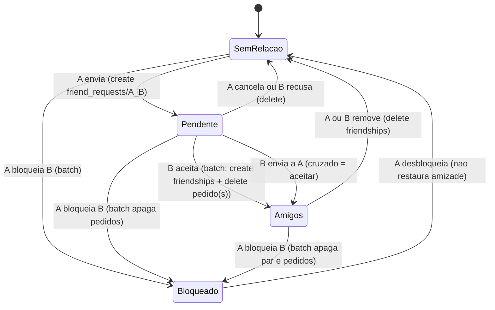

# 50 - Design: Amizades (feature 1 de 5 do conjunto social)

> Autor: Arquiteto · Data: 2026-10-05 · Entrada: [docs/49](./49-especificacao-amizades.md) (inclui a análise do código atual) · Decisão: [ADR-005](./adr/adr-005-modelo-social-amizades.md) (**Proposta**).
> **Nenhum código foi escrito e nenhum arquivo existente foi alterado.** As regras abaixo foram validadas no emulador do Firestore **numa cópia descartável fora do projeto** (§11).

## 1. Contexto e requisitos não funcionais
Contexto, restrições (Spark, privacidade, revogação, exclusão, rollout) e opções estão no ADR-005. Este documento detalha **como** construir.

| NFR | Meta |
|---|---|
| Privacidade | Não amigo, bloqueado e anônimo nunca leem dado do usuário além do cartão de busca (handle, apelido, foto), e só se ele permitir. `users/{uid}/favorites` segue só do dono |
| Revogação | Desfazer/bloquear vale na próxima leitura, nos dois sentidos, sem reescrever dados de outras features |
| Consistência | Sem servidor: invariantes garantidos pelas regras (um lado não cria amizade; bloqueio ⇒ sem amizade/pedido; 1 handle por usuário) |
| Custo | Spark: 50 mil leituras, 20 mil escritas e 20 mil deletes por dia, **por projeto** (fonte: [Firestore pricing](https://firebase.google.com/docs/firestore/pricing)) |
| Compatibilidade | Documentos e app atuais intactos; `validProfile` não muda |
| Desempenho percebido | Lista de amigos do cache em < 1 s; leitura do servidor em segundo plano |
| Acessibilidade | Teclado completo, rótulos com o nome da pessoa, alvos ≥ 48 px, 320 a 1440 px |

## 2. Opções consideradas
Comparação completa (tabelas por eixo: armazenamento da amizade, descoberta, onde mora o cartão) no [ADR-005](./adr/adr-005-modelo-social-amizades.md). Resumo: **A1** (um documento por par + pedido direcional), **B4** (handle exato + convite depois), **C2** (cartão dentro de `handles/{handle}` + ponteiro `social/{uid}`).

## 3. Modelo de dados

Convenções: `timestamp` = Firestore Timestamp; `createdAt`/`updatedAt` sempre `request.time` (servidor). **Suposição documentada:** uids são ASCII alfanuméricos sem `_` (Firebase/Google); a ordenação `menor < maior` das regras (comparação de strings) coincide com `compareTo` do Dart para ASCII (contrato a cobrir com teste Dart usando uids com dígitos/maiúsculas/minúsculas).

### 3.1 Coleções (todas novas; nada existente muda)

**`social/{uid}`** (ativação do social; ponteiro único para o handle). Só o dono lê/escreve.
| Campo | Tipo | Regra |
|---|---|---|
| `handle` | string | `^[a-z0-9_]{3,20}$`, sem `_` nas pontas, fora da lista de reservados |
| `handleChangedAt` | timestamp | `== request.time` ao criar/trocar; troca só se `+30 dias <= request.time` |
| `schemaVersion` | int (opcional) | 1 |

**`handles/{handle}`** (reserva + cartão de busca). Id = handle em minúsculas.
| Campo | Tipo | Regra |
|---|---|---|
| `uid` | string | `== auth.uid`, imutável |
| `nickname` | string | 1 a 40 após `trim` (cópia do apelido; fonte de verdade continua `users/{uid}.displayName`) |
| `photoURL` | string ou null (opcional) | `https://*.googleusercontent.com/...`, ≤ 512 |
| `discoverable` | bool | "Aparecer na busca" |
| `createdAt` | timestamp | imutável |
| `updatedAt` | timestamp | `== request.time` |

**`friend_requests/{de}_{para}`** (pedido direcional, **imutável**: sem update). Id determinístico ⇒ sem duplicata por direção.
| Campo | Tipo |
|---|---|
| `from`, `to` | string (uids; `from == auth.uid`, `to != from`) |
| `fromName`, `toName` | string 1–40 (instantâneos) |
| `fromPhoto`, `toPhoto` | string ou null (opcionais, mesma regra de URL) |
| `createdAt` | timestamp (`== request.time`) |

**`friendships/{menorUid}_{maiorUid}`** (existe **só** se os dois aceitaram).
| Campo | Tipo |
|---|---|
| `members` | list de 2 strings, `[menor, maior]` |
| `createdAt` | timestamp |
| `aName`, `aPhoto?` | instantâneo do `members[0]` (só ele edita) |
| `bName`, `bPhoto?` | instantâneo do `members[1]` (só ele edita) |

**`users/{uid}/blocks/{blockedUid}`** (só o dono lê; o bloqueado não tem acesso).
| Campo | Tipo |
|---|---|
| `blockedName`, `blockedPhoto` | opcionais (instantâneo para a tela de bloqueados) |
| `createdAt` | timestamp (`== request.time`) |

`users/{uid}`, `users/{uid}/favorites/*`, `validProfile` e `validFavorite`: **inalterados**.

### 3.2 IDs e índices
- `pairId(a, b) = a < b ? a_b : b_a` (`friendships`). Pedido: `{de}_{para}`.
- `firestore.indexes.json` (hoje vazio) passa a ter:
```json
{
  "indexes": [
    { "collectionGroup": "friend_requests", "queryScope": "COLLECTION",
      "fields": [ { "fieldPath": "to", "order": "ASCENDING" }, { "fieldPath": "createdAt", "order": "DESCENDING" } ] },
    { "collectionGroup": "friend_requests", "queryScope": "COLLECTION",
      "fields": [ { "fieldPath": "from", "order": "ASCENDING" }, { "fieldPath": "createdAt", "order": "DESCENDING" } ] }
  ],
  "fieldOverrides": []
}
```
- `friendships`: consulta `where('members', array-contains, uid)` usa o índice automático de campo único (ordenar por nome no cliente). `users/{uid}/blocks`: `orderBy('createdAt')` usa índice automático. **Não verifiquei índices no emulador** (ele não os exige); precisam estar "Enabled" no console antes do app (§13).

### 3.3 Consultas do app (todas filtram pelo uid atual: isolamento do cache entre contas)
| Tela | Consulta |
|---|---|
| Lista de amigos | `friendships.where('members', arrayContains: uid)` |
| Recebidos | `friend_requests.where('to', ==, uid).orderBy('createdAt', desc).limit(50)` |
| Enviados | `friend_requests.where('from', ==, uid).orderBy('createdAt', desc).limit(50)` |
| Contador (listener) | a mesma de recebidos, `limit(50)` |
| Bloqueados | `users/{uid}/blocks.orderBy('createdAt', desc)` |
| Busca | `get handles/{handle}` (nunca `list`) |

## 4. Regras concretas (`firestore.rules`)
Trecho **aditivo**, inserido antes do `match /{document=**}` final. É exatamente o texto que o emulador validou (suíte em §11). `isOwner` já existe no arquivo atual.

```
    // ------------------------------------------------------------------
    // Social (docs/50): amizades, pedidos, bloqueios, handles.
    // Reutilizaveis pelas proximas features: isFriend(a, b), isBlocked(a, b).
    // ------------------------------------------------------------------

    function pairId(a, b) {
      return a < b ? a + '_' + b : b + '_' + a;
    }
    function friendshipPath(a, b) {
      return /databases/$(database)/documents/friendships/$(pairId(a, b));
    }
    function requestPath(from, to) {
      return /databases/$(database)/documents/friend_requests/$(from + '_' + to);
    }
    function blockPath(blocker, blocked) {
      return /databases/$(database)/documents/users/$(blocker)/blocks/$(blocked);
    }
    function socialPath(uid) {
      return /databases/$(database)/documents/social/$(uid);
    }
    function handlePath(h) {
      return /databases/$(database)/documents/handles/$(h);
    }

    // a e b sao amigos mutuos (amizade aceita pelos dois lados). 1 exists().
    function isFriend(a, b) {
      return a != b && exists(friendshipPath(a, b));
    }
    // a bloqueou b. 1 exists(). Direcional.
    function isBlocked(a, b) {
      return exists(blockPath(a, b));
    }
    function isBlockedEither(a, b) {
      return isBlocked(a, b) || isBlocked(b, a);
    }

    function validName(s) {
      return s is string && s.trim().size() >= 1 && s.size() <= 40;
    }
    function validPhoto(p) {
      return p == null
        || (p is string && p.size() <= 512
            && p.matches('^https://[A-Za-z0-9-]+[.]googleusercontent[.]com/.*$'));
    }
    function validHandle(h) {
      return h is string && h.matches('^[a-z0-9_]{3,20}$')
        && !h.matches('^_.*|.*_$')
        && !(h in ['admin', 'administrador', 'cinetrack', 'suporte', 'support', 'ajuda', 'help',
                   'root', 'api', 'me', 'eu']);
    }

    // --- friend_requests/{from}_{to}: pedido direcional, imutavel ---
    function validRequest(key) {
      let d = request.resource.data;
      let me = request.auth.uid;
      return d.keys().hasOnly(['from', 'to', 'fromName', 'fromPhoto', 'toName', 'toPhoto', 'createdAt'])
        && d.keys().hasAll(['from', 'to', 'fromName', 'toName', 'createdAt'])
        && d.from == me && d.to is string && d.to.size() >= 1 && d.to.size() <= 128 && d.to != me
        && key == d.from + '_' + d.to
        && d.createdAt == request.time
        && validName(d.fromName) && validName(d.toName)
        && (!('fromPhoto' in d) || validPhoto(d.fromPhoto))
        && (!('toPhoto' in d) || validPhoto(d.toPhoto))
        && exists(socialPath(d.from)) && exists(socialPath(d.to))
        && !isBlockedEither(d.from, d.to)
        && !isFriend(d.from, d.to);
    }

    match /friend_requests/{key} {
      allow get: if request.auth != null && request.auth.uid in key.split('_');
      allow list: if request.auth != null
        && (resource.data.from == request.auth.uid || resource.data.to == request.auth.uid);
      allow create: if request.auth != null && validRequest(key);
      allow update: if false;
      // cancelar (remetente) ou recusar (destinatario). Apagar o que nao existe e inofensivo.
      allow delete: if request.auth != null
        && (resource == null || request.auth.uid in [resource.data.from, resource.data.to]);
    }

    // --- friendships/{menorUid}_{maiorUid}: um documento por par, so existe se aceita ---
    function validFriendshipCreate(key) {
      let d = request.resource.data;
      let me = request.auth.uid;
      let other = d.members[0] == me ? d.members[1] : d.members[0];
      return d.keys().hasOnly(['members', 'createdAt', 'aName', 'aPhoto', 'bName', 'bPhoto'])
        && d.keys().hasAll(['members', 'createdAt', 'aName', 'bName'])
        && d.members is list && d.members.size() == 2 && me in d.members
        && d.members[0] is string && d.members[1] is string && d.members[0] < d.members[1]
        && key == d.members[0] + '_' + d.members[1]
        && d.createdAt == request.time
        && validName(d.aName) && validName(d.bName)
        && (!('aPhoto' in d) || validPhoto(d.aPhoto))
        && (!('bPhoto' in d) || validPhoto(d.bPhoto))
        && exists(socialPath(me)) && exists(socialPath(other))
        && !isBlockedEither(me, other)
        // o outro lado consentiu: existe o pedido dele para mim ...
        && exists(requestPath(other, me))
        // ... e o mesmo batch o consome (nao sobra pedido pendente)
        && !existsAfter(requestPath(other, me))
        && !existsAfter(requestPath(me, other));
    }

    match /friendships/{key} {
      allow get: if request.auth != null && request.auth.uid in key.split('_');
      allow list: if request.auth != null && request.auth.uid in resource.data.members;
      allow create: if request.auth != null && validFriendshipCreate(key);
      // cada lado so atualiza a propria "metade" do instantaneo de nome/foto
      allow update: if request.auth != null && request.auth.uid in resource.data.members
        && request.resource.data.diff(resource.data).affectedKeys().hasOnly(
             request.auth.uid == resource.data.members[0] ? ['aName', 'aPhoto'] : ['bName', 'bPhoto'])
        && validName(request.resource.data.aName) && validName(request.resource.data.bName)
        && validPhoto(request.resource.data.get('aPhoto', null))
        && validPhoto(request.resource.data.get('bPhoto', null));
      // qualquer lado desfaz; remove para os dois
      allow delete: if request.auth != null
        && (resource == null || request.auth.uid in resource.data.members);
    }

    // --- users/{uid}/blocks/{blockedUid}: so o dono le; invariavel bloqueio x amizade ---
    match /users/{uid}/blocks/{blocked} {
      allow read: if isOwner(uid);
      allow create: if isOwner(uid)
        && request.resource.data.keys().hasOnly(['blockedName', 'blockedPhoto', 'createdAt'])
        && request.resource.data.keys().hasAll(['createdAt'])
        && request.resource.data.createdAt == request.time
        && (!('blockedName' in request.resource.data) || validName(request.resource.data.blockedName))
        && (!('blockedPhoto' in request.resource.data) || validPhoto(request.resource.data.blockedPhoto))
        && blocked is string && blocked != uid && blocked.size() <= 128
        // o mesmo batch precisa ter desfeito amizade e pedidos
        && !existsAfter(friendshipPath(uid, blocked))
        && !existsAfter(requestPath(uid, blocked))
        && !existsAfter(requestPath(blocked, uid));
      allow update: if false;
      allow delete: if isOwner(uid);
    }

    // --- social/{uid}: ativacao do social + ponteiro unico para o handle ---
    function validSocialWrite(uid) {
      let d = request.resource.data;
      return d.keys().hasOnly(['handle', 'handleChangedAt', 'schemaVersion'])
        && d.keys().hasAll(['handle', 'handleChangedAt'])
        && (!('schemaVersion' in d) || d.schemaVersion is int)
        && validHandle(d.handle);
    }

    match /social/{uid} {
      allow read: if isOwner(uid);
      allow create: if isOwner(uid) && validSocialWrite(uid)
        && request.resource.data.handleChangedAt == request.time
        && getAfter(handlePath(request.resource.data.handle)).data.uid == uid;
      allow update: if isOwner(uid) && validSocialWrite(uid)
        && (request.resource.data.handle == resource.data.handle
              ? request.resource.data.handleChangedAt == resource.data.handleChangedAt
              : (request.resource.data.handleChangedAt == request.time
                 && resource.data.handleChangedAt + duration.value(30, 'd') <= request.time
                 && getAfter(handlePath(request.resource.data.handle)).data.uid == uid
                 && !existsAfter(handlePath(resource.data.handle))));
      // so apaga se o handle foi liberado no mesmo batch
      allow delete: if isOwner(uid) && !existsAfter(handlePath(resource.data.handle));
    }

    // --- handles/{handle}: reserva (unicidade) + cartao de busca ---
    function validCard(uid) {
      let d = request.resource.data;
      return d.keys().hasOnly(['uid', 'nickname', 'photoURL', 'discoverable', 'createdAt', 'updatedAt'])
        && d.keys().hasAll(['uid', 'nickname', 'discoverable', 'createdAt', 'updatedAt'])
        && d.uid == uid
        && validName(d.nickname)
        && validPhoto(d.get('photoURL', null))
        && d.discoverable is bool
        && d.createdAt is timestamp && d.updatedAt == request.time;
    }

    match /handles/{h} {
      // So busca exata por id (sem list). Nao revela quem esta oculto ou bloqueou.
      allow get: if request.auth != null
        && (resource == null
            || isOwner(resource.data.uid)
            || (resource.data.discoverable == true
                && !isBlockedEither(resource.data.uid, request.auth.uid)));
      allow create: if request.auth != null && validHandle(h) && validCard(request.auth.uid)
        && request.resource.data.createdAt == request.time
        && getAfter(socialPath(request.auth.uid)).data.handle == h;
      allow update: if request.auth != null && isOwner(resource.data.uid)
        && validCard(resource.data.uid)
        && request.resource.data.createdAt == resource.data.createdAt
        && getAfter(socialPath(request.auth.uid)).data.handle == h;
      allow delete: if request.auth != null && isOwner(resource.data.uid)
        && (!existsAfter(socialPath(request.auth.uid))
            || getAfter(socialPath(request.auth.uid)).data.handle != h);
    }
```

Notas de leitura das regras
- `isFriend(a, b)` = **1** `exists`. `isBlocked(a, b)` = "a bloqueou b" = **1** `exists`. `isBlockedEither` = 2.
- `exists()` dentro das regras ignora as regras de leitura do documento consultado: o bloqueado **não** lê `users/{blocker}/blocks/*`, mas as regras enxergam.
- Chamadas repetidas ao mesmo caminho contam uma vez (medido: 12 repetições passaram).
- Apagar documento inexistente é inofensivo (`resource == null`): o batch de bloquear apaga par e pedidos "no escuro".
- `handles/{h}` get: inexistente devolve "não existe"; oculto/bloqueado devolve `permission-denied`. O cliente **mostra a mesma mensagem** nos três casos. Um atacante técnico distingue "inexistente" de "existe mas negado" (revela só que o handle está ocupado, o que a checagem de disponibilidade já revela). Risco aceito.

## 5. Estados da amizade


## 6. Ator x operação x permitido
Atores: **R** remetente do pedido, **D** destinatário, **M** membro do par, **T** terceiro autenticado, **B** bloqueado pelo dono, **X** anônimo. "Dono" = o próprio uid.

| Recurso | Operação | Quem pode | Condições-chave (regras) |
|---|---|---|---|
| `social/{uid}` | ler, criar, atualizar, apagar | Dono | handle válido; ponteiro bate com `handles` (`getAfter`); troca 1×/30 dias; apagar só se o handle foi liberado no mesmo batch. T, B, X: negado |
| `handles/{h}` | get | Dono sempre; qualquer logado se `discoverable` e **sem bloqueio em nenhum sentido**; inexistente = "não existe" | `list` negado a todos |
| `handles/{h}` | criar | Dono | formato; `uid == auth.uid`; ponteiro aponta para ele (1 handle por usuário); id livre (criar sobre existente = update, negado a outro) |
| `handles/{h}` | atualizar | Dono | `uid` e `createdAt` imutáveis |
| `handles/{h}` | apagar | Dono | ponteiro não aponta mais para ele (ou foi apagado) |
| `friend_requests/{de}_{para}` | criar | R | `from == auth.uid`; id confere; os dois têm `social`; sem bloqueio em nenhum sentido; ainda não são amigos; sem campos extras; `createdAt` = servidor |
| mesmo | ler (get/list) | R e D | list: `from` ou `to` = eu. T, B, X: negado |
| mesmo | atualizar | ninguém | imutável |
| mesmo | apagar | R (cancelar) e D (recusar) | inexistente = no-op. T: negado |
| `friendships/{par}` | criar | M | **o outro já enviou pedido para mim**; o batch apaga os pedidos (`existsAfter`); os dois com `social`; sem bloqueio; membros ordenados; id confere. R aceitando o próprio pedido: negado. T: negado |
| mesmo | ler (get/list) | M | `members` contém o uid. T, X: negado |
| mesmo | atualizar | M | só a **própria metade** do instantâneo (`aName/aPhoto` ou `bName/bPhoto`) |
| mesmo | apagar | M (qualquer lado) | remove para os dois. T: negado |
| `users/{uid}/blocks/{b}` | criar | Dono | `blocked != uid`; o batch apagou par e pedidos nos dois sentidos |
| mesmo | ler | Dono | B e T: negado |
| mesmo | apagar | Dono | desbloquear; não restaura nada |
| `users/{uid}`, `favorites/*` | tudo | Dono | **igual a hoje** |
| `isFriend(a, b)` em outras features | decide leitura | M | ver §7 |

## 7. Limites do Firestore Rules e o uso nas próximas features

**Limites (fonte: [Structuring Cloud Firestore Security Rules](https://firebase.google.com/docs/firestore/security/rules-structure), consultada em 2026-10-05):**
- `exists()/get()/getAfter()`: **10** por requisição de documento único e por consulta; **20** em leituras de vários documentos, transações e batches. O limite de 10 vale também **por operação** dentro de um batch (o doc dá o exemplo: 3 escritas com 2 chamadas cada usam 6 das 20). Estourar = `permission-denied`. Chamadas em cache não contam.
- Ruleset ≤ 256 KB (fonte) e 250 KB compilado; `match` aninhado ≤ 10; profundidade de função ≤ 20; sem recursão.
- **Cobrança:** ([Firestore pricing](https://firebase.google.com/docs/firestore/pricing)) "You are charged for reads that are necessary to evaluate your Cloud Firestore Security Rules": uma leitura por documento dependente, mesmo referenciado várias vezes. Mínimo de 1 leitura por consulta, mesmo sem resultado.

**Medido no emulador** (cópia descartável; **o emulador pode divergir da produção**):
| Experimento | Resultado |
|---|---|
| `get` com 10 `exists()` distintos / 11 | passou / negado |
| Mesmo caminho repetido 12× | passou (conta 1) |
| Batch com 2 escritas × 7 chamadas / 3 escritas × 7 (21 > 20) | passou / negado |
| Consulta `authorId in [N amigos]` com `allow list: isFriend(resource.data.authorId, me)` | N = 10, 11, 15, 20 passam; **21 e 30 negados**; com 1 não amigo na lista: negado |
| Consulta `documentId in [N amigos]` com `isFriend(resource.id, me)` | **N = 10 passa; N = 20 negado**; com 1 não amigo: negado |

Observação: o doc diz 10 para consultas e o emulador deixou passar 20 no caso `authorId`; no caso `documentId`, 20 foi negado. **Regra de projeto: lotes de até 10 identificadores por consulta** (o valor documentado, e o único que passou nos dois casos).

**Como F2–F5 usam `isFriend`/`isBlocked` sem estourar o limite**
1. **Visibilidade = `isFriend` apenas.** Como "amigo ⇒ não bloqueado" é invariante (§4), as features seguintes **não** chamam `isBlocked` para ler dado de amigo. Custo por decisão: 1 `exists`. `isBlocked` fica para fluxos entre não amigos (busca, pedido).
2. **Documento do dono, lido por amigo** (F2 snapshot, F4 avaliação, F5 comentário): `allow get: if isOwner(owner) || isFriend(owner, request.auth.uid)` = 1 chamada. Guardar o `authorId`/`ownerUid` **no próprio documento** e a decisão em `resource.data`, sem `get()` de perfil/amizade encadeado.
3. **Consultas**: o autor tem de estar **fixado pela consulta** (`where authorId == x` ou `in [...]`); a regra usa `resource.data.authorId`. Lote de ≤ 10 autores por consulta (medido acima). Para 50 amigos: 5 consultas em paralelo; cada uma custa 1 leitura mínima + 1 leitura de regra por autor + os documentos.
4. **Nunca** usar um array de leitores dentro do documento de outra feature (exigiria reescrever dados ao desfazer amizade; viola a restrição 4).
5. **Nomes/fotos nas listas** vêm do instantâneo (par, pedido): nada de `get(handles/...)` por item.
6. F5 ("cada leitor só vê autores que são ele mesmo ou amigo mútuo dele"): consultar comentários por `authorId in [eu + amigos]` em lotes de ≤ 10 e fundir no cliente; a decisão por documento é só `isFriend(authorId, me)`.
7. Em escritas (batch), cada operação conta contra 10 e o batch contra 20: **desenhar escritas de F2–F5 com ≤ 3 chamadas por operação e ≤ 6 operações com chamadas por batch**. Hoje: criar pedido usa 5, criar par 7 (+2 `existsAfter`), criar bloqueio 3, trocar handle 4 no total.

## 8. Fluxos (cliente)
| Ação | Passos |
|---|---|
| Ativar | validar formato local → transação/batch: `handles/{h}` (cartão) + `social/{uid}` → atualizar `users/{uid}.displayName` se mudou (já existe) |
| Trocar handle | batch: apagar `handles/{antigo}`, criar `handles/{novo}`, atualizar `social/{uid}` |
| Aparecer na busca / foto / apelido | `update` em `handles/{h}` (+ apelido em `users/{uid}`); fan-out opcional nas metades (D8) |
| Buscar | normaliza (`trim`, minúsculas, remove `@`) → `get handles/{h}`; consulta o estado (amigo/pedido) no cache da lista |
| Enviar | `runTransaction`: `get friend_requests/{outro}_{eu}`; se existe → aceitar; senão `set friend_requests/{eu}_{outro}` |
| Aceitar | batch: criar `friendships/{par}` (metade do outro vem do pedido) + apagar `{outro}_{eu}` + apagar `{eu}_{outro}` |
| Cancelar / Recusar / Remover | 1 `delete` |
| Bloquear | batch: criar `users/{eu}/blocks/{outro}` + apagar par + apagar os dois pedidos |
| Desbloquear | `delete` do bloqueio |
| Exclusão | §10 |
Escritas sociais exigem servidor (padrão `ensureOnline` do `AccountDeleter`/transação) para não aplicar uma amizade horas depois, enfileirada.

## 9. Estimativa de cota por tela (Spark)
Hipótese típica: **N = 20 amigos, 2 pedidos recebidos, 2 enviados, 1 bloqueio**; máximos: N = 300, 50, 50. "Regra" = leituras de documentos feitas pelas regras (cobradas). Valores com ≈ são estimativa a partir da documentação; **não medidos em produção**.

| Tela / ação | Leituras | Regra | Escritas | Deletes |
|---|---|---|---|---|
| Abrir Amigos, a frio, online (amigos + recebidos + enviados) | N + 2 + 2 = **24** (máx. 400) | 0 | 0 | 0 |
| Reabrir dentro do TTL de 5 min / offline | 0 (cache) | 0 | 0 | 0 |
| Aba Bloqueados | máx(1, B) = 1 | 0 | 0 | 0 |
| Contador de pedidos (listener, por sessão) | 1 + 2 = **3**; +1 por pedido novo | 0 | 0 | 0 |
| Buscar handle visível | 1 | 2 (`isBlockedEither`) | 0 | 0 |
| Buscar handle inexistente | 1 (mínimo) | 0 | 0 | 0 |
| Buscar handle oculto/bloqueado | 1 (≈, negado) | 0–2 | 0 | 0 |
| Estado do resultado (amigo/pedido) | 0 (cache da lista); sem lista carregada: 2 | 0 | 0 | 0 |
| Enviar pedido | 1 (pedido inverso) | 5 (2 `social`, 2 bloqueios, 1 par) | 1 | 0 |
| Aceitar (batch de 3) | 0 | ≈ 5 + ≈ 2 (`existsAfter`) | 1 | 2 |
| Cancelar / Recusar / Remover amigo / Desbloquear | 0 | 0 | 0 | 1 |
| Bloquear | 0 | ≈ 3 (`existsAfter`) | 1 | até 3 |
| Ativar amizades | 1 (disponibilidade) | ≈ 2 | 2 | 0 |
| Trocar handle | 0–1 | ≈ 4 | 2 | 1 |
| Alternar "Aparecer na busca" / editar apelido (cartão) | 0 | ≈ 1 | 1 | 0 |
| Fan-out de apelido/foto (D8) | 0 | 0 | N (lotes de 400) | 0 |
| Excluir conta | N + pedidos + bloqueios (mín. 1 por consulta) | 0 | 0 | N + pedidos + bloqueios + 2 |

Orçamento: com 100 usuários sociais ativos/dia, 3 aberturas de Amigos + 3 sessões + 3 buscas ≈ (3×24 + 3×3 + 3×3) ≈ 90 leituras/usuário ⇒ **≈ 9 mil leituras/dia (18% da cota)**; com 500 usuários ≈ 45 mil (90%). Esse consumo **soma** ao já existente (favoritos, catálogo em cache); o consumo atual não foi medido. Mitigações: TTL de 5 min na lista (cache-first), um único listener estreito (contador), nada de listener em lista de amigos, `limit(50)`, F2–F5 devem reaproveitar a lista de amigos já carregada. Se a cota estourar, o Firestore falha as operações até o reset diário (comportamento assumido, não verificado, como no ADR-003): o app mostra a mensagem do §12 e **não** ativa Blaze.

## 10. Impacto em outras áreas
- **AccountDeleter / `ProfileDataSource`**: novo passo `deleteAllSocial()` entre `markDeleting()` e `deleteAllFavorites()`; ordem interna (retomável, tudo idempotente): (1) batch único `delete handles/{handle}` + `delete social/{uid}` (**fecha a porta**: sem `social`, ninguém envia pedido nem aceita para este uid); (2) páginas de 400 de `friend_requests` (`from == uid` e `to == uid`) e de `friendships` (`array-contains uid`); (3) `users/{uid}/blocks`. Cada página lida **do servidor** (`wipeInPages`). Resultado: ex-amigos deixam de ver o usuário na lista (o par some). O handle libera na hora. Bloqueios que **outros** fizeram contra ele ficam órfãos (inofensivos; somem quando o bloqueador desbloquear). Se o handle/`social` não existir (usuário nunca ativou), o passo é no-op. Os fakes de `ProfileDataSource` e o teste de ordem do `AccountDeleter` precisam ser atualizados.
- **Exportação**: `kExportSchemaVersion` 1 → 2; seção `social`: `handle`, `discoverable`, `photoVisible`, `friends` (uid, apelido, desde), `requestsSent`, `requestsReceived`, `blocks` (uid, apelido). Sem foto de terceiros (D9). Compatível: quem não ativou exporta `social: null`.
- **Privacidade**: `PrivacySummary`, `web/privacidade.html` (data nova) e o diálogo de exclusão passam a dizer: apelido e (opcionalmente) foto ficam visíveis a quem buscar o handle, **só se ativar**; amigos veem apelido/foto; nada de favoritos/recomendações é compartilhado nesta feature; a frase "a foto não é copiada para o banco" passa a "só se você ativar amizades e permitir".
- **README**: nova seção (modelo, rollout, testes de regras), atualizar "Perfil" e a ordem de rollout.
- **Cache local**: consultas sempre com o uid atual; a limpeza de cache pós-exclusão (`markFirestoreCachePurge`) já cobre os documentos novos.
- **`validProfile`**: não muda. Se um dia o apelido for removido com social ativo, o cartão perde a fonte: o app **não permite** apagar o apelido enquanto ativo (spec).

## 11. Validação das regras no emulador
**O que rodou** (cópia descartável no scratchpad; projeto intocado; `firebase emulators:exec --only firestore`, JDK 24, projeto `demo-cinetrack`): `social.test.mjs` com **47 testes novos, todos passando**, mais a suíte existente do repositório (`firestore.rules.test.mjs` + `recommended.test.mjs`) **contra as regras novas: 76 testes, todos passando** (total 123/123). Cobertura dos novos:
- **Handle**: criar por batch; segundo usuário com o mesmo handle negado; **3 transações concorrentes no mesmo handle ⇒ exatamente 1 vence**; formatos inválidos (curto, longo, maiúscula, espaço, `_` nas pontas, reservado `admin`, acento); ponteiro para handle alheio; cartão com uid de outro; campos extras; foto fora de `googleusercontent.com`; apelido vazio/41 caracteres; `discoverable` não booleano; dois handles para o mesmo usuário negado; troca dentro de 30 dias negada, após 30 dias ok (documento antigo semeado) e handle antigo reutilizável por outro; apagar só handle ou só ponteiro negado; `uid` imutável; terceiro não edita/apaga.
- **Busca**: visível; oculto negado ao terceiro e liberado ao dono; `list` negado; inexistente = "não existe"; anônimo negado; bloqueado não encontra quem o bloqueou e o bloqueador também não vê o bloqueado; desbloquear restabelece.
- **Pedido**: envio ok; remetente forjado, id divergente, auto-pedido, campo extra, destinatário sem `social`, data forjada, nome vazio: negados; duplicado negado; leitura só remetente/destinatário (get e list), terceiro/anônimo negados; cancelar (remetente) e recusar (destinatário) ok, terceiro negado, sem update.
- **Amizade**: **nenhum lado cria sozinho**; remetente não confirma o próprio pedido; terceiro não usa pedido alheio nem cria par entre dois outros; destinatário aceita **só** se o batch consome o pedido; schema (ordem de membros, 3 membros, campo extra, data forjada, nome vazio, foto externa, id errado) negado; **pedido cruzado** (por batch e por transação) vira amizade e não sobra pedido; já amigos ⇒ novo pedido negado; lista por `array-contains` só dos membros; edição só da própria metade; remover por qualquer lado, terceiro negado; recriar só por novo pedido.
- **Bloqueio**: exige desfazer par e pedidos (as três omissões separadamente negadas); sem nada existente funciona; depois do bloqueio: pedidos nos dois sentidos e par negados; bloqueado não lê nem lista o documento de bloqueio; só o dono cria/apaga; auto-bloqueio e campo extra negados; **desbloquear não restaura**, novo pedido é possível.
- **`isFriend/isBlocked` em outras features** (coleções de teste, fora da proposta): amigo lê, estranho e ex-amigo não (revogação imediata); bloqueio revoga; consulta `authorId == amigo` e `in [amigos]` passam, com não amigo negam.
- **Exclusão**: handle sozinho negado; handle+ponteiro em um batch ok; depois ninguém envia pedido ao usuário; varredura de pedidos/pares/bloqueios ok; ex-amigo deixa de listar o usuário.
- **Limites**: tabela do §7.

**O que NÃO verifiquei**
- Nada contra um projeto Firebase real: **produção pode divergir** do emulador (limite de chamadas em consultas, cobrança das leituras de regra, comportamento de `existsAfter` cobrado ou não).
- Código Dart/Flutter (não existe ainda); `SocialDataSource`, transações offline, abas simultâneas.
- Índices compostos (emulador não os exige).
- Regras do **convite por link** (Fatia 5): não escritas nem testadas.
- Regras de F2–F5: apenas sondas genéricas; os desenhos finais serão validados nas respectivas features.
- Texto jurídico/LGPD.
- Comportamento de cota esgotada no Spark.

## 12. Estados de UI
| Estado | Amigos / Pedidos / Bloqueados | Buscar | Perfil > Amigos e privacidade |
|---|---|---|---|
| Carregando | indicador de progresso + esqueleto de 3 linhas (nunca "vazio" falso) | botão "Buscar" com progresso, campo mantido | linha com progresso |
| Vazio | Amigos: "Você ainda não tem amigos." + "Adicionar amigo". Pedidos: "Nenhum pedido." Bloqueados: "Você não bloqueou ninguém." | "Nenhum usuário encontrado" (igual para inexistente, oculto, bloqueado) | "Ativar amizades" |
| Erro | mensagem + "Tentar de novo"; `permission-denied` na ativação: "Amizades ainda não estão disponíveis."; `resource-exhausted`: "Muitas operações hoje. Tente de novo amanhã." | idem | idem |
| Offline | lista do cache + faixa "Sem conexão"; ações de escrita desabilitadas com o motivo | busca desabilitada | alternar/trocar desabilitados |
| Sem login | `/friends` redireciona para `/` (como `/profile`); sem ícone | idem | rota já protegida |
| Sucesso | `SnackBar` curto ("Pedido enviado", "Amizade aceita", "Amigo removido", "Usuário bloqueado") e liveRegion | idem | idem |
Confirmações: remover e bloquear em diálogo com foco inicial em "Cancelar", Esc fecha; textos: "Remover Bruno? Ele não será avisado." / "Bloquear Bruno? Vocês deixam de ser amigos, ele não poderá te encontrar e não será avisado."

## 13. Navegação (sem 6ª aba)
Tab bar atual (≤768 px): Início, Explorar, Recomendo, Favoritos, Perfil (5, o máximo recomendado pelo Material). A Busca já virou lupa na barra superior.
- **Mobile (≤768 px)**: novo ícone **Amigos** (`Icons.people_outline`, 48×48) na `MobileTopBar`, entre o logo e a lupa, **só logado**, com `Badge` numérico quando há pedidos recebidos (rótulo semântico "Amigos, N pedidos recebidos"). Visível em toda aba do shell. Abre `/friends`. Em `/friends` a aba selecionada é **Perfil** (Amigos "mora" no Perfil). Além disso, o **Perfil** ganha um cartão "Amigos" no topo com os contadores e o botão "Gerenciar" (descoberta e fallback). Em 320 px com fonte 2×/3×, o logo+nome pode ficar apertado: o `BrandMark` já usa `Flexible` com reticências; **fallback**: se não couber, o ícone some e o indicador vira um ponto no destino Perfil. A decidir em teste de layout (matriz 320–768 × fonte 1×/2×/3×).
- **Desktop (≥769 px)**: item **Amigos** (ícone+rótulo a partir de 960 px × fator de fonte, só ícone abaixo, com `Badge`) no menu do topo, junto de Explorar/Recomendações/Favoritos (hoje `_NavAction`); verificar todas as telas com AppBar próprio que reproduzem esse menu.
- **Rotas** (dentro do `ShellRoute`): `/friends` (abas internas: Amigos | Pedidos | Bloqueados) e `/friends/add` (busca). O `redirect` passa a proteger `/profile` **e** `/friends*`.
- Teclado: abas internas com setas; foco no campo de busca ao abrir `/friends/add`; Enter busca; Esc fecha diálogos.

## 14. Rollout e rollback
Ordem obrigatória (o Manager executa o que é do console):
1. **Manager exporta a própria conta** (Fatia 0 do ciclo anterior) e anota os números do Perfil.
2. **Publicar `firestore.rules`** (console ou `firebase deploy --only firestore:rules`). É aditivo: o app atual segue idêntico (a suíte existente de 76 testes passa nas regras novas).
3. **Publicar os índices** (`firebase deploy --only firestore:indexes` ou pelo link do console) e esperar "Enabled".
4. Só então **merge/deploy do app** (Fatia 1 em diante, atrás de nada além da ativação opt-in: sem ativar, nenhum dado social é gravado).
5. Cada feature seguinte (F2–F5) repete: regras → índices → app.
**Rollback**: do **app**, sempre seguro (dados sociais ficam e são ignorados). **Nunca voltar as regras** depois que houver dados sociais: regras anteriores negariam tudo e, pior, regras intermediárias sem as invariantes (bloqueio ⇒ sem amizade) quebrariam a revogação de F2+. Correções de regras só para frente. Se o app novo for antes das regras, a ativação falha com a mensagem do §12 e nada se perde.

## 15. Observabilidade
Sem telemetria (política do app). Verificação por: suíte de regras (contrato), contagens locais no Perfil (amigos, pedidos), `debugPrint` apenas de **código** do erro Firestore (como já faz o export), e o console do Firebase (uso diário de leituras/escritas) conferido pelo Manager na primeira semana.

## 16. Riscos
| # | Risco | Mitigação |
|---|---|---|
| 1 | Regra frouxa expõe dados | cartão mínimo e separado; 47 testes de negação; revisão de segurança antes do merge |
| 2 | Cota do projeto (leituras de regra incluídas) | TTL, cache-first, um listener estreito, limites de lista; reavaliar a cada feature social |
| 3 | Limite de 10/20 chamadas em F2–F5 | `isFriend` de 1 chamada; lotes de ≤ 10; regra de projeto do §7 |
| 4 | Divergência emulador × produção | smoke manual em produção com 2 contas (Manager) antes de divulgar |
| 5 | Spam de pedidos / assédio | sem contador no servidor; bloquear; limite de UI (D5); opção D7 |
| 6 | Handles ofensivos / homógrafos | ASCII minúsculo, reservados; sem moderação (sem servidor) |
| 7 | Foto do Google copiada | opt-in, só `googleusercontent.com`, texto de privacidade novo |
| 8 | Dados de terceiros na exportação | só uid + apelido (D9) |
| 9 | Exclusão parcial deixa pedido/par órfão | ordem: fechar a porta primeiro; passos idempotentes; teste no `AccountDeleter` |
| 10 | Instantâneos desatualizados | fan-out raro (D8) ou aceitar |
| 11 | Pedido cruzado simultâneo duplicado | transação + reconciliação no cliente; regras permitem completar |
| 12 | uid com `_` ou ordenação divergente Dart × regras | suposição documentada + teste de contrato com uids reais |
| 13 | Reversão de regras | proibida; checklist no README |

## 17. Tarefas técnicas sugeridas (para o Orquestrador)
1. **Regras + índices + testes**: portar o trecho do §4 para `firestore.rules`, `firestore.indexes.json` e `firestore_rules_test/social.test.mjs` (casos do §11; sondas de F2–F5 marcadas como experimentais). Revisão de segurança.
2. **Modelos e `SocialDataSource`** (interface + Firestore + fake em memória + inerte deslogado): ativação, handle, busca, pedidos, amizades, bloqueios; mapeamento de erros para falhas tipadas; `pairId` com teste de contrato.
3. **`AccountDeleter`/`ProfileDataSource.deleteAllSocial`** + testes de ordem/idempotência/retomada; **exportação schema 2**.
4. **UI Perfil** (ativar, handle, "Aparecer na busca", foto) + textos de privacidade + `web/privacidade.html` + README.
5. **Telas** `/friends`, `/friends/add`, ícone com `Badge` (mobile e desktop), redirect, matriz de layout 320–1440, acessibilidade por teclado.
6. **QA**: rollout em produção com 2 contas; medir leituras no console.

## 18. Decisões a validar com o Manager
Mesma lista do [docs/49](./49-especificacao-amizades.md#decisões-a-validar-com-o-manager) com a recomendação técnica:

| # | Decisão | Opções | **Default** | Consequência técnica |
|---|---|---|---|---|
| D1 | Descoberta | apelido / handle / convite / handle+convite | **handle exato; convite na Fatia 5** | busca = 1 `get`, sem `list`, sem raspagem; oculto só alcançável por convite |
| D2 | Handle | formato; unicidade; troca | **`^[a-z0-9_]{3,20}$`; reserva `handles/{h}` + ponteiro; 1 troca/30 dias; antigo livre na hora** | unicidade garantida pelas regras sob concorrência (testado); sem quarentena |
| D3 | O que o não amigo vê | handle+apelido+foto / sem foto | **handle, apelido, foto (se permitido)** | foto passa a ser copiada para o banco |
| D4 | Pedido cruzado | vira amizade / dois pendentes | **vira amizade** | transação no cliente + regra aceita completar |
| D5 | Limites | só app / contador no servidor | **300 amigos, 50 enviados, 50 recebidos listados, só app** | não imposto no servidor |
| D6 | Ativação | opt-in / automática | **opt-in** | `social/{uid}` é o marcador |
| D7 | Recusar | apagar / marcar recusado 30 dias | **apagar** | sem estado extra |
| D8 | Instantâneo de nome/foto | nunca / fan-out raro / ler fresco | **fan-out raro** | N escritas por mudança, 0 leitura de regra |
| D9 | Exportar dados de amigos | uid+apelido / só uid | **uid+apelido** | texto de privacidade |
| D10 | Foto | só Google / qualquer URL | **só `googleusercontent.com`** | regra de URL |
| D11 | Cota/plano | seguir Spark / Blaze | **Spark, cache+TTL** | §9 |
| D12 | Pedido a oculto | só com uid conhecido | **só com uid conhecido** | oculto ≠ mudo |

## Decisões do Manager (2026-10-05)
Todas as decisões D1–D12 aprovadas com os **padrões recomendados** (handle exato agora + convite por link na fatia 5; `^[a-z0-9_]{3,20}$` com troca a cada 30 dias; não amigo vê handle, apelido e avatar só se o usuário permitir; pedido cruzado vira amizade; 300 amigos e 50 pedidos enviados só no app; ativação opt-in; recusar apaga em silêncio; fan-out raro de apelido/foto; exportação inclui uid e apelido dos amigos; sem Blaze, com cache/TTL; pedido a quem está oculto só com uid conhecido).
Regras de condução: a Fase 1 só termina com TODAS as fatias (0–5) implementadas, revisadas com APROVADO limpo e publicadas; **as regras do Firestore devem ser FINAIS desde a fatia 0 (incluindo o convite por link da fatia 5)** para o Manager publicá-las uma única vez, antes do app; nenhuma fase seguinte começa antes disso. Restrições absolutas: ninguém perde dados atuais; ninguém precisa fazer nada; sem ressalvas.
