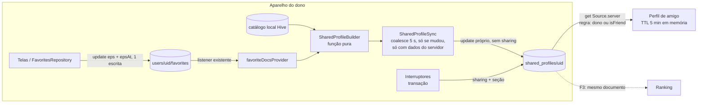

# 82 - Design: Perfil social (Fase 2 de 5: meu perfil, perfil de amigo, snapshot de estatísticas e atividades)

> Autor: Arquiteto · Data: 2026-10-10 · Base: `main` 9c57327 (Fase 1 em produção) · Branch: `feat/social-profile`
> Entradas: [docs/81](./81-especificacao-perfil-social.md) (PA, D1–D14, A1–A14) e [docs/83](./83-testabilidade-perfil-social.md) (QA, B1–B8). Decisão: [ADR-006](./adr/adr-006-snapshot-perfil-social.md) (**Aceita**, Manager, 2026-10-10). D1–D17 aprovadas pelo Manager em 2026-10-10.
> **Nenhum código, regra ou arquivo existente do projeto foi alterado.** As regras do §4 foram validadas no emulador do Firestore **numa cópia descartável no scratchpad** (§4.6). Onde discordo do PA, digo onde e por quê (§16); o docs/81 não foi editado.

## Sumário
1. Contexto e NFR · 2. Opções · 3. Solução · 4. Modelo de dados e regras · 5. Cálculo do snapshot (períodos, atividades) · 6. Atualização (quando, como) · 7. Fluxos (interruptores, perfil de amigo) · 8. Exclusão, desativação, exportação · 9. Rotas, providers e repositórios · 10. Estados de UI · 11. Cota · 12. Rollout/rollback · 13. Testes · 14. Riscos · 15. Fatias · 16. Respostas A1–A14, bloqueantes B1–B8 e posição sobre D1–D14 · 17. Decisões para o Manager

---

## 1. Contexto e requisitos não funcionais
Contexto, alternativas e justificativa da revisão de "estatísticas sem contadores guardados" estão no ADR-006. Aqui está o **como**.

| NFR | Meta |
|---|---|
| Privacidade | Só amigos mútuos leem; não amigo, ex-amigo, bloqueado (2 sentidos), anônimo: negados. `users/{uid}/favorites` segue só do dono. Seção desligada = ausente do servidor |
| Consentimento | Opt-in por seção, desligado por padrão, efeito imediato, reversível; nenhum aparelho republica seção desligada; nada anterior ao consentimento de atividades é publicado |
| Nunca perder dados | Nenhuma escrita desta fase compartilha batch com escrita de favorito; falha do compartilhado é silenciosa e não desfaz nada; `epsAt` só enviado com regras novas confirmadas |
| Revogação | Desfazer amizade/bloquear: próxima leitura negada, sem reescrever dados |
| Cota | Perfil de amigo: 2 leituras a frio, 0 no TTL; quem não liga nada: 0 escritas novas; recálculo sem mudança: 0 escritas |
| Contenção | ≤ 1 escrita por 5 s por documento compartilhado (limite do Firestore ≈ 1/s sustentado) |
| Limite das regras | Pior escrita **do app** ≤ 65% e pior documento **legal** ≤ 70% do limite de 1000 expressões, folga travada por teste (medido na Fatia 0, docs/84: ≈ 64% e ≈ 65%); ≤ 1 chamada `exists` por operação |
| Compatibilidade | App antigo × regras novas: tudo igual (376/376 testes atuais passam); app novo × regras antigas: interruptores falham com mensagem, favoritos intactos |
| Acessibilidade | 320–1440 px, fonte 1×–3×, claro/escuro, teclado, leitor de tela (docs/81 RNF7) |

## 2. Opções consideradas

| Opção | Prós | Contras | Custo/Esforço |
|---|---|---|---|
| A. Snapshot no **mesmo batch** do favorito, contadores `increment` (prompt literal) | Atômico | Recusa do snapshot **desfaz a marcação** (perda); `increment` duplica com Desfazer; não cobre episódio novo/duração; divergência permanente entre aparelhos | Médio; +1 escrita/marcação |
| B. Mesmo batch, snapshot recalculado | Corrige-se | Mesma perda de A; contenção em maratona; consistência ilusória (visão local) | Médio; +1 escrita/marcação |
| **C. Projeção derivada em escrita própria, coalescida, só com dados confirmados (escolhida)** | Nunca toca a ação do usuário; idempotente; autocorretiva; atividades derivadas dos dados | Atraso de segundos; velho enquanto o dono não abre o app | Médio; ≤ 1 escrita/5 s |
| D. Log de eventos lido pelo amigo | Histórico | N leituras por perfil; não se corrige; regra de leitura numa coleção do dono | Alto |
| Layout: **1 documento por usuário** (escolhido) / 1 por seção / subcoleção | 2 leituras por perfil; F3 lê o mesmo documento | Documento maior (≤ ~30 KB no pior caso) para o ranking | — |
| Datas: **`epsAt` por episódio** (escolhido) / contadores por período / só desde que ligou | Recalculável, desmarcar desconta do mês certo | Campo novo em `validFavorite` | Baixo |

## 3. Solução escolhida


- O favorito é escrito como hoje (mais a data de marcação no mesmo `update`). O snapshot é **outra** escrita, depois, a partir do que o servidor confirmou.
- O dono continua vendo estatísticas **ao vivo** (`profileStatsProvider` inalterado); só a prévia "Como seus amigos veem" lê o documento gravado.

---

## 4. Modelo de dados e regras

### 4.1 `shared_profiles/{uid}` (coleção nova, raiz)
Um documento por usuário, **existe só se pelo menos uma seção estiver ligada**. Fica na raiz (como `social`, `handles`) para manter a semântica "tudo sob `users/` é privado".

| Campo | Tipo | Presença | Significado |
|---|---|---|---|
| `v` | int = 1 | sempre | versão do schema (F3/F4 publicam regras que aceitam a próxima) |
| `calc` | int ≥ 1 | sempre | versão da fórmula de cálculo (F3 pode exigir mínimo) |
| `updatedAt` | timestamp = `request.time` | sempre | última gravação ou pulso de 24 h ("Atualizado há") |
| `tz` | int, −840..840 | sempre | deslocamento UTC do dono no cálculo, em minutos (períodos) |
| `sharing` | map `{stats?, activity?, recs?: true}` | sempre, ≥ 1 chave | consentimento vigente; **só os interruptores escrevem** |
| `actSince` | timestamp | ⇔ `sharing.activity` | hora do servidor em que "Atividades" foi ligado |
| `stats` | map (§4.4) | ⇔ `sharing.stats` | estatísticas Total/mês/ano + "No CineTrack desde" |
| `activity` | list ≤ 10 de map (§4.4) | ⇔ `sharing.activity` | últimas atividades derivadas, mais recente primeiro |
| `recs` | map `{count, items ≤ 50}` | ⇔ `sharing.recs` | recomendados (ordem da aba) e total |

Exemplo (Ana compartilha estatísticas e atividades):
```json
{ "v": 1, "calc": 1, "updatedAt": "<server>", "tz": -180,
  "sharing": { "stats": true, "activity": true }, "actSince": "2026-10-12T14:00:00Z",
  "stats": {
    "total": { "favorites": 54, "movies": 20, "series": 34, "watchedMovies": 12, "watchedEpisodes": 300,
               "watchedSeries": 10, "completedSeries": 3, "minutes": 20000, "estimated": 5, "unknown": 2 },
    "year":  { "key": "2026",    "watchedMovies": 3, "watchedEpisodes": 40, "watchedSeries": 4, "completedSeries": 1, "minutes": 2100, "estimated": 0, "unknown": 0 },
    "month": { "key": "2026-10", "watchedMovies": 1, "watchedEpisodes": 12, "watchedSeries": 2, "completedSeries": 0, "minutes": 600,  "estimated": 0, "unknown": 0 },
    "undatedMovies": 2, "undatedEpisodes": 260, "datedFrom": "2026-10-11T22:10:00Z", "memberSince": "2025-03-02T10:00:00Z" },
  "activity": [ { "type": "watched_episodes", "id": 1399, "mediaType": "tv", "title": "Série X",
                  "poster": "/abc.jpg", "at": "2026-10-12T21:30:00Z", "count": 4, "season": 2, "episode": 4 } ] }
```

### 4.2 `users/{uid}/favorites/{key}`: campo aditivo `epsAt`
| Campo | Tipo | Regra | Semântica |
|---|---|---|---|
| `epsAt` | map `{"{s}_{e}": Timestamp}` | opcional; `is map`, `size() <= 5000` | data da marcação **atual** de cada episódio marcado pela versão nova |

- Gravado **no mesmo `update`** de `setEpisodes` (`'epsAt.1_3': ts` ao marcar; `FieldValue.delete()` ao desmarcar), nunca em escrita separada (não dobra escritas). É parte da própria ação, como `lastWatchedAt`.
- **Um único instante por escrita**: `ServerClock.now()` = hora do aparelho + desvio estimado. Desvio: quando um `lastWatchedAt` (`serverTimestamp`) que o próprio aparelho carimbou chega confirmado, `desvio = servidor − carimbo local` (o `ActivityOverlay` já guarda o carimbo). Sem estimativa: desvio 0. **Não** usa `serverTimestamp` por episódio: a marcação de série inteira tem até 5000 episódios e o Firestore documenta no máximo 500 transformações por documento numa escrita (não verificado em produção; o emulador não impõe).
- **Desfazer** (`SeriesBulkUndo`) passa a guardar também as datas anteriores e restaurá-las (desmarcar série inteira + Desfazer não "rejuvenesce" o histórico). O inverso de uma marcação nova apaga as datas.
- **Órfãs**: app antigo desmarca `eps.k` e deixa `epsAt.k`. Regra de cálculo: **data só conta se `eps` tem a chave**. Toda escrita da versão nova no documento inclui `FieldValue.delete()` das órfãs (limitado a 500 por escrita). O validador Dart nunca deixa `epsAt` passar de 5000 (se passaria, marca sem data: a marcação nunca é recusada por causa da data).
- App antigo remarcando um episódio com data órfã: volta a contar na data antiga (impreciso, raro, documentado).
- **Gate de regras** (`SharedRulesProbe`): o app só envia `epsAt` depois de constatar as regras novas: `get` do próprio `shared_profiles/{uid}` no servidor; `permission-denied` = regras antigas (não envia, tenta de novo na próxima sessão); "existe/não existe" = regras novas, gravado no Hive por projeto (regras nunca voltam), sem nova leitura daí em diante. Para quem tem amizades ativas, a leitura de sessão do próprio documento (§7.1) já serve de sonda. Offline sem resposta: não envia data (a marcação vai sem data e conta só no Total).
- `FavoriteDoc` ganha `Map<String, DateTime> watchedAt` (default vazio); `FavoriteMapper.fromMap` lê `epsAt` tolerante (ignora valor que não é data); `_fromFirestore` converte `Timestamp` aninhado (hoje só converte o primeiro nível). `toMap` (usado pelo `add`) não emite `epsAt` vazio: o `add` continua bit a bit igual.
- Filmes: **nenhum campo novo**. `lastWatchedAt` com `watchedMovie == true` é a data da marcação atual (o último toggle foi o que marcou); nulo = sem data.

### 4.3 Regras propostas (`firestore.rules`, aditivas; texto validado no emulador)
Inserir antes do `match /{document=**}` final, e em `validFavorite` acrescentar `'epsAt'` ao `hasOnly` e a linha `&& (!('epsAt' in d) || (d.epsAt is map && d.epsAt.size() <= 5000))`. Reaproveita `isOwner`, `isFriend`, `isGoogle`, `validUid`, `socialPath` da Fase 1.

```
    // ==================================================================
    // Perfil social (Fase 2: docs/82, ADR-006): shared_profiles/{uid}
    // Um documento por usuario, so com as secoes que ele consentiu.
    //   leitura: dono ou amigo mutuo (isFriend = 1 exists; amigo => nao bloqueado)
    //   escrita: so o dono; schema fechado; updatedAt = hora do servidor
    //   secao presente <=> consentimento presente em `sharing`. O recalculo do
    //   app nunca escreve `sharing`: um aparelho atrasado nao republica uma
    //   secao desligada em outro aparelho (a escrita dele e negada).
    // Limite da plataforma (medido no emulador, docs/82 §4.5): 1000 expressoes
    // por requisicao. Por isso: secoes so sao revalidadas quando mudam; itens
    // das listas tem forma minima validada; tipos/faixas de cada item e tetos
    // ficam no validador Dart (tabela de tetos, docs/82 §4.4).
    // ==================================================================
    // As 5 metricas do ranking (F3) sao numeros >= 0 em cada recorte
    // (texto, nulo ou booleano: erro de avaliacao = negado).
    function rankOk(p) {
      return p.watchedMovies >= 0 && p.watchedEpisodes >= 0 && p.watchedSeries >= 0
        && p.completedSeries >= 0 && p.minutes >= 0;
    }
    function validStats(s) {
      return s is map
        && s.keys().hasOnly(['total', 'month', 'year', 'undatedMovies', 'undatedEpisodes', 'datedFrom', 'memberSince'])
        && s.total is map && s.month is map && s.year is map
        && s.total.keys().hasOnly(['favorites', 'movies', 'series', 'watchedMovies', 'watchedEpisodes',
                                   'watchedSeries', 'completedSeries', 'minutes', 'estimated', 'unknown'])
        && s.month.keys().hasOnly(['key', 'watchedMovies', 'watchedEpisodes', 'watchedSeries',
                                   'completedSeries', 'minutes', 'estimated', 'unknown'])
        && s.year.keys().hasOnly(['key', 'watchedMovies', 'watchedEpisodes', 'watchedSeries',
                                  'completedSeries', 'minutes', 'estimated', 'unknown'])
        && rankOk(s.total) && rankOk(s.month) && rankOk(s.year)
        && s.year.key is string && s.year.key.matches('^20[0-9]{2}$')
        && s.month.key is string && s.month.key.matches('^20[0-9]{2}-(0[1-9]|1[0-2])$')
        && s.month.key.split('-')[0] == s.year.key;
    }
    // Ate 10 itens; cada um com `at` >= actSince: nada anterior ao consentimento
    // vigente e publicado, nem por um aparelho que ainda tenha o actSince antigo.
    function validActivities(l, since) {
      return l is list && l.size() <= 10
        && (l.size() <= 0 || l[0].at >= since) && (l.size() <= 1 || l[1].at >= since)
        && (l.size() <= 2 || l[2].at >= since) && (l.size() <= 3 || l[3].at >= since)
        && (l.size() <= 4 || l[4].at >= since) && (l.size() <= 5 || l[5].at >= since)
        && (l.size() <= 6 || l[6].at >= since) && (l.size() <= 7 || l[7].at >= since)
        && (l.size() <= 8 || l[8].at >= since) && (l.size() <= 9 || l[9].at >= since);
    }
    function validRecs(r) {
      return r is map && r.keys().hasOnly(['count', 'items']) && r.keys().hasAll(['count', 'items'])
        && r.items is list && r.items.size() <= 50
        && r.count is int && r.count >= r.items.size() && r.count <= 100000;
    }
    function validShared(d) {
      let s = d.sharing;
      return d.keys().hasOnly(['v', 'calc', 'updatedAt', 'tz', 'sharing', 'actSince', 'stats', 'activity', 'recs'])
        && d.keys().hasAll(['v', 'calc', 'updatedAt', 'tz', 'sharing'])
        && d.v == 1 && d.calc is int && d.calc >= 1
        && d.updatedAt == request.time
        && d.tz is int && d.tz >= -840 && d.tz <= 840
        && s is map && s.size() >= 1 && s.keys().hasOnly(['stats', 'activity', 'recs'])
        && s.values().hasOnly([true])
        && ('stats' in d) == ('stats' in s)
        && ('activity' in d) == ('activity' in s)
        && ('recs' in d) == ('recs' in s)
        && ('actSince' in d) == ('activity' in s);
    }
    // Secoes so sao revalidadas quando mudam (as demais foram validadas ao gravar).
    function sharedSectionsOk(d, ch) {
      return (!('stats' in ch) || !('stats' in d) || validStats(d.stats))
        && (!('activity' in ch) || !('activity' in d) || validActivities(d.activity, d.actSince))
        && (!('recs' in ch) || !('recs' in d) || validRecs(d.recs))
        && (!('actSince' in ch) || !('actSince' in d) || d.actSince == request.time);
    }

    match /shared_profiles/{uid} {
      allow get: if isOwner(uid) || (request.auth != null && isFriend(uid, request.auth.uid));
      allow list: if false;
      // Primeiro interruptor ligado: so com amizades ativas (1 exists) e conta Google.
      allow create: if isGoogle() && isOwner(uid) && validUid(uid)
        && validShared(request.resource.data)
        && sharedSectionsOk(request.resource.data, request.resource.data.keys())
        && exists(socialPath(uid));
      // Recalculo (sem mudar `sharing`/`actSince`): 0 chamadas. Mudar o
      // consentimento: amizades ativas (1 exists) e conta Google.
      allow update: if isOwner(uid)
        && validShared(request.resource.data)
        && sharedSectionsOk(request.resource.data, request.resource.data.diff(resource.data).affectedKeys())
        && (!request.resource.data.diff(resource.data).affectedKeys().hasAny(['sharing', 'actSince'])
            || (isGoogle() && exists(socialPath(uid))));
      allow delete: if isOwner(uid);
    }
```

Notas de leitura
- **Por que `get` de amigo não exige `exists(social/{dono})` (A8)**: o documento é apagado **antes e depois** de fechar `social/{uid}` na desativação e na exclusão (§8), e criar/mudar consentimento exige `social`. Logo não existe documento compartilhado sem amizades ativas, exceto na janela "exclusão interrompida depois de apagar o compartilhado e antes de varrer pares": aí o amigo lê **"não existe"** (mostra "não compartilha nada", coerente com o cartão que ainda está na lista dele) e nada é exposto. Economiza 1 leitura cobrada por abertura (−33%).
- **Amigo lendo documento inexistente** recebe "não existe" (regra avaliada sem `resource`); não amigo recebe `permission-denied` exista ou não o documento: não há como um estranho saber se alguém compartilha.
- **Aparelho atrasado**: a escrita do motor contém `stats` mas o servidor já não tem `sharing.stats` ⇒ `('stats' in d) == ('stats' in s)` falha ⇒ negada. O motor trata `permission-denied`/`not-found` como "consentimento mudou": relê o próprio documento e para de escrever a seção.
- **Orçamento de chamadas**: leitura 1 (`isFriend`); dono 0; criar 1; recálculo 0; mudar consentimento 1; apagar 0. Nenhuma escrita desta fase é batch com chamadas (≤ 3 por operação, docs/50 §7: cumprido).
- `request.time` em `updatedAt` e `actSince`: o app envia `FieldValue.serverTimestamp()`.

### 4.4 Tabela de tetos e schema (oráculo dos testes de regra e do validador Dart)
Camada: **R** = regras (testes no emulador + mutação), **D** = validador Dart `SharedProfileValidator` (testes unitários; o app **limita** antes de gravar, nunca recusa a ação do usuário; golden de payloads reproduzido contra as regras). Tudo que é R também é D.

| Campo | Tipo | Mín | Máx / formato | Camada |
|---|---|---|---|---|
| documento | chaves | — | `hasOnly[v, calc, updatedAt, tz, sharing, actSince, stats, activity, recs]`; `hasAll[v, calc, updatedAt, tz, sharing]` | R |
| `v` | int | 1 | 1 | R |
| `calc` | int | 1 | 1000 (D) | R (≥1), D |
| `updatedAt` | timestamp | `== request.time` | — | R |
| `tz` | int | −840 | 840 | R |
| `sharing` | map de `true` | 1 chave | `{stats, activity, recs}` | R |
| seção ⇔ `sharing` | — | — | `stats`, `activity`, `recs`, `actSince` | R |
| `actSince` | timestamp | `== request.time` quando muda | — | R |
| `stats.total.*` (10 campos) | int | 0 | `favorites` ≤ 100 000; `movies + series == favorites`; `watchedMovies ≤ movies`; `watchedSeries ≤ series`; `completedSeries ≤ watchedSeries`; `watchedEpisodes` ≤ 1 000 000; `minutes` ≤ 52 560 000 (100 anos); `estimated ≤ watchedEpisodes`; `unknown ≤ watchedEpisodes + watchedMovies` | R (5 métricas ≥ 0, chaves), D (resto) |
| `stats.year/month.*` (7 números) | int | 0 | cada métrica de `month` ≤ `year` ≤ `total` | R (5 métricas ≥ 0, chaves), D |
| `stats.year.key` | string | — | `^20[0-9]{2}$` | R |
| `stats.month.key` | string | — | `^20[0-9]{2}-(0[1-9]\|1[0-2])$`, prefixo = `year.key` | R |
| `undatedMovies` / `undatedEpisodes` | int | 0 | ≤ `watchedMovies` / ≤ `watchedEpisodes` | D (chave: R) |
| `datedFrom`, `memberSince` | timestamp ou ausente | — | ≤ agora + 24 h | D (chave: R) |
| `activity` | list | 0 | 10 itens; cada `at >= actSince` | R |
| item de atividade | map | — | chaves `hasOnly[type, id, mediaType, title, poster, at, count, season, episode]`, `hasAll[type, id, mediaType, title, at]`; `type ∈ {favorited, watched_movie, watched_episodes, completed_series}`; `id` 1..999 999 999; `mediaType ∈ {movie, tv}`; `title` ≤ 300; `poster` nulo ou ≤ 200 e `^/[A-Za-z0-9._-]+$`; `at` ≤ agora + 24 h; `count` 1..5000; `season` 0..1000; `episode` 0..100 000 | R (`at >= actSince`), D (resto) |
| `recs` | map | — | `hasOnly/hasAll[count, items]`; `items` ≤ 50; `count` int ≥ `items.size()`, ≤ 100 000 | R |
| item de recomendado | map | — | `hasOnly[id, mediaType, title, poster]`; mesmos formatos do item de atividade | D |
| `epsAt` (favorito) | map | — | ≤ 5000 entradas | R (tipo, tamanho), D (só chaves de `eps`, valores timestamp) |
| margem de data | — | — | **24 h** à frente de `request.time` | D (atividades/datas), R não (limite de expressões) |

**O que as regras não garantem (risco aceito, D12):** que os números correspondem aos favoritos; números plausíveis inventados; conteúdo de cada item de atividade/recomendado vindo de um cliente modificado do próprio dono (mesma classe de risco do apelido livre; documento limitado a 1 MiB pelo Firestore). O leitor é **defensivo**: item malformado, de tipo desconhecido ou com pôster fora do formato é ignorado/sem pôster; campo ausente é "—".

### 4.5 Limite de expressões (medido)
| Experimento (emulador, cópia descartável) | Resultado |
|---|---|
| Validação item a item (10 atividades + 50 recomendados + recortes com tetos e coerência) | **Negado** ("maximum of 1000 expressions"); estatísticas sozinhas já estouravam |
| Comparação simples sobre parâmetro | ≈ 6–7 expressões cada (≈ 145 cabem numa requisição vazia) |
| Regras finais, pior escrita (cria/atualiza estatísticas + 10 atividades + 50 recomendados) | aceita; usa ≈ 62% (folga ≈ 50 comparações) — **spike; revisto abaixo** |
| Recálculo só de estatísticas / só atividades / só recomendados | ≈ 21% / 14% / 7% do limite (spike) |

**Revisão (Fatia 0, 2026-10-10; decisão do Orquestrador pelo Arquiteto, docs/84).** O spike media escritas cujas estatísticas eram iguais às gravadas (`validStats` não era avaliada). Método corrigido: todas as seções **mudam**; unidade = 1 comparação extra, agrupada 10 por função; uma requisição vazia comporta ≈ 123. Com as otimizações equivalentes da Fatia 0 (sem `is map`/`is string` redundantes, `let` para a lista de chaves dos recortes e para `l.size()`, `affectedKeys()` calculado uma vez, `validRecs` só com `hasOnly`):
| Escrita (todas as seções mudando) | Comparações livres | Uso |
|---|---|---|
| Criar 3 seções, 10 atividades, 50 recomendados (pior documento legal; o app nunca faz) | 43 | ≈ 65% |
| `set` sobre documento existente, 3 seções | 47 | ≈ 62% |
| Mudar consentimento + 3 seções (pior escrita do app) | 44 | ≈ 64% |
| Recálculo das 3 seções | 47 | ≈ 62% |
**NFR revisto:** pior escrita do app ≤ 65%; pior documento legal ≤ 70%; **folga travada** em `rules_budget.test.mjs` (pior escrita do app + 44 comparações e pior documento + 37 têm de passar; requisição vazia comporta ≥ 120 e 140 estouram).

### 4.6 Validação no emulador (spike)
- Cópia de `firestore_rules_test/` no scratchpad, `firebase emulators:exec` com JDK 24. **376/376** testes atuais passam com as regras do §4.3 (`firestore.rules.test`, `recommended`, `social`, `social_compat`, `rules_budget`, `dart_payloads`).
- Spike de 13 testes: ver ADR-006 "Evidência". **Não** está no repositório: a Fatia 0 escreve a suíte definitiva (§13).

### 4.7 Índices (A13)
Nenhuma consulta nova (só `get` por id): **nenhum índice composto**. Recomendo uma **isenção de índice de campo único** (opcional, não bloqueia nada) para não indexar 5000 subcampos de `epsAt` por documento:
```json
"fieldOverrides": [
  { "collectionGroup": "favorites", "fieldPath": "epsAt", "indexes": [] }
]
```
Sem ela, uma série com 5000 episódios fica com ≈ 20 000 entradas de índice (`eps` + `epsAt`), abaixo do limite de 40 000. Publicar junto das regras (`firebase deploy --only firestore:indexes`).

---

## 5. Cálculo do snapshot (função pura)

`SharedProfileBuilder.build(docs, catalog, movieRuntime, tvFallbackRuntime, sharing, actSince, memberSince, nowUtc, tzMinutes)` → `SharedProfileContent` (sem `updatedAt`). Mesmo `catalog`/durações do `profileStatsProvider`; relógio injetável (`sharedProfileClockProvider`), também passado a `EpisodeCache.hasAired` (hoje usa `DateTime.now()`; ganha `hasAiredAt(DateTime now)` e o getter antigo delega).

### 5.1 Períodos (B1)
- `periodKey(DateTime instantUtc, int tzMinutes)` → `(month: "AAAA-MM", year: "AAAA")` do instante deslocado pelo fuso do dono. Pura, testada com datas absolutas (ex.: 31/10/2026 23:59 em America/Sao_Paulo = "2026-10"; 01/11 00:00 = "2026-11"; 31/12 → 01/01 vira o ano).
- `tz` = `DateTime.now().timeZoneOffset` do aparelho do dono no cálculo. Horário de verão: vale o deslocamento do cálculo (borda de 1 h, aceita).
- **Exibição no leitor**: `ownerNow = agoraUtc + tz`; "este mês" = `stats.month` se `month.key == periodKey(ownerNow).month`, senão **0**; "este ano" idem com `year.key`. Todos os leitores, em qualquer fuso, veem o mesmo número (necessário para a F3 comparar amigos). A mudança de `month.key`/`year.key` conta como mudança (grava).

### 5.2 Definições (B2, B3)
Seja `E(s)` = episódios marcados de uma série (`eps`), `D(s,k)` = `epsAt[k]` **só se `k ∈ eps`** (data órfã não conta). "Datado no período P" = `periodKey(D) == P`.

| Métrica | Total | Período P (mês ou ano) |
|---|---|---|
| Favoritos / filmes / séries | nº de documentos por tipo | — |
| Filmes assistidos | `watchedMovie` | `watchedMovie` e `lastWatchedAt` ∈ P |
| Episódios assistidos | `|eps|` | nº de `k` com `D(s,k)` ∈ P |
| Séries assistidas | séries com `|eps| ≥ 1` | séries com ≥ 1 `D(s,k)` ∈ P |
| Séries concluídas | regra atual do Perfil (`ProfileStats._isCompleted`, catálogo local) | concluída **agora** e `conclusão(s)` ∈ P, onde `conclusão(s)` = maior `D(s,k)` entre os episódios marcados; série concluída sem nenhuma data: só Total |
| Minutos / estimado / sem duração | `WatchTimeCalculator` (inalterado) | mesma fórmula restrita a filmes e episódios datados em P |
| `undatedMovies` / `undatedEpisodes` | filmes assistidos com `lastWatchedAt` nulo / `k ∈ eps` sem data | — |
| `datedFrom` | menor `D(s,k)` existente (nulo se nenhum) | — |
| `memberSince` | `AppUser.createdAt` (metadado do Firebase Auth) | — |

- **Remarcar** substitui a data (escreve `epsAt.k` de novo). Série "desconcluída" por episódio novo: sai de concluídas (Total e períodos) no próximo recálculo; reconcluída: conta na data da nova marcação.
- **Nota "contamos a partir de" (B2)**: aparece se `undatedMovies + undatedEpisodes > 0`. Texto: "Marcações feitas antes de {datedFrom, DD/MM/AAAA} contam só no total." (sem `datedFrom`: "Marcações anteriores a esta versão contam só no total."). Mostrada sob "este mês" se `datedFrom` (ou, sem ele, o `updatedAt`) cai no mês atual do dono, sob "este ano" se cai no ano atual. Filme com `lastWatchedAt` = 02/10/2026 conta em outubro; sem `lastWatchedAt`, só no Total.

### 5.3 Atividades derivadas (D1, B8)
**Eventos** (só de documentos existentes, `at >= actSince`, `at` limitado a `ServerClock.now()`):
- `F(t)`: favoritou `t` em `addedAt`;
- `M(t)`: filme `t` assistido em `lastWatchedAt` (com `watchedMovie`);
- `E(s,k)`: episódio `k` da série `s` em `D(s,k)`.

**Redução** (eventos em ordem crescente de `at`; empate: chave do título, depois temporada/episódio):
1. `F(t)` → acrescenta `favorited(t)`.
2. `M(t)` → se o último item é `favorited(t)` com `M.at − F.at ≤ 10 min`, **substitui** ("favoritar e assistir no mesmo gesto"); senão acrescenta `watched_movie(t)`.
3. `E(s,k)` → se o último item é `watched_episodes(s)`, **funde** (`count+1`, `at` = do evento, temporada/episódio = **maior** (s, e) do grupo); se é `favorited(s)` a ≤ 10 min, substitui por `watched_episodes(s, 1)`; senão acrescenta. Sem limite de tempo: "seguidos" = **sem outro título entre eles** (B4).
4. Para cada série concluída agora, o grupo `watched_episodes(s)` cujo `at == conclusão(s)` vira `completed_series(s)` (mantém `count`, temporada/episódio).
5. Mantém os **10 mais recentes**, do mais novo para o mais antigo. O leitor mostra 3.

Massa (série/temporada) grava todas as datas com o **mesmo instante** ⇒ 1 grupo. Recomendar nunca é evento.

**Tabela de transições** (oráculo do teste parametrizado; `ep(X,n,TaEb)` = "Assistiu n episódios de X, até TaEb"; lista do mais novo ao mais antigo):
| # | Estado antes | Ação | Estado depois |
|---|---|---|---|
| 1 | `[]` | marca T1E1, T1E2, T1E3, T1E4 de X, um por vez | `[ep(X,4,T1E4)]` |
| 2 | `[ep(X,4,T1E4)]` | desmarca T1E2 | `[ep(X,3,T1E4)]` |
| 3 | `[ep(X,4,T1E4)]` | desmarca T1E4 | `[ep(X,3,T1E3)]` |
| 4 | `[ep(X,1,T1E1), mov(Y)]` | desmarca T1E1 | `[mov(Y)]` |
| 5 | `[ep(X,2,T2E2)]` | marca T1E5 (fora de ordem) | `[ep(X,3,T2E2)]` ("até" = maior episódio) |
| 6 | `[mov(Y), ep(X,2,T1E2)]` | marca T1E3 de X | `[ep(X,1,T1E3), mov(Y), ep(X,2,T1E2)]` (Y está entre: novo grupo) |
| 7 | `[ep(X,1,T1E3), mov(Y), ep(X,2,T1E2)]` | desmarca Y | `[ep(X,3,T1E3)]` (grupos ficam adjacentes e se fundem) |
| 8 | `[mov(Y)]` | marca X inteira (massa, conclui) | `[done(X,n), mov(Y)]` |
| 9 | `[ep(X,2,T1E2)]` | marca o resto de X em massa (conclui) | `[done(X,2+m)]` (mesmo título adjacente: funde) |
| 10 | `[done(X,n), mov(Y)]` | Desfazer da massa do #8 | `[mov(Y)]` (datas e marcações restauradas) |
| 11 | `[done(X,n)]` | episódio novo de X vai ao ar; recálculo | `[ep(X,n,…)]` |
| 12 | `[]` | favorita Z e marca Z assistido em ≤ 10 min | `[mov(Z)]` |
| 13 | `[]` | favorita Z; 2 h depois marca Z assistido | `[mov(Z), fav(Z)]` |
| 14 | `[ep(X,3,…), fav(Z)]` | remove X dos favoritos | `[fav(Z)]` |
| 15 | qualquer | marca/desmarca "Recomendo" | inalterado |
| 16 | qualquer | marcação feita no app antigo (sem data) | inalterado |
| 17 | lista com itens | desliga e religa "Atividades" | `[]` (novo `actSince`) |
| 18 | `[mov(Y), ep(X,1,T1E1)]` | desmarca e remarca T1E1 | `[ep(X,1,T1E1), mov(Y)]` (nova data) |
| 19 | 10 itens | nova atividade | 10 itens (o mais antigo sai); desfazer a nova traz o antigo de volta |
| 20 | atividade de tipo desconhecido ou malformada no documento | leitor desta fase | item ignorado, demais exibidos |
Diverge do PA em dois pontos (ver §16): desmarcar 1 de N **reduz o contador** (não apaga o grupo inteiro), e grupos se fundem quando o título que os separava some.

### 5.4 Recomendados
`items` = favoritos com `recommended`, ordem `FavoriteItem.byRecentActivity` (a da aba), primeiros 50 (`id, mediaType, title, poster`); `count` = total. Leitor: 50 sem "e mais"; 51 com "e mais 1". O número "Recomendações" mora em `recs.count` (só existe com "Recomendados" ligado; RF-P3).

---

## 6. Atualização do snapshot (A3, A4, B4)

`SharedProfileSync` (Notifier no shell, como `CatalogSyncNotifier`; recriado por uid; geração descarta trabalho da conta anterior).

| Item | Decisão |
|---|---|
| Gatilhos | mudança de `favoriteDocsProvider` (toda escrita do app, massa, Desfazer, `addAndRecommend`, `favoriteThen`, replay pós-login, outro aparelho, aba antiga); `CatalogSyncState.isRunning` passando a falso; virada de mês/ano do dono (timer até a próxima virada); interruptor ligado; início de sessão |
| Ponto de integração | **o listener, não o repositório**: nenhuma linha de `FavoritesRepository` muda por causa do snapshot (só `epsAt` no `setEpisodes`). Desacoplamento total do batch do favorito (D4) |
| Coalescência | **W = 5 s** sem nova mudança (debounce de borda final), **no máximo 30 s** desde a primeira mudança pendente; ao ocultar a página (`AppLifecycleState.hidden/paused`) tenta gravar o que estiver pronto. N mudanças dentro de W = **1** escrita |
| Condições para gravar | sessão com favoritos **confirmados pelo servidor** (`SyncMeta.fromCache == false` já visto); `hasPendingWrites == false`; sync de catálogo ocioso **ou** 60 s de espera; pelo menos uma seção ligada (estado lido do servidor nesta sessão); `users/{uid}.deleting != true`; nenhuma exclusão/desativação em andamento; uid igual ao do início |
| Só se mudou | compara o conteúdo canônico (sem `updatedAt`) com o último estado conhecido do servidor (lido no início da sessão ou o último gravado); igual = **0 escritas** |
| Não regredir | se total e períodos de contagem são iguais aos do servidor e só `minutes/estimated/unknown` mudaram para **menos completo** (`unknown` ou `estimated` maior), não grava (aparelho com catálogo incompleto não piora o que outro gravou) |
| Pulso | conteúdo igual mas `updatedAt` com mais de 24 h: grava só `updatedAt` (1 escrita/dia no máximo, só com o app aberto) |
| Escrita | `update` com caminhos de campo das seções ligadas que mudaram + `tz` + `calc` + `updatedAt: serverTimestamp()`. **Nunca** `set`, nunca `sharing`/`actSince`, nunca no batch de um favorito. Não aguardada (pode ir para a fila), com sink **próprio** (`SharedProfileSink`): erros não aparecem no banner de sincronização dos favoritos |
| Falhas | `permission-denied`/`not-found` ⇒ relê o próprio documento do servidor (consentimento mudou noutro aparelho ou regras), atualiza estado, sem nova tentativa até o próximo gatilho. `resource-exhausted` ⇒ silêncio até o próximo gatilho. Nunca laço: no máximo 1 tentativa por gatilho (10 falhas = ≤ 10 tentativas) |
| Dois aparelhos | cada um calcula da própria visão (a mesma, depois de sincronizar); vence a última escrita; o segundo costuma achar "igual" e não grava. Divergência de catálogo é coberta por "não regredir" |
| Offline | nada é calculado para gravar (condição `fromCache == false`); escritas já na fila seguem a ordem da fila |
| Validação | `SharedProfileValidator` limita faixas (§4.4) antes de gravar; o payload é exatamente o do golden |

---

## 7. Fluxos

### 7.1 Estado do dono e interruptores (B5)
- **Estado**: com amizades ativas, ao iniciar a sessão o app lê `shared_profiles/{uid}` **do servidor** (1 leitura; serve também de sonda de regras, §4.2). Sem amizades ativas: nada é lido. Uma pista local (Hive, por uid) mostra os interruptores imediatamente e é confirmada pela leitura.
- **Ligar** (diálogo de consentimento com prévia calculada pelo builder; confirmar): `runTransaction(timeout: 10 s)`: lê o próprio documento; escreve `set` (não existe) ou `update` (existe) com `sharing.X = true`, a seção X recalculada, `actSince = serverTimestamp()` se X = atividades, `updatedAt`. Transação **não vai para a fila**: offline falha na hora ("Sem conexão…"), nada pendente (RF-P6). A prévia só fica disponível com as condições de §6 (senão o botão mostra "Calculando…").
- **Desligar** (sem confirmação; ❓-1 fechado pelo Manager em 2026-10-10): transação que apaga `sharing.X` e a seção (`actSince` junto); se era a última seção, **apaga o documento**.
- **Resultado incerto** (timeout depois de enviar, `deadline-exceeded`, `unavailable` no commit): interruptor em estado **"Ainda não confirmado…"** (desabilitado, com progresso), e o app **reconcilia** com uma leitura do servidor assim que houver conexão (imediata e a cada volta de conectividade, sem fila). Resultado: mostra o estado real do servidor. Ligar confirmado depois = **ligado** com "Compartilhamento ligado" (a pessoa consentiu no diálogo; não há publicação sem consentimento). Desligar que não aconteceu = **ligado** com "Não foi possível desligar. Tente de novo." Reaproveita o padrão `SocialFailureKind.uncertain` da Fase 1.
- Erros: `permission-denied` ⇒ releitura: se `social` não existe mais, estado de amizades desativadas; senão (regras antigas) "O perfil compartilhado ainda não está disponível."; `resource-exhausted` ⇒ mensagem de cota existente. Operação em andamento ⇒ "Aguarde a operação anterior terminar." O recálculo automático **não** trava os interruptores (QA); um toque durante a gravação do motor espera a escrita local e segue.

### 7.2 Perfil de amigo (A11, B6, B7)
- Entrada: toque no cartão em `/friends` → `context.push('/friends/u/<uid>', extra: Friend)`. O cabeçalho (apelido, foto, "Amigos desde") vem do `Friend` (0 leitura). Sem `extra` (recarregar/endereço digitado): procura na lista em cache; se não houver, `get friendships/{par}` (1 leitura; negado ou inexistente = "indisponível").
- Leitura: `get shared_profiles/{uid}` com **`Source.server`** (nunca cache persistente). Resultado em **cache só de memória**, por (uid do leitor, uid do amigo), **TTL 5 min**. "Atualizar"/"Tentar novamente" ignoram o TTL. Trocar de conta/sair descarta todo o cache (provider ligado ao uid, como `account_isolation_test`).

**Resposta do servidor → estado da tela (B7)**
| Resposta | Estado | Efeito colateral |
|---|---|---|
| documento existe | conteúdo (seções presentes; ausentes = frase "Fulano não compartilha…") | grava no cache de memória |
| `not-found` (leitura permitida) | "Fulano ainda não compartilha nada além do cartão." | grava no cache |
| `permission-denied` | "Este perfil não está disponível." + "Voltar para Amigos" | apaga o cache desse uid; remove o amigo da lista em cache na hora |
| `unavailable` / sem conexão / timeout (8 s) | se o aparelho está offline: "Sem conexão. Conecte-se para ver o perfil de Fulano."; senão "Não foi possível carregar o perfil." + "Tentar novamente" | **nenhum conteúdo exibido**, nem o de memória (offline nunca mostra conteúdo) |
| `resource-exhausted` | mensagem de cota existente + "Tentar novamente" | — |
| `unauthenticated` | fluxo de sessão expirada existente | — |
| `fromCache == true` | impossível (Source.server); se ocorrer, tratado como `unavailable` | — |
| uid inválido (`validUid` local falha), longo ou especial | "Este perfil não está disponível." | **nenhuma leitura** |
| próprio uid | redireciona para `/profile` | nenhuma leitura |
- **Exclusão interrompida** (dono apagou o compartilhado, par ainda existe): o amigo vê "ainda não compartilha nada além do cartão", coerente com o cartão que ele ainda vê em Amigos; ao retomar a exclusão, o par some e passa a "indisponível". Nada é exposto. Decisão explícita: **sem** `exists(social)` na regra (A8).
- **Risco residual do TTL (B6)**: um ex-amigo que **reabre** o perfil em até 5 min depois da revogação, sem tocar "Atualizar", vê o que já tinha visto há menos de 5 min (nada novo). Recomendo aceitar por escrito (D15) ou eliminar com TTL 0 (+2 leituras por reabertura).
- Ações Remover/Bloquear: mesmos métodos e diálogos da Fase 1; sucesso ⇒ `go('/friends')` com a mensagem da Fase 1; offline: botões desabilitados com o motivo (padrão Fase 1).

---

## 8. Exclusão, desativação, exportação (A9, A10)

**`AccountDeleter`** (retomável, idempotente):
`reauth → ensureOnline → markDeleting → sharedProfile.deleteOwn() → social.wipeForAccountDeletion() → sharedProfile.deleteOwn() → deleteAllFavorites → deleteProfile → deleteUser`.
- O 1º apagar tira o conteúdo antes das varreduras; o 2º, depois de fechar `social`, remove o que um aparelho tenha criado na janela (depois disso nenhuma criação é possível: regra exige `social`).
- `deleteOwn()` é `delete` aguardado do servidor (apagar inexistente é sucesso). `permission-denied` = regras antigas = nada pode existir ⇒ segue (como `kSocialReadDeniedCode`).
- O motor para ao ver `deleting == true` ou exclusão em andamento; escrita coalescida pendente é **descartada** (0 escritas depois de `markDeleting`). Uma escrita que já estava na fila do SDK (rara: o motor só grava online) seria negada depois (documento apagado ⇒ `update` = `not-found`).

**Desativar amizades** (`SocialRepository.deactivate`): `sharedProfile.deleteOwn() → sweepAll → closeSocial → sharedProfile.deleteOwn() → sweepAll`. Falha no 1º apagar ⇒ a desativação falha antes de tudo (tenta de novo). Interruptores voltam a desligado (documento inexistente); reativar começa tudo desligado (RF-P9). Pistas locais do uid limpas. "Concluir limpeza" (`finishCleanup`) também chama `deleteOwn()`.

**Exportar meus dados**: `kExportSchemaVersion` 2 → **3**, aditivo:
```json
"sharedProfile": null | { "id": "<uid>", "data": { ...documento bruto como no servidor... } }
```
- 1 leitura a mais (do servidor, como o resto). Regras antigas (`permission-denied`) ou documento inexistente ⇒ `null`. O estado dos interruptores é `data.sharing`.
- Favoritos já saem brutos: **`epsAt` aparece automaticamente** (`convertValue` é recursivo). `ExportSummary` inalterado.
- Quem nunca ligou nada: arquivo igual ao de hoje + `"sharedProfile": null` e `schemaVersion: 3` (leitores que ignoram chaves desconhecidas leem os dois).

**Privacidade**: `web/privacidade.html` (data nova) e `PrivacySummary`: (Fatia 1) "guardamos a data em que você marca cada episódio, só para você, para as estatísticas por período"; (Fatia 2/4) "por padrão seus amigos veem só o seu cartão; você escolhe, por seção, mostrar estatísticas, atividades recentes e recomendados a amigos mútuos; desligar apaga na hora". Diálogo de exclusão cita o perfil compartilhado.

---

## 9. Rotas, providers e repositórios

**Rota (A12, D14)**: `GoRoute(path: '/friends/u/:uid')` **irmã** de `/friends/add` dentro do `ShellRoute` (sem conflito: `add` e `u` são literais distintos; `/invite/:code` não muda). O `redirect` já protege `/friends/*`. Estratégia hash: `<base>/cinetrack/#/friends/u/<uid>` funciona ao recarregar. Amizades próprias desativadas: mesmo estado de `/friends` sem amizades ativas.

**Camadas** (repositórios/DataSources são a **única** camada que sabe rede × nuvem × cache):
| Peça | Responsabilidade |
|---|---|
| `SharedProfileDataSource` (interface) + `FirestoreSharedProfileDataSource` + `SignedOutSharedProfileDataSource` (inerte) + `InMemorySharedProfileDataSource` (fake com log de operações, contador de leituras, falhas injetáveis `permission-denied`/`unavailable`/`resource-exhausted`/timeout com entrega posterior/modo "regras antigas") | `readOwn({server})`, `toggle(change)` (transação), `writeSections(patch)` (update não aguardado, sink próprio), `deleteOwn()`, `readFriend(uid)` (`Source.server`), `probeRules()` |
| `SharedProfilePayloads` | mapas exatos enviados (fonte do golden `shared_profile_payloads.json`) |
| `SharedProfileValidator` | tabela §4.4; limita (clamp) faixas; usado no builder e nos testes |
| `SharedProfileBuilder`, `ActivityDeriver`, `periodKey`, `ServerClock` | funções puras / relógio |
| `SharedProfileRepository` | mapeia erros para `SharedProfileFailure` (offline, denied, unavailable, uncertain, quota, notFound); cache de memória com TTL dos perfis de amigos |
| `FavoritesDataSource.setEpisodes` | + `epsAt` (gate de regras, `ServerClock`, limpeza de órfãs); `SeriesBulkUndo` guarda datas |
| Providers | `sharedProfileDataSourceProvider` (por uid), `sharedRulesReadyProvider` (sonda + Hive), `ownSharedProfileProvider` (estado do dono, leitura de sessão), `sharingControllerProvider` (interruptores, incerto, reconciliação), `sharedProfileSyncProvider` (motor), `friendProfileProvider.family(uid)` (TTL), `sharedProfileClockProvider` |
| UI | `SharingSection` (Meu perfil: interruptores, diálogos, prévia, "Atualizado há", atividades recentes), `FriendProfileScreen`, `SharedStatsGrid`/`ActivityTile`/`RecommendedStrip` (mesmos componentes na prévia e no perfil de amigo) |

---

## 10. Estados de UI
Os estados do docs/81 valem; acrescento/ajusto:
| Tela | Estado | O que aparece |
|---|---|---|
| Meu perfil | estado dos interruptores carregando | interruptores com a pista local, desabilitados com progresso; sem pista: esqueleto |
| Meu perfil | estado não confirmado e offline | interruptores desabilitados, "Sem conexão. Tente de novo quando estiver online." |
| Meu perfil | ligar/desligar incerto | "Ainda não confirmado…" no interruptor; reconcilia ao reconectar |
| Meu perfil | prévia ainda calculando (dados não confirmados/catálogo baixando) | botão de ligar mostra "Calculando…" |
| Meu perfil | falha silenciosa do recálculo | sem banner; "Atualizado há X" continua honesto; prévia mostra o que está no servidor |
| Meu perfil / perfil de amigo | `month.key` antigo | "este mês" 0 + "Atualizado há N dias" (texto neutro, ❓-3) |
| Meu perfil / perfil de amigo | marcações sem data | nota "Marcações feitas antes de DD/MM/AAAA contam só no total." (§5.2) |
| Perfil de amigo | todos os casos | tabela do §7.2 |
"Atualizado há": "agora" (< 1 min), "há N min" (< 60), "há N h" (< 24), "há N dias".

---

## 11. Cota (A14)
"Regra" = leitura de documento feita pelas regras (cobrada). Estimativas pela documentação; **não medidas em produção**.

| Tela / ação | Leituras | Regra | Escritas | Deletes |
|---|---|---|---|---|
| Abrir perfil de amigo pela lista, a frio | 1 | 1 (`isFriend`) | 0 | 0 |
| Idem por endereço sem lista em cache | 2 (+ par) | 1 | 0 | 0 |
| Reabrir no TTL / offline | 0 | 0 | 0 | 0 |
| Meu perfil, sem amizades ativas | 0 | 0 | 0 | 0 |
| Início de sessão com amizades ativas (estado do dono = sonda) | 1 | 0 | 0 | 0 |
| Sonda de regras sem amizades ativas | 1 **por aparelho, uma vez** | 0 | 0 | 0 |
| Ligar seção | 1 (transação) | 1 (`social`) | 1 | 0 |
| Desligar seção | 1 | 1 | 1 (ou 0) | 0 (ou 1) |
| Marcação de quem compartilha | 0 | 0 | ≤ 1 por janela de 5 s (máx. 2/min contínuo) | 0 |
| Marcação de quem não compartilha | 0 | 0 | **0** (data vai no mesmo `update`) | 0 |
| Recálculo/pulso | 0 | 0 | 0–1 (só se mudou; pulso ≤ 1/dia) | 0 |
| Exportar | +1 | 0 | 0 | 0 |
| Excluir conta / desativar | 0 | 0 | 0 | 2 (idempotentes) |

Por usuário/dia (hipótese do PA: 100 usuários sociais ativos, 30% compartilham, 20 marcações/dia, 5 perfis abertos/dia, 3 sessões/dia):
- Leituras: perfis 100 × 5 × 2 = 1 000 + estado de sessão 100 × 3 = 300 ⇒ **≈ 1 300/dia (2,6% de 50 mil)**.
- Escritas: 30 × (≈ 8 coalescidas + 1 pulso/recálculo) ⇒ **≈ 270/dia (1,4% de 20 mil)**. Pior caso de maratona contínua: 2 escritas/min por pessoa que compartilha.
- Soma ao consumo da Fase 1 (≈ 9 mil leituras/dia estimadas para 100 usuários, docs/50 §9): total ≈ 10,3 mil (≈ 21%).
- **F3**: ranking com N amigos lê N documentos (2N leituras a frio; 0 se já no TTL compartilhado com o perfil de amigo). Com 20 amigos, 40 leituras por abertura; a F3 precisa de TTL próprio e, se quiser consultas, `documentId in [≤ 10]` (medido na Fase 1).
- Bytes: documento típico ≈ 3–8 KB; pior ≈ 30 KB (50 recomendados com títulos longos).

## 12. Rollout e rollback
Ordem obrigatória (o Orquestrador publica regras e índices pela CLI; o resto como na Fase 1):
1. Manager exporta a própria conta e anota os números do Perfil.
2. **Regras da Fase 2** (`firebase deploy --only firestore:rules`): aditivas (376/376 atuais passam). **Nunca voltar**: regras anteriores negariam toda marcação de episódio com `epsAt`.
3. **Índices** (isenção de `epsAt`, opcional) `firebase deploy --only firestore:indexes`.
4. **Política** atualizada junto ou antes do app de cada fatia que muda o que é guardado/compartilhado.
5. Merge/deploy do app por fatia. App antes das regras: sonda vê `permission-denied` ⇒ marcações seguem **sem** data (nada se perde); interruptores mostram "ainda não disponível".
**Rollback**: sempre do app. O documento compartilhado e `epsAt` ficam e são ignorados pelo app antigo (testado: o mapper antigo ignora campos desconhecidos; `eps` intocado). Para retirar conteúdo publicado depois de um rollback: a versão anterior não sabe desligar; o dono reinstala a nova ou o documento é apagado pela exclusão/desativação da nova (registrar no checklist de release).

## 13. Plano de testes
**Regras (Fatia 0, emulador)** — `shared_profile.test.mjs`:
- Leitura: dono sim; amigo sim; amigo + documento inexistente = "não existe"; estranho, ex-amigo (par apagado), bloqueado nos dois sentidos (bloqueio apaga o par), anônimo, não Google: negados; `list` negado a todos.
- Escrita: amigo não cria/atualiza/apaga; criar sem `social` negado; não Google negado; cada linha **R** da tabela §4.4 (positivo e negativo); `updatedAt` do cliente negado; atividade com `at` < `actSince` negada; aparelho atrasado não republica seção desligada (stats, activity, recs); mudar `sharing` sem `social` negado e recálculo sem `social` aceito; apagar.
- `validFavorite`: `epsAt` ausente/mapa/5000 entradas aceitos; não-mapa e 5001 negados; payloads antigos aceitos.
- Compatibilidade (`social_compat`): nova fixture `fixtures/firestore.rules.v3` = regras atuais da `main`: app novo × v3 nega interruptores e **não** recebe `epsAt` (sonda); app antigo × regras novas: suíte inteira atual passa.
- Orçamento (`rules_budget`): leitura de amigo = 1 chamada; teste de **folga de expressões** com o pior payload.
- Golden (`dart_payloads` + `shared_profile_payloads.json` gerado pelo Dart): toggles, recálculo, pulso, desligar, `setEpisodes` com `epsAt`/órfãs, Desfazer com datas.
- Mutações (`mutations.mjs`): todas as do docs/83 §4 que se aplicam a regras.

**Unitário (fakes, relógio injetável)**: `periodKey` (viradas de mês/ano, fusos); builder (Total/mês/ano, concluídas, assistidas, minutos/estimado/sem duração, órfãs, remarcar, sem data, `datedFrom`); `ActivityDeriver` com a tabela §5.3 1:1; validador (clamp); coalescedor com `fake_async` (N mudanças em W = 1 escrita; após W exatamente 1; sem mudança = 0; com `fromCache`/pendente/`deleting` = 0; máx. 30 s; "não regredir"; pulso de 24 h); `ServerClock`; mapper com `epsAt` (Timestamp aninhado); cache TTL (4:59 sem leitura, 5:00 com; "Atualizar" ignora; `permission-denied` limpa; troca de conta limpa).
**Repositório/controller (log de operações)**: snapshot **nunca** no mesmo batch/escrita do favorito; recusa do compartilhado não desfaz a marcação (fake recusa e o favorito permanece); 0 escritas/0 leituras para quem não tem amizades ativas (exceto a sonda única); interruptor incerto e reconciliação (B5); ordem do `AccountDeleter` e do `deactivate` (apagar antes e depois); exportação schema 3.
**Widget**: Meu perfil (seção, diálogos com texto literal, prévia, estados §10), perfil de amigo (cada linha do §7.2), matriz 320/375/768/1024/1440 × 1×/2×/3× × claro/escuro, teclado/Semantics; snapshot exibido **coerente com os dados** (fixture de 54 favoritos: prévia = números do `ProfileStats` ao vivo).
**Smoke (Manager, 2 contas)**: docs/83 §5.

## 14. Riscos
| # | Risco | Mitigação | Residual |
|---|---|---|---|
| 1 | Números falsos (cliente modificado do dono) | só amigos; remover/bloquear; validador no app oficial | **aceito (D12)** |
| 2 | Regras não validam conteúdo dos itens (limite de 1000 expressões) | forma + `at >= actSince` nas regras; Dart + golden; leitor defensivo | texto arbitrário do próprio dono para os amigos dele; até 1 MiB (D16) |
| 3 | Snapshot velho | pulso 24 h, "Atualizado há", recálculo ao abrir | velho enquanto o dono não abre o app |
| 4 | `epsAt` com regras antigas desfaria marcações | sonda de regras; regras antes do app; nunca voltar | nenhum se o processo for seguido |
| 5 | Relógio do aparelho errado | `ServerClock` com desvio estimado; clamp | marcação antes da 1ª correção pode cair no mês vizinho |
| 6 | Divergência de catálogo entre aparelhos | esperar catálogo ocioso; "não regredir" | pequena oscilação de minutos |
| 7 | Ex-amigo reabrindo no TTL | "Atualizar" ignora TTL; `permission-denied` limpa | ≤ 5 min do que já viu (D15) |
| 8 | Conteúdo do amigo no cache persistente do SDK do leitor | leitura `Source.server`; nunca exibido do cache; purga na exclusão de conta | cópia em disco do aparelho do leitor (D15) |
| 9 | Limite de 500 transformações (não verificado) | `epsAt` com instante único do cliente, sem `serverTimestamp` por episódio | — |
| 10 | Divergência emulador × produção | smoke com 2 contas; console de uso na 1ª semana | — |
| 11 | App antigo em outra aba | marca sem data; recálculo na versão nova corrige o resto | datas faltando/órfãs remarcadas |
| 12 | Rollback deixa conteúdo publicado sem botão de desligar | checklist de release; exclusão/desativação da versão nova apagam | — |
| 13 | F3 lendo N documentos grandes | TTL compartilhado; F3 decide `list` por lotes de 10 | — |

## 15. Tarefas por fatia (refina o fatiamento do PA)
0. **Fatia 0 — Regras + índices + testes** (gate: Orquestrador publica): §4.3 em `firestore.rules`, isenção de `epsAt`, `shared_profile.test.mjs`, fixture `firestore.rules.v3`, `rules_budget` (folga), mutações; ADR-006 aceito pelo Manager. Nada de app.
1. **Fatia 1 — Fundação de dados (nada visível a amigos)**: `epsAt` (sonda, `ServerClock`, órfãs, Desfazer com datas) + `FavoriteDoc.watchedAt` + mapper; `hasAiredAt` + relógio injetável; `SharedProfileBuilder`/`ActivityDeriver`/`periodKey`/validador + payloads + golden; `SharedProfileDataSource` (interface, Firestore, fake, inerte) com `deleteOwn`; `AccountDeleter`/`deactivate`/`finishCleanup`; exportação schema 3; política e `PrivacySummary` (data de marcação). **Exclusão/exportação antes do primeiro dado compartilhado** (como na Fase 1).
2. **Fatia 2 — Meu perfil "O que seus amigos veem" (Estatísticas e Atividades)**: estado do dono, interruptores por transação (consentimento, prévia, incerto, mensagens), motor `SharedProfileSync`, "Atualizado há", "Atividades recentes", nota de datas; política (compartilhamento).
3. **Fatia 3 — Perfil de amigo**: rota, entrada pela lista, cabeçalho do par, leitura `Source.server` com TTL de memória, tabela §7.2, Remover/Bloquear, layout/teclado/leitor.
4. **Fatia 4 — Recomendados**: interruptor e consentimento próprios, `recs` no builder/motor, lista 50 + "e mais N", número "Recomendações"; política (trecho de recomendações).
5. **Fechamento**: review e QA integrados, smoke com 2 contas, cota no console, README, checklist de release (modelo docs/80).

---

## 16. Respostas ao PA (A1–A14), ao QA (B1–B8) e posição sobre D1–D14

### A1–A14
| # | Resposta |
|---|---|
| A1 | **Um documento** `shared_profiles/{uid}` com só as seções consentidas; seção = presença; consentimento em `sharing` dentro do próprio documento (regra: seção ⇔ consentimento). O dono sabe o estado lendo esse documento (1 leitura por sessão, só com amizades ativas), **sem** campo novo em `validProfile` nem em `social`. F3 lê o mesmo documento (§4.1, §11) |
| A2 | Mapa paralelo `epsAt` (não muda o valor `true` de `eps`, que apps antigos leem); ≈ 100 KB com 5000 episódios; `validFavorite` aditivo (tipo + ≤ 5000); data só conta com a chave em `eps`; órfãs limpas pela versão nova (§4.2) |
| A3 | Recálculo **completo** (função pura), não incremental; idempotente; só grava se mudou; W = 5 s (máx. 30 s); ≤ 1 escrita/5 s; só com dados do servidor (`fromCache == false`, sem pendentes) (§6) |
| A4 | Observa o **listener** de favoritos (`favoriteDocsProvider`), não o repositório: cobre massa, Desfazer, `addAndRecommend`, `favoriteThen`, replay e outros aparelhos sem acoplar ao batch (§6) |
| A5 | Atividades e datas de episódio: hora do aparelho corrigida pelo desvio do servidor, um instante por escrita (não `serverTimestamp` por campo); filmes: `lastWatchedAt` (servidor). Período no **fuso do dono** com `tz` gravado; leitor calcula o mês do dono. Margem de data futura: 24 h (Dart) (§4.2, §5.1) |
| A6 | `minutes` + `estimated` + `unknown` em Total/mês/ano, mesma fórmula do `WatchTimeCalculator`; recalcula quando o sync de durações termina; "não regredir" entre aparelhos (§5.2, §6) |
| A7 | Regras §4.3, tabela §4.4 (R × D), limite de expressões medido §4.5, orçamento ≤ 1 chamada, testes §13 |
| A8 | **Não** adotar `exists(social)` na leitura: o documento é apagado antes e depois de fechar `social` e não pode ser criado sem `social`; caso da exclusão interrompida tratado no §7.2 (mostra "não compartilha nada", nada exposto) |
| A9 | Posições exatas no §8; motor bloqueado com `deleting`/exclusão/desativação em andamento; pendente descartado |
| A10 | Schema 3, `sharedProfile: null \| {id, data bruto}`; `epsAt` sai nos favoritos brutos; quem nunca ligou: `null` (§8) |
| A11 | Cache só de memória, TTL 5 min, `Source.server`, nunca do cache persistente nem offline; `permission-denied` limpa uid e lista; troca de conta limpa tudo (§7.2) |
| A12 | `/friends/u/:uid`, irmã de `/friends/add`; sem conflito com `/invite/:code`; hash sob `base-href /cinetrack/` (§9) |
| A13 | Nenhum índice composto; isenção opcional de `epsAt` (§4.7) |
| A14 | ≈ 1 300 leituras e ≈ 270 escritas/dia na hipótese do PA; F3 = 2N leituras por abertura a frio (§11) |

### Bloqueantes do QA (docs/83)
| # | Como foi fechado |
|---|---|
| B1 | `month.key`/`year.key` no fuso do dono + `tz` gravado; leitor compara com o mês **do dono** (não do leitor: todos os amigos veem o mesmo); `periodKey` pura; relógio injetável `sharedProfileClockProvider`, inclusive `EpisodeCache.hasAiredAt` (§5.1) |
| B2 | Corte = `datedFrom` (primeira data de episódio existente); nota quando há marcações sem data, sob mês/ano conforme o corte; filmes por `lastWatchedAt` (§5.2) |
| B3 | Tabela de definições §5.2 (concluída = maior data dos episódios marcados, se concluída agora; sem data = só Total; assistida no período; tempo no período; órfã não conta; remarcar substitui) |
| B4 | W = 5 s, máx. 30 s; N em W = 1 escrita; sem mudança = 0; "seguidos" = sem outro título entre eles, sem limite de tempo (§5.3, §6) |
| B5 | Interruptores por **transação** (nada na fila); timeout/`unavailable` no commit = "Ainda não confirmado…" + reconciliação por leitura do servidor; resultado real exibido (§7.1) |
| B6 | "Atualizar" ignora TTL; offline nunca mostra conteúdo; "indisponível" limpa cache e lista; troca de conta limpa; residual ≤ 5 min para decisão (D15) (§7.2) |
| B7 | Tabela "resposta → estado" §7.2; exclusão interrompida decidida (A8) |
| B8 | Tabela de transições §5.3 (20 linhas) |
Também fechados: tabela de tetos (§4.4), A1, A5, A10.

### Posição sobre D1–D14 do PA
| # | Posição | Impacto técnico |
|---|---|---|
| D1 | **Concordo com (b)**, implementado como **derivação dos dados** (não registro de eventos). Ajustes: desmarcar 1 de N **reduz** o grupo (PA: "remove a atividade"); grupos do mesmo título se fundem se o título entre eles some; "mesmo gesto" = ≤ 10 min | Remoção ao desfazer/desmarcar/remover sai de graça; nada a apagar; idempotente entre aparelhos |
| D2 | Concordo (a) | — |
| D3 | Concordo (b) + `undatedMovies/Episodes`, `datedFrom`, `tz`, `calc`; "Recomendações" sai de `stats` e vai para `recs.count` | F3 sem migração |
| D4 | **Concordo com (b)** e **diverjo do prompt** ("em batch"): escrita própria, coalescida, disparada por cada escrita (via listener) | Zero risco de desfazer a ação do usuário; ver ADR-006 |
| D5 | Concordo (b), com `epsAt` mapa paralelo e hora do aparelho corrigida (não `serverTimestamp` por episódio), gate de regras e Desfazer com datas | Regras antes do app; sonda de 1 leitura |
| D6 | Concordo (a). Observação: a **data de marcação** (D5) é guardada para todos, privada; atividades só são **publicadas** a partir de `actSince` | Coerente com "lista começa vazia" |
| D7 | Concordo (b) + **pulso de 24 h** (sem ele "Atualizado há" mentiria quando nada muda) + "não regredir" | ≤ 1 escrita/dia extra |
| D8 | Concordo (b) (`memberSince` dentro de `stats`) | — |
| D9 | Concordo (50, ordem da aba, número só com opt-in). **Limitação**: as regras validam só tamanho/total; os itens, no Dart (limite de expressões) | ver D16 |
| D10 | Concordo (b); offline também não usa o cache de memória | — |
| D11 | Concordo (b), apagando **antes e depois** de fechar a porta | fecha o resíduo sem `exists` extra |
| D12 | Concordo (a), mas as regras garantem **menos** que o PA listou (tetos e coerência ficam no Dart; nas regras: forma, ≥ 0 nas métricas do ranking, formatos, hora do servidor, listas ≤ 10/50, `at >= actSince`) | medido: alternativa estoura 1000 expressões |
| D13 | Concordo (a) | texto do consentimento cita "comparações entre amigos" |
| D14 | Concordo: `/friends/u/:uid` | — |
Divergências em métricas do PA: "Meu perfil sem nenhuma leitura nova" vale para quem **não** tem amizades ativas; com amizades ativas há 1 leitura por sessão (estado/prévia); e todo aparelho faz 1 leitura **única** (sonda de regras) — ver D17.

---

## 17. Decisões para o Manager
Versão consolidada (PA + Arquiteto), pronta para apresentação.

| # | Decisão | Opções | Recomendação | Consequência |
|---|---|---|---|---|
| D1 | O que conta como atividade | (a) 4 eventos sem agrupar; (b) 4 eventos agrupados e removidos ao desfazer; (c) incluir "recomendou" | **(b)**, derivado dos dados: favoritou, assistiu filme, assistiu N episódios (agrupados enquanto nenhum outro título entra no meio), concluiu série; massa = 1; favoritar+assistir em ≤ 10 min = só assistir; desmarcar reduz/remove; recomendar não é atividade; `rated` reservado à F4; guardar 10, mostrar 3 | Lista sempre coerente com os dados, sem apagar nada à mão. Desmarcar 1 de 4 mostra "3 episódios" |
| D2 | Padrões de privacidade | (a) tudo desligado; (b) ligado para novos; (c) tudo ligado exceto recomendados | **(a)** opt-in por seção | Cumpre a promessa atual da política; perfis começam vazios. Parecer jurídico não verificado |
| D3 | O que o snapshot guarda | (a) só o Perfil; (b) Perfil + mês/ano + séries assistidas + minutos/estimado/sem duração + "desde" + atualizado em | **(b)** + contadores de marcações sem data, fuso e versão da fórmula | F3 sem migração |
| D4 | Quando atualizar | (a) mesmo batch do favorito (texto do prompt); (b) escrita própria coalescida + recálculo | **(b)**: a cada escrita (observada), 5 s de coalescência (máx. 30 s), recálculo ao abrir/sync/virada de mês, só se mudou | Amigo vê com segundos de atraso; nenhuma marcação pode ser desfeita por causa do snapshot. (a) pode **apagar a ação do usuário** se o snapshot for recusado |
| D5 | Períodos e dados antigos | (a) contadores por período; (b) data por marcação daqui pra frente; (c) só desde que ligou | **(b)** `epsAt` no favorito, gravado na mesma escrita, só depois de confirmadas as regras novas; histórico sem data só no Total, com nota | Campo privado novo para todos; regras antes do app e nunca voltam |
| D6 | Sem snapshot / registro de atividades | (a) só com interruptor; (b) gravar para todos | **(a)** | 0 escritas extras para quem não liga |
| D7 | Recalcular e corrigir | (a) só a cada escrita; (b) + recálculo; (c) + botão | **(b)** + pulso de 24 h, sem botão | "Atualizado há" honesto; ≤ 1 escrita/dia extra |
| D8 | "Membro desde" | (a) sempre; (b) com Estatísticas; (c) não | **(b)** | Data da conta copiada só com opt-in |
| D9 | Recomendados | 20 / 50 / todos | **50**, ordem da aba, número só com opt-in | Itens validados pelo app, não pelas regras (D16) |
| D10 | Offline no perfil de amigo | (a) cache; (b) só cabeçalho | **(b)**, sem usar nem o cache de memória | Sem consulta offline |
| D11 | Desativar/excluir | (a) só regras; (b) apagar | **(b)**, antes e depois de fechar a porta | Sem resíduo; sem chamada extra na leitura |
| D12 | Números falsos | (a) aceitar com limites; (b) validar no leitor | **(a)** — **assinar o risco** no ADR-006; regras garantem forma, ≥ 0 nas métricas do ranking, formatos, hora do servidor, listas ≤ 10/50, nada antes do consentimento; tetos/coerência no app | Um cliente modificado do dono pode mostrar números plausíveis falsos aos amigos dele |
| D13 | Estatísticas = ranking (F3) | (a) mesmo interruptor; (b) separado | **(a)** | Um consentimento só |
| D14 | Endereço do perfil | uid / handle / sem endereço | **`/friends/u/<uid>`** | Recarregar funciona; uid no histórico |
| **D15** (novo) | Cache de perfil de amigo × revogação | (a) TTL 5 min em memória; (b) TTL 0 | **(a)**, com "Atualizar" ignorando TTL, offline sem conteúdo, `permission-denied` limpando | (a): ex-amigo que reabre em ≤ 5 min revê o que já viu; cópia no cache persistente do SDK do leitor (nunca exibida). (b): +2 leituras por reabertura |
| **D16** (novo) | Validação dos itens (atividades, recomendados) | (a) regras validam forma; itens no app (limite de 1000 expressões, medido); (b) reduzir a ~10 recomendados para caber validação completa | **(a)** | O dono (cliente modificado) pode publicar texto arbitrário em títulos para os amigos dele (como o apelido) e inflar o documento até 1 MiB; remédio: remover/bloquear |
| **D17** (novo) | Leituras novas fora do perfil de amigo | (a) 1 leitura por sessão com amizades ativas + 1 leitura única por aparelho (sonda de regras); (b) sem sonda, confiando só na ordem do rollout | **(a)** | +≈ 300 leituras/dia na hipótese; protege as marcações se o app sair antes das regras |
| ❓-1 | Desligar pede confirmação | sim / não | **Não**, só aviso | — |
| ❓-2 | Janela de coalescência | — | **5 s, máx. 30 s** + ao ocultar a página | ≤ 2 escritas/min em maratona |
| ❓-3 | Destaque de desatualizado | — | **Nunca alarme**; texto neutro | F3 decide seu limiar (sugestão 7 dias) |
| ❓-4 | "Mês passado" na F3 | — | **Fora desta fase**; derivável depois de `epsAt` sem migração | — |
